# SAP S/4HANA Public Cloud Implementation

## Business Blueprint Document - Enterprise Asset Management (EAM) Module

### Graphic Systems (U) Limited (GSUL)

------

## **Document Control**

| **Field**                    | **Details**                                  |
| ---------------------------- | -------------------------------------------- |
| **Project Name**             | GSUL SAP S/4HANA Public Cloud Implementation |
| **Customer**                 | Graphic Systems (U) Limited                  |
| **Project Type**             | SAP S/4HANA Public Cloud Implementation      |
| **SAP Version**              | S/4HANA Public Cloud 2502                    |
| **Customer Project Manager** | Mr. Muhammad Ubaid Ashraf                    |
| **NXSYS Project Manager**    | Mr. Rahul Vaid                               |
| **Document Version**         | V1.0                                         |
| **Date**                     | July 17, 2025                                |
| **Author**                   | Kalpesh Khairnar                             |
| **Reviewed By**              | Kalpesh Khairnar                             |
| **Validated By**             | Rahul Rathore                                |

------

## **1. Purpose and Scope**

### **1.1 Document Purpose**

This Business Blueprint document outlines GSUL's business processes and requirements for the Enterprise Asset Management (EAM) module in SAP S/4HANA Public Cloud. It serves as the foundation for system configuration, mapping current "AS-IS" operations to the desired "TO-BE" processes, and ensures stakeholder alignment throughout the implementation.

### **1.2 Module Scope**

The EAM module implementation covers the following SAP S/4HANA Public Cloud scope items:

- **Reactive Maintenance Process (Scope Item 4HH)** - Breakdown and corrective maintenance
- **Proactive Maintenance Process (Scope Item 4HI)** - Preventive and planned maintenance
- **Operational & Overhead Maintenance (Scope Item 4WM)** - Routine operational maintenance
- **Improvement Maintenance Process (Scope Item 4VT)** - Equipment upgrades and modifications

------

## **2. Enterprise Asset Management Overview**

### **2.1 SAP Enterprise Asset Management (EAM) Module**

Enterprise Asset Management (EAM) is the SAP module that helps GSUL maintain its physical assets throughout their lifecycle. It handles the complete maintenance process from breakdown notifications to planned preventive maintenance and cost tracking.

**Key Activities in EAM:**

- Managing equipment and functional locations
- Planning preventive and corrective maintenance
- Managing maintenance notifications and orders
- Tracking spare parts and maintenance costs
- Scheduling maintenance resources
- Managing external services
- Analyzing equipment performance and maintenance KPIs

### **2.2 GSUL Maintenance Process Categories**

GSUL operates with four main maintenance scenario categories covered by SAP scope items:

1. **Reactive Maintenance (4HH)**
   - Equipment breakdown response
   - Emergency repairs
   - Corrective maintenance actions
2. **Proactive Maintenance (4HI)**
   - Time-based preventive maintenance
   - Performance-based maintenance
   - Scheduled maintenance activities
3. **Operational & Overhead Maintenance (4WM)**
   - Routine operational tasks
   - Infrastructure maintenance
   - Support activities
4. **Improvement Maintenance (4VT)**
   - Equipment upgrades
   - Process improvements
   - Equipment modifications

------

## **3. Organizational Structure**

### **3.1 Company Code Configuration**

The organizational structure forms the foundation for all EAM transactions and reporting:

| **Company Code** | **Description**             | **Location** | **Currency** |
| ---------------- | --------------------------- | ------------ | ------------ |
| 1000             | Graphic Systems (U) Limited | Uganda       | UGX          |
| 2000             | Fusion Africa Limited       | Uganda       | UGX          |

### **3.2 Plant Configuration**

Plants represent physical locations for maintenance activities:

| **Plant** | **Description**  | **Company Code** | **Maintenance Plant** | **Planning Plant** |
| --------- | ---------------- | ---------------- | --------------------- | ------------------ |
| 1100      | Corporate Office | 1000             | 1100                  | 1200               |
| 1200      | Luzira Plant     | 1000             | 1200                  | 1200               |
| 1300      | LIPA Plant       | 1000             | 1300                  | 1200               |
| 1400      | Namanve Plant    | 1000             | 1400                  | 1200               |
| 2100      | Corporate Office | 2000             | 2100                  | 2200               |
| 2200      | Luzira II Plant  | 2000             | 2200                  | 2200               |

### **3.3 Maintenance Planning Plant Structure**

Maintenance Planning Plants coordinate maintenance activities across multiple maintenance plants:

| **Planning Plant** | **Description**              | **Responsible for Plants** |
| ------------------ | ---------------------------- | -------------------------- |
| 1200               | GSUL Planning Plant          | 1100, 1200, 1300, 1400     |
| 2200               | Fusion Africa Planning Plant | 2100, 2200                 |

### **3.4 Planner Groups**

Planner groups represent organizational units responsible for maintenance planning and scheduling:

| **Planner Group** | **Description**          | **Responsible for**         |
| ----------------- | ------------------------ | --------------------------- |
| MECH              | Mechanical Planners      | Mechanical maintenance      |
| ELEC              | Electrical Planners      | Electrical maintenance      |
| INST              | Instrumentation Planners | Instrumentation maintenance |
| QUAL              | Quality Planners         | Calibration activities      |

### **3.5 Work Centers**

Work Centers represent organizational units where maintenance tasks are performed:

| **Work Center** | **Description**                          | **Plant Specific** |
| --------------- | ---------------------------------------- | ------------------ |
| IN01            | Internal Work Center                     | All Plants         |
| EX01            | External Work Center                     | All Plants         |
| FF01            | Fire Fighting Work Center                | All Plants         |
| WSN01           | Workshop Center                          | All Plants         |
| EXTAGCY         | EXTERNAL  AGENCY                         | All Plants         |
| EXACHI01        | Air condition  repair & service provider | All Plants         |
| FLSAG           | Forklift  servicing agency               | All Plants         |
| MRRW            | Motor  rewinding service provider        | All Plants         |
| GENS01          | Generator  servicing agency              | All Plants         |
| COMPS01         | Compressor  servicing agency             | All Plants         |
| BOILS01         | Boiler service  provider                 | All Plants         |
| UNBS            | UNBS  Calibration Work Center            | All Plants         |
| SECB            | Sani Engineering Calibration Work Center | All Plants         |

------

## **4. Master Data Configuration**

### **4.1 Functional Location Structure**

Functional locations represent the hierarchical structure of technical objects:

#### **4.1.1 Functional Location Coding Structure**

| **Level** | **Structure**             | **Description** | **Example**               |
| --------- | ------------------------- | --------------- | ------------------------- |
| 1         | XXXX                      | Company         | GSUL                      |
| 2         | XXXX-XXXX                 | Plant           | GSUL-1200                 |
| 3         | XXXX-XXXX-XXXXXXXXXX      | Area            | GSUL-1200-PRODUCTION      |
| 4         | XXXX-XXXX-XXXXXXXXXX-XXXX | Sub Area        | GSUL-1200-PRODUCTION-PRD1 |

#### **4.1.2 Structure Indicators**

Structure indicators define the edit mask for functional location hierarchy:

- **Level 1**: Company (4 positions)
- **Level 2**: Plant (4 positions)
- **Level 3**: Area (10 positions)
- **Level 4**: Sub Area (4 positions)

### **4.2 Equipment Master Data**

Equipment represents individual physical objects maintained as autonomous units:

#### **4.2.1 Equipment Categories**

| **Category** | **Description**       | **Number Range**  | **Usage**                   |
| ------------ | --------------------- | ----------------- | --------------------------- |
| M            | Machines              | 10000000-19999999 | Production equipment        |
| P            | Calibration Equipment | 10000000-19999999 | Quality measurement devices |

#### **4.2.2 Equipment Master Data Elements**

- **General Data**: Manufacturer, part number, serial number, manufacturing year
- **Location Data**: Maintenance plant, functional location
- **Organization Data**: Company code, cost center, planning plant, planner group
- **Structural Data**: Equipment hierarchy, superior equipment relationships

### **4.3 Task Lists**

Task lists describe sequences of maintenance activities for standardized work processes:

#### **4.3.1 Task List Types**

| **Task List Type** | **Code** | **Description**                | **Usage**                       |
| ------------------ | -------- | ------------------------------ | ------------------------------- |
| General Task List  | A        | General maintenance task lists | Standard maintenance procedures |

#### **4.3.2 Task List Components**

- **Operations**: Work steps with work center assignments
- **Material Components**: Required spare parts and consumables
- **Service Specifications**: External services needed

### **4.4 Maintenance Activity Types**

Activity types classify the nature of maintenance work performed:

| **Activity Type** | **Description**                                        |
| ----------------- | ------------------------------------------------------ |
| Replace           | Component removal and substitution                     |
| Modify            | Design or configuration changes                        |
| Adjust            | Minor realignment or calibration                       |
| Repair            | Restorative work without full replacement              |
| Overhaul          | Complete disassembly, inspection, and service          |
| Test              | Functional or performance testing                      |
| Inspection        | Visual or technical condition inspection               |
| Service           | Routine servicing (lubrication, cleaning, etc.)        |
| External          | Maintenance performed by third-party service providers |

------

## **5. Document Types Configuration**

### **5.1 Maintenance Notification Types**

| **Notification Type** | **Description**       | **Number Range**  | **Usage**               |
| --------------------- | --------------------- | ----------------- | ----------------------- |
| Y1                    | Reactive Maintenance  | 10000000-19999999 | Breakdown notifications |
| Y2                    | Proactive Maintenance | 10000000-19999999 | Planned maintenance     |

### **5.2 Maintenance Order Types**

| **Order Type** | **Description**         | **Number Range** | **Usage**                     |
| -------------- | ----------------------- | ---------------- | ----------------------------- |
| YA01           | Reactive Maintenance    | 4000000-4999999  | Breakdown maintenance orders  |
| YA02           | Proactive Maintenance   | 4000000-4999999  | Preventive maintenance orders |
| YA03           | Improvement Maintenance | 4000000-4999999  | Equipment improvement orders  |
| YA04           | Operational Maintenance | 4000000-4999999  | Routine operational orders    |
| YA05           | Overhead Maintenance    | 4000000-4999999  | Infrastructure maintenance    |

### **5.3 Activity Types for Financial Integration**

| **Activity Type** | **Name**             | **Usage**                            |
| ----------------- | -------------------- | ------------------------------------ |
| AT04              | Maintenance Services | Internal maintenance activities      |
| AT20              | External Maintenance | External service provider activities |

------

## **6. EAM Process Flows - SAP Scope Items**

### **6.1 Reactive Maintenance Process (Scope Item 4HH)**

This process handles equipment breakdowns and emergency repairs through a comprehensive 9-phase approach.

#### **6.1.1 Main Reactive Maintenance Process Flow**

```mermaid
flowchart TD
    START([START]) --> CREATE_REQ["Create Maintenance Request<br/>Role: Employee<br/>App: F1511A"]
    CREATE_REQ --> REVIEW_REQ["Review Maintenance Request<br/>Role: Employee<br/>App: F4513"]
    REVIEW_REQ --> SCREEN_REQ["Screen Maintenance Request<br/>Role: Maintenance Supervisor<br/>App: F4072"]
    SCREEN_REQ --> ACCEPT_DECISION{"Accept Request?"}
    ACCEPT_DECISION -->|No| REJECT["Reject/Action Required"]
    ACCEPT_DECISION -->|Yes| CREATE_ORDER["Create & Plan Maintenance Order<br/>Role: Maintenance Planner<br/>App: F4604"]
    CREATE_ORDER --> SUBMIT_APPROVAL["Submit for Approval<br/>Role: Maintenance Planner<br/>App: F4604"]
    SUBMIT_APPROVAL --> APPROVE_ORDER["Approve Maintenance Order<br/>Role: Approver (Workflow)<br/>App: F0862"]
    APPROVE_ORDER --> RELEASE_ORDER["Review & Release Order<br/>Role: Maintenance Planner<br/>App: F4604"]
    RELEASE_ORDER --> CONVERT_PR["Convert PR to PO<br/>Role: Purchaser<br/>App: F1048A"]
    CONVERT_PR --> GOODS_RECEIPT["Goods Receipt<br/>Role: Warehouse Clerk<br/>App: MIGO"]
    GOODS_RECEIPT --> SUBMIT_SCHEDULE["Submit for Scheduling<br/>Role: Maintenance Planner<br/>App: F2175"]
    SUBMIT_SCHEDULE --> SCHEDULE_ORDER["Schedule & Dispatch Order<br/>Role: Maintenance Planner<br/>App: F2175"]
    SCHEDULE_ORDER --> EXECUTE_ORDER["Execute Maintenance Order<br/>Role: Maintenance Technician<br/>App: F5104A"]
    EXECUTE_ORDER --> COMPLETE_MAIN["Complete Main Work<br/>Role: Maintenance Supervisor<br/>App: F2175"]
    COMPLETE_MAIN --> EXECUTE_POST["Execute Post Work<br/>Role: Maintenance Technician<br/>App: F5104A"]
    EXECUTE_POST --> REVIEW_FAILURE["Review Failure Data<br/>Role: Maintenance Supervisor<br/>App: F2173"]
    REVIEW_FAILURE --> REVIEW_COST["Review Maintenance Cost<br/>Role: Maintenance Planner<br/>App: F4603"]
    REVIEW_COST --> TECH_COMPLETE["Technically Complete Order<br/>Role: Maintenance Planner<br/>App: F2175"]
    TECH_COMPLETE --> CREATE_INVOICE["Create Supplier Invoice<br/>Role: AP Accountant<br/>App: MIRO"]
    CREATE_INVOICE --> END_MAIN([END])
    
    classDef processStyle fill:#E3F2FD,stroke:#1976D2,stroke-width:2px
    classDef decisionStyle fill:#FFF3E0,stroke:#F57C00,stroke-width:2px
    classDef startEndStyle fill:#E8F5E8,stroke:#4CAF50,stroke-width:2px
    
    class CREATE_REQ,REVIEW_REQ,SCREEN_REQ,CREATE_ORDER,SUBMIT_APPROVAL,APPROVE_ORDER,RELEASE_ORDER,CONVERT_PR,GOODS_RECEIPT,SUBMIT_SCHEDULE,SCHEDULE_ORDER,EXECUTE_ORDER,COMPLETE_MAIN,EXECUTE_POST,REVIEW_FAILURE,REVIEW_COST,TECH_COMPLETE,CREATE_INVOICE,REJECT processStyle
    class ACCEPT_DECISION decisionStyle
    class START,END_MAIN startEndStyle
```

#### **6.1.2 Procurement Sub-Process**

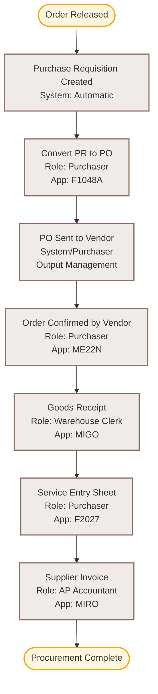

### **6.2 Proactive Maintenance Process (Scope Item 4HI)**

This process manages preventive maintenance through time-based and performance-based scheduling.

#### **6.2.1 Time-Based Single Cycle Plan**

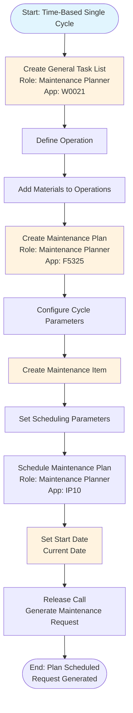

#### **6.2.2 Time-Based Strategy Plan**

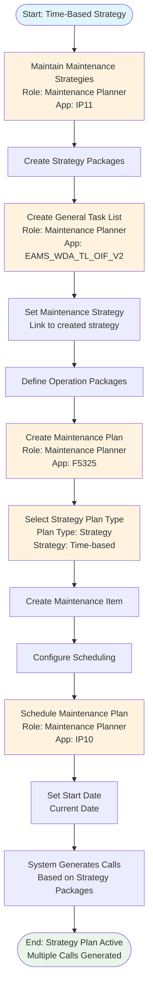

#### **6.2.3 Performance-Based Single Cycle Plan**

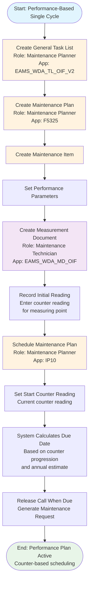

#### **6.2.4 Performance-Based Strategy Plan**

```mermaid
flowchart TD
    A([Start: Performance-Based Strategy]) --> B[Maintain Maintenance Strategies<br/>Role: Maintenance Planner<br/>App: IP11]
    B --> C[Create Performance Packages]
    C --> D[Create General Task List<br/>Role: Maintenance Planner<br/>App: EAMS_WDA_TL_OIF_V2]
    D --> E[Set Strategy and Packages<br/>Link operations to<br/>performance packages]
    E --> F[Create Maintenance Plan<br/>Role: Maintenance Planner<br/>App: F5325]
    F --> G[Create Maintenance Item]
    G --> H[Configure Strategy Plan<br/>Plan Type: Strategy<br/>Counter: Measuring Point<br/>Counter-based scheduling]
    H --> I[Create Measurement Document<br/>Role: Maintenance Technician<br/>App: EAMS_WDA_MD_OIF]
    I --> J[Record Initial Reading<br/>Enter counter reading]
    J --> K[Schedule Maintenance Plan<br/>Role: Maintenance Planner<br/>App: IP10]
    K --> L[Set Start Counter Reading<br/>Current counter reading]
    L --> M[System Determines Package<br/>Based on counter progression<br/>and strategy hierarchy]
    M --> N[Release Call for Package<br/>Generate appropriate<br/>maintenance request]
    N --> O([End: Performance Strategy Active<br/>Package-based counter scheduling])

    style A fill:#e1f5fe
    style O fill:#e8f5e8
    style B fill:#fff3e0
    style D fill:#fff3e0
    style F fill:#fff3e0
    style G fill:#fff3e0
    style I fill:#f3e5f5
    style K fill:#fff3e0
```

#### **6.2.5 Order Processing and Execution**

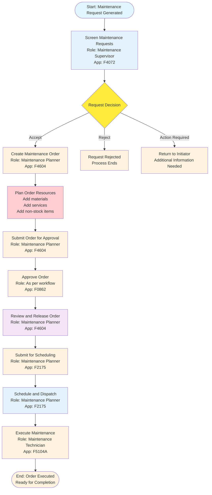

### **6.3 Operational & Overhead Maintenance (Scope Item 4WM)**

This process handles routine operational maintenance and infrastructure support activities.

#### **6.3.1 Complete End-to-End Maintenance Process**

```mermaid
flowchart TD
    A[Start Maintenance Process] --> B[Create Maintenance Order<br/>Role: Maintenance Planner<br/>App: EAMS_WDA_ORDNTF_OIF]
    B --> C[Plan Order Operations<br/>Add Materials and Services]
    C --> D[Save Order in Planning Phase]
    D --> E[Submit Order for Approval<br/>App: F4604]
    E --> F{Approval Required?}
    F -->|Yes| G[Approve Order<br/>Role: Maintenance Supervisor<br/>App: F0862]
    F -->|No| H[Auto-Approved]
    G --> I[Release Order for Preparation<br/>App: F4604]
    H --> I
    I --> J[Convert Purchase Requisitions<br/>Role: Purchaser<br/>App: F1048A]
    J --> K[Goods Receipt<br/>Role: Warehouse Clerk<br/>App: MIGO]
    K --> L[Submit Order for Scheduling<br/>Role: Maintenance Planner<br/>App: F2175]
    L --> M[Dispatch Operations<br/>Set to Execution Phase]
    M --> N[Execute Maintenance Work<br/>Role: Production Operator/Technician<br/>App: F5104A]
    N --> O[Complete Main Work<br/>Role: Maintenance Supervisor<br/>App: F2175]
    O --> P[Create Service Entry Sheet<br/>Role: Purchaser<br/>App: F2027]
    P --> Q[Execute Post Work Operations<br/>Role: Production Operator/Technician]
    Q --> R[Create Supplier Invoice<br/>Role: AP Accountant<br/>App: MIRO]
    R --> S[Technically Complete Order<br/>Role: Maintenance Planner<br/>App: F2175]
    S --> T[End Process]

    style A fill:#e1f5fe
    style B fill:#fff3e0
    style C fill:#fff3e0
    style D fill:#f3e5f5
    style E fill:#fff3e0
    style F fill:#ffeb3b
    style G fill:#e3f2fd
    style H fill:#f3e5f5
    style I fill:#fff3e0
    style J fill:#fff3e0
    style K fill:#fff3e0
    style L fill:#fff3e0
    style M fill:#fff3e0
    style N fill:#fff3e0
    style O fill:#e3f2fd
    style P fill:#fff3e0
    style Q fill:#fff3e0
    style R fill:#fff3e0
    style S fill:#fff3e0
    style T fill:#e8f5e8
```

#### **6.3.2 Create and Plan Maintenance Order**

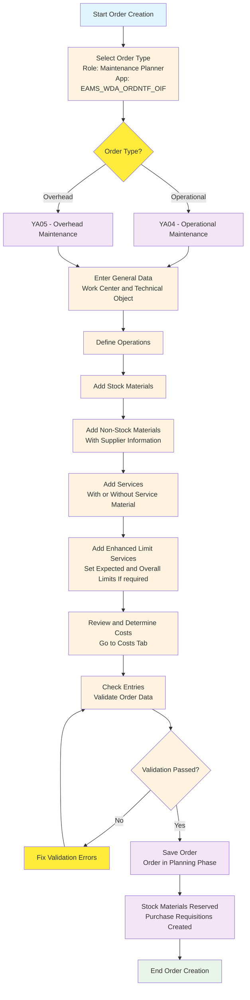

### **6.4 Improvement Maintenance Process (Scope Item 4VT)**

This process manages asset improvements, upgrades, and modifications.

#### **6.4.1 Main Improvement Maintenance Process**

```mermaid
flowchart TD
    A[Start: Need for<br/>Asset Improvement] --> H[Create and Plan<br/>Maintenance Order<br/>Role: Maintenance Planner<br/>App: EAMS_WDA_ORDNTF_OIF]
    H --> I[Submit Order for Approval<br/>Role: Maintenance Planner<br/>App: F4604]
    I --> J{Approval<br/>Required?}
    J -->|Yes| K[Approve Maintenance Order<br/>Role: Maintenance Supervisor<br/>App: F0862]
    J -->|No - Auto Approved| L[Review and Release Order<br/>Role: Maintenance Planner<br/>App: F4604]
    K --> M{Approved?}
    M -->|Yes| L
    M -->|No| N[Order Rejected<br/>Return to Planning]
    N --> H
    L --> O[Convert Purchase Requisitions<br/>to Purchase Orders<br/>Role: Purchaser<br/>App: F1048A]
    O --> P[Goods Receipt for<br/>Purchase Order<br/>Role: Warehouse Clerk<br/>App: MIGO]
    P --> S[Submit Order for Scheduling<br/>Role: Maintenance Planner<br/>App: F2175]
    S --> U[Schedule and Submit<br/>for Execution<br/>Role: Maintenance Planner<br/>App: F2175]
    U --> W[Execute Maintenance Order<br/>Role: Maintenance Technician<br/>App: F5104A]
    W --> X[Complete Main Work<br/>Role: Maintenance Supervisor<br/>App: F2175]
    X --> Y[Maintain Service Entry Sheet<br/>Role: Purchaser<br/>App: F2027]
    Y --> Z[Execute Post Work Operations<br/>Role: Maintenance Technician<br/>App: F5104A]
    Z --> AA[Review Maintenance Cost<br/>Role: Maintenance Planner<br/>App: F4603]
    AA --> BB[Technically Complete Order<br/>Role: Maintenance Planner<br/>App: F2175]
    BB --> CC[Create Supplier Invoice<br/>Role: Accounts Payable<br/>App: MIRO]
    CC --> DD[End: Order Completed<br/>and Invoiced]

    style A fill:#e1f5fe
    style H fill:#fff3e0
    style I fill:#fff3e0
    style J fill:#ffeb3b
    style K fill:#e3f2fd
    style L fill:#fff3e0
    style M fill:#ffeb3b
    style N fill:#ffcdd2
    style O fill:#fff3e0
    style P fill:#fff3e0
    style S fill:#fff3e0
    style U fill:#fff3e0
    style W fill:#fff3e0
    style X fill:#e3f2fd
    style Y fill:#fff3e0
    style Z fill:#fff3e0
    style AA fill:#fff3e0
    style BB fill:#fff3e0
    style CC fill:#fff3e0
    style DD fill:#e8f5e8
```

#### **6.4.2 Create and Plan Maintenance Order**

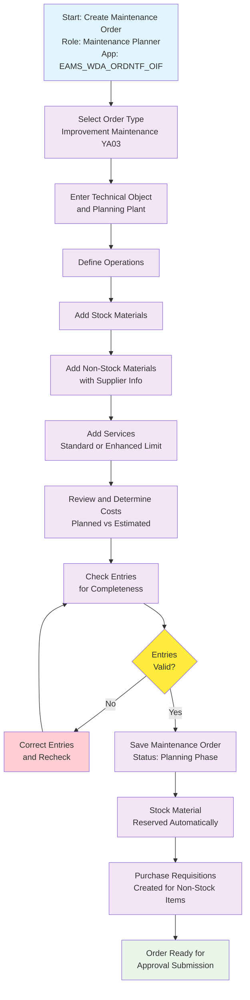

#### **6.4.3 Order Completion Process**

```mermaid
flowchart TD
    A[Start: Main Work<br/>Execution Complete] --> B[Complete Main Work<br/>Role: Maintenance Supervisor<br/>App: F2175]
    B --> C[Select Order]
    C --> D[Change Status to<br/>Main Work Completed]
    D --> E[Enter Main Work<br/>Completion Date/Time]
    E --> F[Set as Reference<br/>Date/Time]
    F --> G[Order Status:<br/>Main Work Completed]
    G --> P[Final Time<br/>Confirmation]
    P --> Q[Review Maintenance<br/>Cost<br/>Role: Maintenance Planner<br/>App: F4603]
    Q --> S[Analyze Cost<br/>by Category]
    S --> T[Technically Complete<br/>Order<br/>Role: Maintenance Planner<br/>App: F2175]
    T --> U[Select Order<br/>Complete Technically]
    U --> V[Enter Completion<br/>Date/Time]
    V --> W[Keep Default Values<br/>Complete Notifications]
    W --> X[Order Status:<br/>Technically Complete]
    X --> Y[Create Supplier Invoice<br/>Role: Accounts Payable<br/>App: MIRO]
    Y --> Z[Enter Invoice Details<br/>Reference PO Number]
    Z --> AA[Check Amount<br/>Quantity and Tax]
    AA --> BB[Simulate Invoice<br/>Check Messages]
    BB --> CC[Post Invoice<br/>Document Created]
    CC --> DD[End: Order<br/>Fully Completed]

    style A fill:#e1f5fe
    style B fill:#e3f2fd
    style C fill:#e3f2fd
    style D fill:#e3f2fd
    style E fill:#e3f2fd
    style F fill:#e3f2fd
    style G fill:#f3e5f5
    style P fill:#fff3e0
    style Q fill:#fff3e0
    style S fill:#fff3e0
    style T fill:#fff3e0
    style U fill:#fff3e0
    style V fill:#fff3e0
    style W fill:#fff3e0
    style X fill:#f3e5f5
    style Y fill:#fff3e0
    style Z fill:#fff3e0
    style AA fill:#fff3e0
    style BB fill:#fff3e0
    style CC fill:#fff3e0
    style DD fill:#e8f5e8
```

------

## **7. Key SAP Fiori Applications**

### **7.1 Core Maintenance Applications**

| **Category**           | **Application**                             | **App ID**         | **Business Role**      |
| ---------------------- | ------------------------------------------- | ------------------ | ---------------------- |
| **Request Management** | Create Maintenance Request                  | F1511A             | Employee               |
|                        | My Maintenance Requests                     | F4513              | Employee               |
|                        | Screen Maintenance Requests                 | F4072              | Maintenance Supervisor |
| **Order Management**   | Manage Maintenance Notifications and Orders | F4604              | Maintenance Planner    |
|                        | Find Maintenance Orders - Completion        | F2175              | Maintenance Planner    |
|                        | Maintenance Order Costs                     | F4603              | Maintenance Planner    |
| **Planning**           | Create/Change Task Lists                    | EAMS_WDA_TL_OIF_V2 | Maintenance Planner    |
|                        | Create Maintenance Plans                    | F5325              | Maintenance Planner    |
|                        | Schedule Maintenance Plans                  | IP10               | Maintenance Planner    |
| **Execution**          | Perform Maintenance Jobs                    | F5104A             | Maintenance Technician |
|                        | Create Measurement Documents                | EAMS_WDA_MD_OIF    | Maintenance Technician |
| **Procurement**        | Process Purchase Requisitions               | F1048A             | Purchaser              |
|                        | Manage Service Entry Sheets                 | F2027              | Purchaser              |
| **Approval**           | My Inbox                                    | F0862              | Approver               |

### **7.2 Supporting Applications**

| **Application**                | **App ID** | **Purpose**                               | **User Role**       |
| ------------------------------ | ---------- | ----------------------------------------- | ------------------- |
| Post Goods Movement            | MIGO       | Material movements for maintenance        | Warehouse Clerk     |
| Create Supplier Invoice        | MIRO       | Process maintenance service invoices      | Accounts Payable    |
| Create Technical Objects       | -          | Create equipment and functional locations | Master Data Admin   |
| Monitor Procurement Milestones | F5105      | Track procurement status                  | Maintenance Planner |

------

## **8. Business Roles and Authorization**

### **8.1 Core Maintenance Roles**

| **Business Role**      | **Template ID**         | **Key Responsibilities**               | **Key Applications**             |
| ---------------------- | ----------------------- | -------------------------------------- | -------------------------------- |
| Maintenance Planner    | SAP_BR_MAINT_PLANNER    | Plan and manage maintenance activities | F4604, F2175, F4603, F5325, IP10 |
| Maintenance Supervisor | SAP_BR_MAINT_SUPERVISOR | Oversee and approve maintenance work   | F4072, F0862, F2175              |
| Maintenance Technician | SAP_BR_MAINT_TECHNICIAN | Execute maintenance tasks              | F5104A, EAMS_WDA_MD_OIF          |
| Production Operator    | SAP_BR_PROD_OPERATOR    | Operational maintenance execution      | F5104A, F1511A                   |
| Purchaser              | SAP_BR_PURCHASER        | Handle maintenance procurement         | F1048A, F2027                    |
| Warehouse Clerk        | SAP_BR_WAREHOUSE_CLERK  | Material movements for maintenance     | MIGO                             |
| Employee               | SAP_BR_EMPLOYEE         | Create maintenance requests            | F1511A, F4513                    |

### **8.2 Approval Authorization Matrix**

#### **8.2.1 Maintenance Order Approval**

| **Order Value** | **Order Type** | **Level 1 Approver**   | **Level 2 Approver** | **Level 3 Approver** |
| --------------- | -------------- | ---------------------- | -------------------- | -------------------- |
| Up to 2M UGX    | All Types      | Maintenance Supervisor | -                    | -                    |
| 2M - 10M UGX    | All Types      | Maintenance Manager    | -                    | -                    |
| 10M - 50M UGX   | All Types      | Maintenance Manager    | Plant Manager        | -                    |
| Above 50M UGX   | All Types      | Maintenance Manager    | Plant Manager        | Operations Director  |

#### **8.2.2 Specialized Approval Requirements**

| **Process Type**        | **Special Approval Required** | **Approver**        |
| ----------------------- | ----------------------------- | ------------------- |
| Improvement Maintenance | Technical Review              | Engineering Manager |
| External Services       | Vendor Evaluation             | Procurement Manager |
| Calibration Activities  | Quality Compliance            | Quality Manager     |
| Safety-Related Work     | Safety Assessment             | Safety Officer      |

------

## **9. Integration Architecture**

### **9.1 Module Integration Overview**

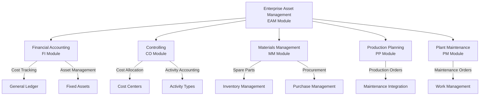

### **9.2 Financial Integration Points**

#### **9.2.1 Cost Flow in Maintenance Orders**

| **Process Step**     | **Financial Entry**                           | **GL Accounts Affected**          |
| -------------------- | --------------------------------------------- | --------------------------------- |
| Material Reservation | No financial impact                           | -                                 |
| Material Issue       | Dr. Maintenance Order / Cr. Inventory         | Maintenance WIP, Raw Materials    |
| Labor Confirmation   | Dr. Maintenance Order / Cr. Wages             | Maintenance WIP, Payroll          |
| External Service     | Dr. Maintenance Order / Cr. Vendor Payable    | Maintenance WIP, Accounts Payable |
| Order Settlement     | Dr. Cost Center/Asset / Cr. Maintenance Order | Maintenance Expense, Asset Value  |

#### **9.2.2 Activity Type Integration**

| **Activity Type** | **Controlling Area** | **Cost Center Assignment** | **Usage in EAM**           |
| ----------------- | -------------------- | -------------------------- | -------------------------- |
| AT04              | All Company Codes    | Maintenance Cost Centers   | Internal maintenance labor |
| AT20              | All Company Codes    | Maintenance Cost Centers   | External service providers |

------

## **10. Reporting and Analytics**

### **10.1 Standard EAM Reports**

| **Report Category**     | **Report Name**                 | **Purpose**                     | **Available in** |
| ----------------------- | ------------------------------- | ------------------------------- | ---------------- |
| **Cost Analysis**       | Maintenance Order Costs         | Analyze maintenance expenditure | F4603            |
| **Performance Metrics** | Equipment Downtime Analysis     | Track equipment availability    | Standard Reports |
| **Planning Overview**   | Maintenance Scheduling Overview | Monitor planned maintenance     | IP10             |
| **Compliance Tracking** | Maintenance History Reports     | Document maintenance activities | Standard Reports |

### **10.2 Key Performance Indicators (KPIs)**

| **KPI Category**           | **KPI Name**                      | **Description**                           | **Measurement** |
| -------------------------- | --------------------------------- | ----------------------------------------- | --------------- |
| **Equipment Reliability**  | Mean Time Between Failures (MTBF) | Average time between equipment failures   | Hours/Days      |
| **Maintenance Efficiency** | Mean Time To Repair (MTTR)        | Average time to complete repairs          | Hours           |
| **Cost Management**        | Maintenance Cost per Asset        | Average maintenance cost per equipment    | Currency/Asset  |
| **Planning Effectiveness** | Planned vs. Unplanned Maintenance | Ratio of planned to reactive maintenance  | Percentage      |
| **Resource Utilization**   | Technician Utilization Rate       | Percentage of productive maintenance time | Percentage      |

------

## **11. Data Migration Strategy**

### **11.1 Master Data Migration**

#### **11.1.1 Technical Objects**

| **Object Type**      | **Data Source** | **Migration Method** | **Data Volume** | **Priority** |
| -------------------- | --------------- | -------------------- | --------------- | ------------ |
| Functional Locations | CMMS + Manual   | Data Migration Tool  | ~500 objects    | High         |
| Equipment Master     | CMMS + Manual   | Data Migration Tool  | ~1000 objects   | High         |
| Manufacturer Data    | Manual          | Manual Entry         | ~50 entries     | Medium       |

#### **11.1.2 Maintenance Planning Data**

| **Data Type**          | **Data Source** | **Migration Method** | **Data Volume** | **Priority** |
| ---------------------- | --------------- | -------------------- | --------------- | ------------ |
| Task Lists             | CMMS + Manual   | Manual Creation      | ~100 lists      | High         |
| Maintenance Plans      | CMMS + Manual   | Manual Creation      | ~200 plans      | High         |
| Maintenance Strategies | Manual          | Manual Creation      | ~20 strategies  | Medium       |

------

## **12. Training and Change Management**

### **12.1 Training Program Structure**

#### **12.1.1 Role-Based Training Modules**

| **User Role**           | **Training Duration** | **Training Format** | **Key Topics**                             |
| ----------------------- | --------------------- | ------------------- | ------------------------------------------ |
| Maintenance Planners    | 3 days                | Hands-on Workshop   | Order management, planning, procurement    |
| Maintenance Supervisors | 2 days                | Hands-on Workshop   | Approval workflows, monitoring, reporting  |
| Maintenance Technicians | 2 days                | Hands-on Workshop   | Job execution, confirmations, measurements |
| Production Operators    | 1 day                 | Classroom + Demo    | Request creation, basic order processing   |
| Management              | 0.5 day               | Executive Briefing  | Reports, KPIs, business benefits           |

#### **12.1.2 Training Delivery Plan**

| **Phase**         | **Timeline** | **Participants** | **Delivery Method** |
| ----------------- | ------------ | ---------------- | ------------------- |
| Train-the-Trainer | Week 1       | Key Users        | Intensive Workshop  |
| End User Training | Weeks 2-3    | All Users        | Role-based Sessions |
| Go-Live Support   | Week 4       | All Users        | Floor Support       |
| Post Go-Live      | Weeks 5-8    | All Users        | Refresher Sessions  |

### **12.2 Change Management Strategy**

#### **12.2.1 Change Readiness Assessment**

| **Factor**              | **Current State** | **Target State** | **Gap Analysis**    | **Mitigation Strategy**    |
| ----------------------- | ----------------- | ---------------- | ------------------- | -------------------------- |
| System Familiarity      | CMMS (Legacy)     | SAP EAM          | High learning curve | Intensive training program |
| Process Standardization | Basic             | Advanced         | Process gaps        | Process redesign workshops |
| Data Quality            | Manual tracking   | System-driven    | Data inconsistency  | Data cleansing initiative  |
| User Adoption           | Resistant         | Embracing        | Change resistance   | Communication campaign     |

#### **12.2.2 Communication Plan**

| **Stakeholder Group** | **Communication Method** | **Frequency** | **Key Messages**                     |
| --------------------- | ------------------------ | ------------- | ------------------------------------ |
| Senior Management     | Executive Updates        | Bi-weekly     | Benefits, ROI, progress milestones   |
| Department Heads      | Status Meetings          | Weekly        | Implementation progress, issues      |
| End Users             | Team Meetings            | Weekly        | Training schedule, system features   |
| IT Support Team       | Technical Briefings      | As needed     | System architecture, support process |

------

## **13. Go-Live Strategy**

### **13.1 Phased Implementation Approach**

#### **13.1.1 Phase 1: Foundation (Month 1)**

| **Activity**        | **Scope**                        | **Success Criteria**           |
| ------------------- | -------------------------------- | ------------------------------ |
| Master Data Setup   | Functional locations, equipment  | 100% master data loaded        |
| Basic Configuration | Organizational structure         | Configuration testing complete |
| User Access         | Role assignments, authorizations | User access testing complete   |

#### **13.1.2 Phase 2: Core Processes (Month 2)**

| **Activity**          | **Scope**        | **Success Criteria**          |
| --------------------- | ---------------- | ----------------------------- |
| Reactive Maintenance  | Scope item 4HH   | Process testing complete      |
| Proactive Maintenance | Scope item 4HI   | Planning functionality active |
| Basic Reporting       | Standard reports | Reports accessible            |

#### **13.1.3 Phase 3: Advanced Processes (Month 3)**

| **Activity**            | **Scope**      | **Success Criteria**          |
| ----------------------- | -------------- | ----------------------------- |
| Operational Maintenance | Scope item 4WM | Operational processes active  |
| Improvement Maintenance | Scope item 4VT | Improvement workflow complete |
| Reporting and Analytics | KPI            | Reporting functional          |

### **13.2 Cutover Plan**

#### **13.2.1 Pre-Cutover Activities**

| **Activity**             | **Timeline** | **Responsible** | **Deliverable**             |
| ------------------------ | ------------ | --------------- | --------------------------- |
| Final Data Migration     | T-7 days     | Technical Team  | Migrated data validation    |
| User Training Completion | T-5 days     | Training Team   | Training completion records |
| System Integration Test  | T-3 days     | Technical Team  | Integration test results    |
| Go-Live Rehearsal        | T-1 day      | Project Team    | Rehearsal completion report |

#### **13.2.2 Cutover Activities**

| **Activity**             | **Timeline**  | **Responsible** | **Deliverable**      |
| ------------------------ | ------------- | --------------- | -------------------- |
| Production System Start  | T-Day 08:00   | Technical Team  | System availability  |
| User Access Verification | T-Day 09:00   | Security Team   | Access confirmation  |
| Process Execution Test   | T-Day 10:00   | Business Users  | Process validation   |
| Issue Resolution         | T-Day Ongoing | Support Team    | Issue resolution log |

### **13.3 Post Go-Live Support**

#### **13.3.1 Support Structure**

| **Support Level**      | **Team**               | **Availability** | **Response Time** |
| ---------------------- | ---------------------- | ---------------- | ----------------- |
| Level 1 - User Support | Floor Support Team     | 24/7             | Immediate         |
| Level 2 - Functional   | Functional Consultants | Business Hours   | 2 hours           |
| Level 3 - Technical    | Technical Team         | Business Hours   | 4 hours           |
| Level 4 - SAP Support  | SAP Support            | As per contract  | As per SLA        |

#### **13.3.2 Hypercare Period**

| **Week** | **Focus Area**       | **Key Activities**                      |
| -------- | -------------------- | --------------------------------------- |
| Week 1   | System Stability     | Monitor system performance, fix issues  |
| Week 2   | Process Optimization | Refine processes, address user feedback |
| Week 3   | Performance Tuning   | Optimize system performance             |
| Week 4   | Knowledge Transfer   | Complete knowledge transfer to support  |

------

## **14. Success Metrics and Benefits**

### **14.1 Business Benefits**

#### **14.1.1 Quantitative Benefits**

| **Benefit Category**       | **Metric**                       | **Current State** | **Target State** | **Expected Improvement** |
| -------------------------- | -------------------------------- | ----------------- | ---------------- | ------------------------ |
| **Maintenance Efficiency** | Work Order Processing Time       | 2-3 days          | Same day         | 60% reduction            |
| **Cost Management**        | Maintenance Cost Visibility      | 40%               | 95%              | 55% improvement          |
| **Equipment Reliability**  | Planned vs Unplanned Maintenance | 30:70             | 70:30            | 40% shift to planned     |
| **Resource Utilization**   | Technician Productivity          | 60%               | 80%              | 20% improvement          |
| **Inventory Management**   | Spare Parts Accuracy             | 70%               | 95%              | 25% improvement          |

#### **14.1.2 Qualitative Benefits**

| **Benefit Area**            | **Description**                                    | **Impact** |
| --------------------------- | -------------------------------------------------- | ---------- |
| **Process Standardization** | Consistent maintenance processes across all plants | High       |
| **Data Quality**            | Improved data accuracy and reliability             | High       |
| **Compliance**              | Better regulatory and safety compliance            | Medium     |
| **Decision Making**         | Data-driven maintenance decisions                  | High       |
| **Integration**             | Seamless integration with other business processes | Medium     |

### **14.2 Success Criteria**

#### **14.2.1 Technical Success Criteria**

| **Criteria**        | **Measurement**                    | **Target** | **Status** |
| ------------------- | ---------------------------------- | ---------- | ---------- |
| System Availability | Uptime percentage                  | 99.5%      | TBD        |
| Performance         | Response time for key transactions | <3 seconds | TBD        |
| Data Accuracy       | Master data completeness           | >95%       | TBD        |
| Integration         | Interface success rate             | >98%       | TBD        |

#### **14.2.2 Business Success Criteria**

| **Criteria**           | **Measurement**               | **Target**      | **Status** |
| ---------------------- | ----------------------------- | --------------- | ---------- |
| User Adoption          | Active user percentage        | >90%            | TBD        |
| Process Compliance     | SOP adherence rate            | >95%            | TBD        |
| Cost Reduction         | Maintenance cost optimization | 15% reduction   | TBD        |
| Efficiency Improvement | Process cycle time reduction  | 30% improvement | TBD        |

------

## **15. Risk Management**

### **15.1 Project Risks**

| **Risk Category**  | **Risk Description**        | **Probability** | **Impact** | **Mitigation Strategy**                |
| ------------------ | --------------------------- | --------------- | ---------- | -------------------------------------- |
| **Technical**      | Data migration complexity   | Medium          | High       | Comprehensive data mapping and testing |
| **Organizational** | User resistance to change   | High            | Medium     | Change management and training         |
| **Operational**    | Business process disruption | Medium          | High       | Phased implementation approach         |
| **Resource**       | Key resource unavailability | Low             | High       | Cross-training and backup resources    |

### **15.2 Business Continuity**

#### **15.2.1 Fallback Procedures**

| **Scenario**        | **Fallback Action**       | **Recovery Time** | **Responsible**    |
| ------------------- | ------------------------- | ----------------- | ------------------ |
| System Downtime     | Manual process activation | 2 hours           | Operations Manager |
| Data Corruption     | Restore from backup       | 4 hours           | Technical Team     |
| Integration Failure | Manual data entry         | 1 hour            | Functional Team    |
| User Access Issues  | Alternative access method | 30 minutes        | Security Team      |

#### **15.2.2 Disaster Recovery**

| **Component**      | **Recovery Strategy**       | **RTO** | **RPO**    |
| ------------------ | --------------------------- | ------- | ---------- |
| Application        | SAP cloud disaster recovery | 4 hours | 1 hour     |
| Master Data        | Daily backup restoration    | 2 hours | 24 hours   |
| Transactional Data | Real-time replication       | 1 hour  | 15 minutes |
| Customizations     | Version control restoration | 2 hours | 24 hours   |

------

## **16. Business Process Sign-Off**

### **16.1 Process Owner Confirmation**

The following business process owners confirm that the documented processes accurately reflect GSUL's business requirements:

| **Process Area**            | **Process Owner**   | **Designation**        | **Sign-off**      | **Date**  |
| --------------------------- | ------------------- | ---------------------- | ----------------- | --------- |
| **Reactive Maintenance**    | Maintenance Manager | Breakdown Management   | _________________ | _________ |
| **Proactive Maintenance**   | Planning Manager    | Preventive Maintenance | _________________ | _________ |
| **Operational Maintenance** | Operations Manager  | Routine Operations     | _________________ | _________ |
| **Improvement Maintenance** | Engineering Manager | Asset Improvements     | _________________ | _________ |
| **Master Data Management**  | Technical Manager   | Asset Management       | _________________ | _________ |
| **Cost Management**         | Finance Manager     | Maintenance Accounting | _________________ | _________ |
| **Resource Planning**       | HR Manager          | Workforce Management   | _________________ | _________ |
| **Procurement Integration** | Procurement Manager | Materials & Services   | _________________ | _________ |

### **16.2 Management Approval**

The following management representatives approve this Business Blueprint for implementation:

| **Name**                      | **Designation**       | **Approval**      | **Date**  | **Comments**      |
| ----------------------------- | --------------------- | ----------------- | --------- | ----------------- |
| **Mr. Muhammad Ubaid Ashraf** | GSUL Project Manager  | _________________ | _________ | _________________ |
| **Mr. Khalil Hajee**          | Business Owner        | _________________ | _________ | _________________ |
| **Mr. Irfan Hajee**           | Business Owner        | _________________ | _________ | _________________ |
| **Rahul Rathore**             | Project Lead          | _________________ | _________ | _________________ |
| **Mr. Rahul Vaid**            | NXSYS Project Manager | _________________ | _________ | _________________ |
| **Deepak Saxena**             | NXSYS Delivery Head   | _________________ | _________ | _________________ |

------

## **17. Appendices**

### **17.1 Glossary**

| **Term**                 | **Definition**                                               |
| ------------------------ | ------------------------------------------------------------ |
| **ATP**                  | Available to Promise - material availability check           |
| **BOM**                  | Bill of Materials - list of components for maintenance       |
| **CMMS**                 | Computerized Maintenance Management System                   |
| **EAM**                  | Enterprise Asset Management                                  |
| **Functional Location**  | Hierarchical structure representing physical maintenance areas |
| **Maintenance Plan**     | Scheduling framework for preventive maintenance              |
| **Maintenance Strategy** | Rules for sequence of planned maintenance work               |
| **MTBF**                 | Mean Time Between Failures                                   |
| **MTTR**                 | Mean Time To Repair                                          |
| **Task List**            | Standardized maintenance procedures                          |
| **Work Center**          | Organizational unit where maintenance tasks are performed    |

### **17.2 SAP Scope Items Reference**

| **Scope Item** | **Name**                           | **Description**                                    |
| -------------- | ---------------------------------- | -------------------------------------------------- |
| **4HH**        | Reactive Maintenance               | 9-phase breakdown and corrective maintenance       |
| **4HI**        | Proactive Maintenance              | Time and performance-based preventive maintenance  |
| **4WM**        | Operational & Overhead Maintenance | Routine operational and infrastructure maintenance |
| **4VT**        | Improvement Maintenance            | Asset improvements, upgrades, and modifications    |

### **17.3 Key Fiori Applications Quick Reference**

| **App ID** | **Application Name**                      | **Primary User Role**  |
| ---------- | ----------------------------------------- | ---------------------- |
| **F1511A** | Create Maintenance Request                | Employee               |
| **F4513**  | My Maintenance Requests                   | Employee               |
| **F4072**  | Screen Maintenance Requests               | Maintenance Supervisor |
| **F4604**  | Manage Maintenance Notifications & Orders | Maintenance Planner    |
| **F0862**  | My Inbox                                  | Approver               |
| **F2175**  | Find Maintenance Orders - Completion      | Maintenance Planner    |
| **F5104A** | Perform Maintenance Jobs                  | Maintenance Technician |
| **F4603**  | Maintenance Order Costs                   | Maintenance Planner    |
| **F5325**  | Create Maintenance Plans                  | Maintenance Planner    |
| **IP10**   | Schedule Maintenance Plans                | Maintenance Planner    |

------

*This document represents the complete Enterprise Asset Management module blueprint for GSUL's SAP S/4HANA Public Cloud implementation, covering the four standard SAP scope items (4HH, 4HI, 4WM, 4VT) with detailed process flows, organizational structure, and implementation guidance.*