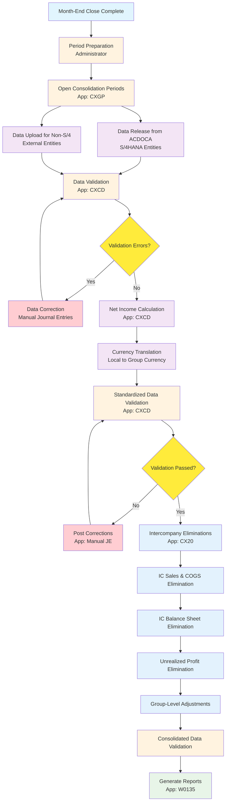
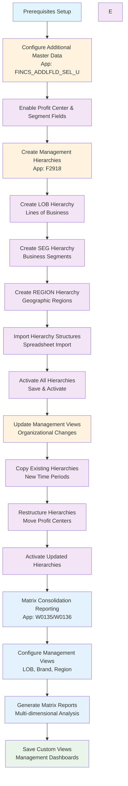
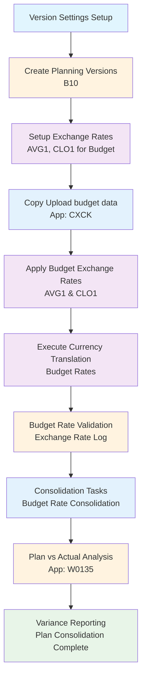
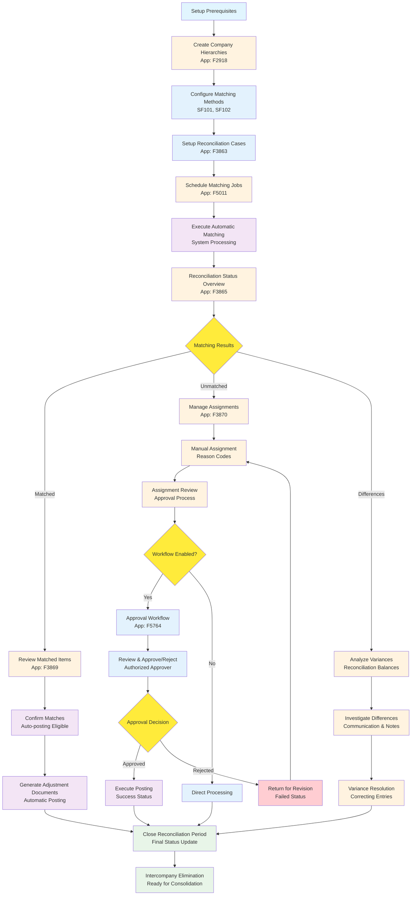
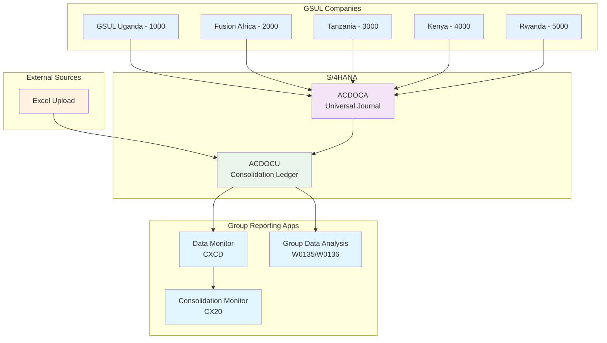

# SAP S/4HANA Public Cloud Implementation

## Business Blueprint Document - Group Reporting Module

### Graphic Systems (U) Limited (GSUL)

------

## **Document Control**

| **Field**                    | **Details**                                  |
| ---------------------------- | -------------------------------------------- |
| **Project Name**             | GSUL SAP S/4HANA Public Cloud Implementation |
| **Customer**                 | Graphic Systems (U) Limited                  |
| **Project Type**             | SAP S/4HANA Public Cloud Implementation      |
| **SAP Version**              | S/4HANA Public Cloud 2502                    |
| **Customer Project Manager** | Mr. Muhammad Ubaid Ashraf                    |
| **NXSYS Project Manager**    | Mr. Rahul Vaid                               |
| **Document Version**         | V2.0                                         |
| **Date**                     | July 17, 2025                                |
| **Author**                   | Pooja Mohinani                               |
|                              | Abubakar Javaid                              |
| **Reviewed By**              | Muhammad Ubaid Ashraf                        |
| **Validated By**             | Rahul Rathore                                |

------

## **1. Purpose and Scope**

### **1.1 Document Purpose**

This Business Blueprint document outlines GSUL's business processes and requirements for the Group Reporting (GR) module in SAP S/4HANA Public Cloud. It serves as the foundation for system configuration, mapping current "AS-IS" consolidation operations to the desired "TO-BE" processes, and ensures stakeholder alignment throughout the implementation.

### **1.2 Module Scope**

The Group Reporting module implementation covers the complete financial consolidation cycle through the following SAP Public Cloud scope items:

**SAP Scope Items Activated:**

- **Financial Consolidation (Scope Item 1SG)** - Core consolidation processes including:
  - Data collection from multiple company codes
  - Currency translation and standardization
  - Validating and standardizing data
  - Automated intercompany eliminations
  - Consolidated financial statement generation
  - Group-level adjustments and allocations
- **Matrix Consolidation (Scope Item 3LX)** - Management reporting hierarchies including:
  - Multi-dimensional consolidation using profit centers and segments
  - Rapid response to organizational changes
- **Plan Consolidation (Scope Item 28B)** - Budget consolidation including:
  - Multi-version planning scenarios (Budget, Actual at Budget Rates)
  - SAC integration for planning data
  - Plan vs. actual variance analysis
- **Intercompany Reconciliation (Scope Item 40Y)** - Automated IC processing including:
  - Automated IC matching and reconciliation
  - Exception management and approval workflows
  - Real-time reconciliation status monitoring

**Additional Capabilities (Built into Core S/4HANA):**

The following capabilities are inherent to S/4HANA Group Reporting and don't require separate scope item activation:

- Legal and management reporting through Group Data Analysis (W0135/W0136)
- Real-time data integration from ACDOCA to ACDOCU
- Standard consolidation reporting and analytics

------

## **2. Group Reporting Overview**

### **2.1 SAP Group Reporting Module**

Group Reporting is the comprehensive consolidation solution in SAP S/4HANA that enables GSUL to consolidate financial data from multiple legal entities into unified group financial statements. It provides automated data collection, validation, elimination processing, and reporting capabilities.

**Key Activities in Group Reporting:**

- Data collection from multiple company codes
- Currency translation and standardization
- Automated intercompany eliminations
- Group-level adjustments and allocations
- Consolidated financial statement generation
- Management and legal reporting
- Plan vs. actual variance analysis

### **2.2 GSUL Consolidation Scenarios**

GSUL operates with four main consolidation scenarios:

1. **Legal Consolidation**
   - Statutory financial statements
   - Regulatory reporting requirements
   - External stakeholder reporting
2. **Management Consolidation**
   - Internal performance reporting
   - Management decision support
3. **Budget Consolidation**
   - Annual budget consolidation
   - Plan vs. actual analysis
4. **Intercompany Reconciliation**
   - Automated matching processes
   - Exception management
   - Elimination preparation

------

## **3. Organizational Structure**

### **3.1 Consolidation Units**

Consolidation units represent the legal entities within GSUL group that require consolidation:

| **Consolidation Unit** | **Company | **Description**                      | **Location** | **Local Currency** |
| ---------------------- | --------- | ------------------------------------ | ------------ | ------------------ |
| 1000                   | 1000      | Graphic Systems (U) Limited          | Uganda       | UGX                |
| 2000                   | 2000      | Fusion Africa Limited                | Uganda       | UGX                |
| 3000                   | 3000      | Label & Printing Systems (T) Limited | Tanzania     | TZS                |
| 4000                   | 4000      | Label & Printing Systems (K) Limited | Kenya        | KES                |
| 5000                   | 5000      | Graphic Systems (R) Ltd              | Rwanda       | RWF                |

### **3.2 Consolidation Groups**

| **Consolidation Group** | **Description**          | **Purpose**   |
| ----------------------- | ------------------------ | ------------- |
| CGXX                    | GSUL Consolidation Group | Consolidation |

### **3.3 Group Structure and Ownership**

The group structure defines the ownership relationships between entities:

**GSUL Group Structure:**

- GSUL Group (CGRXX)
  - Graphic Systems Uganda (1000 - 100%)
  - Fusion Africa Limited (2000 - 100%)
  - Label & Printing Tanzania (3000 - 100%)
  - Label & Printing Kenya (4000 - 100%)
  - Graphic Systems Rwanda (5000 - 100%)

### **3.4 Consolidation Versions**

| **Version** | **Description**      | **Group Currency** | **Purpose**         | **Data Source** |
| ----------- | -------------------- | ------------------ | ------------------- | --------------- |
| A10         | Legal Actual         | USD                | Legal consolidation | ACDOCA          |
| B10         | Budget Consolidation | USD                | Budget planning     | External upload |

------

## **4. Master Data Configuration**

### **4.1 Consolidation Chart of Accounts (COA)**

GSUL will implement a unified consolidation chart of accounts with one-to-one mapping to operational COA:

| **COA** | **Description**        | **Relationship** |
| ------- | ---------------------- | ---------------- |
| Y1      | GSUL Consolidation COA | Group-level COA  |

Operational chart of accounts

| **COA**   | **Description**             | **Relationship**  |
| --------- | --------------------------- | ----------------- |
| 1000      | Graphics Uganda Operational | 1:1 mapping to Y1 |
| 2000      | Fusion Africa Operational   | 1:1 mapping to Y1 |
| 3000-5000 | Regional Operations COA     | 1:1 mapping to Y1 |

### **4.2 Financial Statement (FS) Items**

FS Items represent the consolidation account structure:

**Balance Sheet FS Items:**

| **FS Item** | **Description**             | **FS Item Type** | **Balance Sheet Side** |
| ----------- | --------------------------- | ---------------- | ---------------------- |
| 1000000     | Property, Plant & Equipment | Assets           | Assets                 |
| 1100000     | Inventory                   | Assets           | Assets                 |
| 1200000     | Accounts Receivable         | Assets           | Assets                 |
| 1300000     | Cash & Bank                 | Assets           | Assets                 |
| 2000000     | Share Capital               | Equity           | Liabilities            |
| 2100000     | Retained Earnings           | Equity           | Liabilities            |
| 2200000     | Accounts Payable            | Liabilities      | Liabilities            |
| 2300000     | Bank Loans                  | Liabilities      | Liabilities            |

**P&L FS Items:**

| **FS Item** | **Description**    | **FS Item Type** |
| ----------- | ------------------ | ---------------- |
| 3000000     | Revenue            | Income           |
| 3100000     | Cost of Goods Sold | Expense          |
| 3200000     | Operating Expenses | Expense          |
| 3300000     | Financial Income   | Income           |
| 3400000     | Financial Expenses | Expense          |
| 3500000     | Net Income         | Income           |

### **4.3 Intercompany FS Items**

Special FS items for intercompany transactions requiring elimination:

| **FS Item** | **Description**  | **IC Elimination Type** | **Partner Required** |
| ----------- | ---------------- | ----------------------- | -------------------- |
| 1210000     | IC Receivables   | Balance Sheet           | Yes                  |
| 2210000     | IC Payables      | Balance Sheet           | Yes                  |
| 3010000     | IC Sales         | P&L                     | Yes                  |
| 3110000     | IC Cost of Sales | P&L                     | Yes                  |

### **4.4 Subitems and Movement Types**

Subitems capture transaction movements for detailed reporting:

**Fixed Asset Movements:**

| **Subitem** | **Description** | **Movement Type** |
| ----------- | --------------- | ----------------- |
| 100         | Opening Balance | Opening           |
| 120         | Additions       | Increase          |
| 140         | Disposals       | Decrease          |
| 220         | Depreciation    | Decrease          |

### **4.5 Currency Configuration**

**Local Currencies:**

| **Entity** | **Local Currency** | **Description**    |
| ---------- | ------------------ | ------------------ |
| 1000       | UGX                | Uganda Shillings   |
| 2000       | UGX                | Uganda Shillings   |
| 3000       | TZS                | Tanzania Shillings |
| 4000       | KES                | Kenya Shillings    |
| 5000       | RWF                | Rwanda Francs      |

**Group Currency:** USD (United States Dollar)

------

## **5. Scope Item 1SG - Financial Consolidation**

### **5.1 Financial Consolidation Overview**

The Financial Consolidation scope item (1SG) provides the core consolidation functionality for GSUL, enabling automated data collection, validation, elimination processing, and consolidated reporting.

### **5.2 Data Collection Process**

**Financial Consolidation Process Flow:**

### **5.3 Key Applications and Roles**

| **Application**       | **App ID** | **Description**              | **Primary Role**                   |
| --------------------- | ---------- | ---------------------------- | ---------------------------------- |
| Set Global Parameters | CXGP       | Period and version settings  | Administrator - Group Reporting    |
| Data Monitor          | CXCD       | Data collection & validation | Group Accountant                   |
| Consolidation Monitor | CX20       | Elimination processing       | Group Accountant                   |
| Manual Journal Entry  | CXJE       | Correction entries           | Group Accountant                   |
| Group Data Analysis   | W0135      | Consolidated reporting       | Business Analyst - Group Reporting |

### **5.4 Elimination Rules Configuration**

**Intercompany Sales Elimination:**

| **Rule Type** | **FS Item From** | **FS Item To** | **Elimination Method** |
| ------------- | ---------------- | -------------- | ---------------------- |
| IC Sales      | 3010000          | 3010000        | One-sided (Sales)      |
| IC COGS       | 3110000          | 3110000        | Partner-based          |

**Intercompany Balance Sheet Elimination:**

| **Rule Type**  | **FS Item From** | **FS Item To** | Elimination Method |
| -------------- | ---------------- | -------------- | ------------------ |
| IC Receivables | 1210000          | 2210000        | Partner-based      |
| IC Payables    | 2210000          | 1210000        | Partner-based      |

### **5.5 Document Types and Posting Levels**

| **Document Type** | **Description**              | **Posting Level** | **Usage**        |
| ----------------- | ---------------------------- | ----------------- | ---------------- |
| 0F                | Universal Journal Release    | Company           | Automatic data   |
| 00                | Flexible Upload              | 00 - Reported     | External data    |
| 01                | Manual Correction - UJ       | 0C - UJ Adj       | Data corrections |
| 02                | Manual Correction - Reported | 01 - Reported Adj | Standalone adj   |
| 05                | Net Income Calculation       | 00 - Reported     | Automatic        |
| 2E                | IC Sales Elimination         | 20 - Pair         | Automatic        |
| 2F                | IC Other P&L Elimination     | 20 - Pair         | Automatic        |
| 2G                | IC Balance Sheet Elimination | 20 - Pair         | Automatic        |
| 31                | Group Adjustments            | 30 - Group        | Manual           |

------

## **6. Scope Item 3LX - Matrix Consolidation**

### **6.1 Matrix Consolidation Overview**

Matrix Consolidation enables GSUL to create management-oriented organizational unit consolidation using profit centers, business segments, and other dimensions for rapid response to organizational changes.

### **6.2 Management Hierarchies**

**Lines of Business (LOB) Hierarchy:**

| **LOB Code** | **Description**       | **Profit Centers**     |
| ------------ | --------------------- | ---------------------- |
| LOBA00       | Offset Printing       | PC0001, PC0002, PC0003 |
| LOBB00       | Digital Printing      | PC0004, PC0005, PC0006 |
| LOBC00       | Large Format Printing | PC0007, PC0008, PC0009 |
| LOBD00       | Packaging Solutions   | PC0010, PC0011, PC0012 |

**Regional (REGION) Hierarchy:**

| **Region Code** | **Description** | **Consolidation Units** |
| --------------- | --------------- | ----------------------- |
| REGA00          | East Africa     | 1000, 2000              |
| REGB00          | Tanzania        | 3000                    |
| REGC00          | Kenya           | 4000                    |
| REGD00          | Rwanda          | 5000                    |

### **6.3 Matrix Consolidation Process Flow**

### **6.4 Matrix Consolidation Applications**

| **Application**                | **App ID** | **Description**               | **Role**                         |
| ------------------------------ | ---------- | ----------------------------- | -------------------------------- |
| Set Global Parameters          | CXGP       | Matrix consolidation setup    | GL Accountant Group Reporting    |
| Manage Global Hierarchies      | F2918      | Create management hierarchies | GL Accountant Group Reporting    |
| Group Data Analysis            | W0135      | Matrix reporting              | Business Analyst Group Reporting |
| Group Data Analysis with Rules | W0136      | Advanced matrix analysis      | Business Analyst Group Reporting |

------

## **7. Scope Item 28B - Plan Consolidation**

### **7.1 Plan Consolidation Overview**

Plan Consolidation enables GSUL to consolidate budget and forecast data across all entities, supporting multiple planning scenarios including actual-at-budget-rates analysis.

### **7.2 Planning Versions and Scenarios**

| **Version** | **Description** | **Periods** | **Currency Translation** | **Data Source** |
| ----------- | --------------- | ----------- | ------------------------ | --------------- |
| B10         | Budget          | 12+1+1+1    | Budget rates             | Upload/Copy     |

### **7.3 Plan Consolidation Process Flow**

### **7.4 Budget Data Upload Process**

**Upload Methods:**

| **Method** | **Description**        | **File Format** | **Usage**              |
| ---------- | ---------------------- | --------------- | ---------------------- |
| SRD2       | Standard Reported Data | Excel Template  | Budget/Forecast upload |
| Manual     | Manual Journal Entry   | Online entry    | Adjustments            |
| Copy       | Copy from Actual       | System copy     | Actual at budget rates |

------

## **8. Scope Item 40Y - Intercompany Reconciliation**

### **8.1 Intercompany Reconciliation Overview**

Intercompany Reconciliation automates the matching and reconciliation of transactions between GSUL entities, reducing manual effort and ensuring accurate eliminations.

### **8.2 Reconciliation Process Components**

**Key Elements:**

- Automatic matching methods (SF101, SF102)
- Manual assignment capabilities
- Exception management workflow
- Real-time reconciliation status
- Approval processes for variances

### **8.3 Intercompany Reconciliation Process Flow**

### **8.4 Matching Methods Configuration**

| **Method** | **Description**           | **Matching Criteria**   | **Tolerance** |
| ---------- | ------------------------- | ----------------------- | ------------- |
| SF101      | Exact Amount Matching     | Amount, Date, Reference | 0.00          |
| SF102      | Tolerance Amount Matching | Amount ± tolerance      | 1.00 USD      |
| CUSTOM     | Custom Business Rules     | Business-specific logic | Configurable  |

### **8.5 Reconciliation Applications**

| **Application**        | **App ID** | **Description**              | **Role**                     |
| ---------------------- | ---------- | ---------------------------- | ---------------------------- |
| Schedule Matching Jobs | F5011      | Automated matching execution | GL Accountant - Intercompany |
| Reconciliation Status  | F3865      | Status monitoring            | GL Accountant - Intercompany |
| Manage Assignments     | F3870      | Manual reconciliation        | GL Accountant - Intercompany |
| Display Matching Items | F3869      | Review matched transactions  | GL Accountant - Intercompany |
| Verify IC Variance     | F5764      | Approval workflow            | Approver                     |

------

## **9. Integration Architecture**

### **9.1 Data Flow Architecture**

### **9.2 System Integration Points**

| **Integration Type** | **Source**      | **Target**      | **Method**        | **Frequency** |
| -------------------- | --------------- | --------------- | ----------------- | ------------- |
| Financial Data       | ACDOCA          | ACDOCU          | Real-time release | Daily         |
| Master Data          | S/4HANA         | Group Reporting | Automatic sync    | Real-time     |
| External Data        | Excel Templates | Group Reporting | Manual upload     | Monthly       |
| Elimination Results  | Group Reporting | ACDOCU          | Automatic posting | Monthly       |

### 

------

## **10. Reporting and Analytics**

### **10.1 Standard Reports**

**Legal Consolidation Reports:**

| **Report Name**            | **App** | **Description**          | **Frequency** |
| -------------------------- | ------- | ------------------------ | ------------- |
| Consolidated Balance Sheet | W0135   | Group balance sheet      | Monthly       |
| Consolidated P&L Statement | W0135   | Group income statement   | Monthly       |
| Cash Flow Statement        | W0136   | Group cash flow analysis | Monthly       |
| Elimination Details        | W0135   | IC elimination breakdown | Monthly       |

------

## **11. Authorization and Security**

### **11.1 Role-Based Access Control**

**Group Reporting Roles:**

| **Role**                           | **Description**          | **Key Authorizations**               |
| ---------------------------------- | ------------------------ | ------------------------------------ |
| Administrator - Group Reporting    | System administration    | All configuration, period management |
| Group Accountant                   | Consolidation processing | Data monitor, eliminations           |
| GL Accountant - Group Reporting    | Data preparation         | Data release, validation             |
| Business Analyst - Group Reporting | Reporting and analysis   | Group data analysis, reporting       |
| GL Accountant - Intercompany       | IC reconciliation        | IC matching, assignments             |
| Configuration Expert - BPC         | System configuration     | Master data, rules setup             |

### **11.2 Fiori Application Authorization**

| **Fiori App**               | **App ID** | **Authorized Roles**               |
| --------------------------- | ---------- | ---------------------------------- |
| Set Global Parameters       | CXGP       | Administrator, Group Accountant    |
| Data Monitor                | CXCD       | Group Accountant, GL Accountant    |
| Consolidation Monitor       | CX20       | Group Accountant                   |
| Group Data Analysis         | W0135      | Business Analyst, Group Accountant |
| Matrix Consolidation        | W0136      | Business Analyst, Group Accountant |
| Manage Global Hierarchies   | F2918      | Administrator, GL Accountant       |
| Intercompany Reconciliation | F3865      | GL Accountant - Intercompany       |
| Manual Journal Entry        | CXJE       | Group Accountant, GL Accountant    |
| Flexible Upload             | Various    | Group Accountant, GL Accountant    |

### **11.3 Data Access Controls**

**Consolidation Unit Access:**

| **User Group**     | **Access Level** | **Consolidation Units** | **Versions**  |
| ------------------ | ---------------- | ----------------------- | ------------- |
| Uganda Team        | Full Access      | 1000, 2000              | All           |
| Tanzania Team      | Limited Access   | 3000                    | Local only    |
| Kenya Team         | Limited Access   | 4000                    | Local only    |
| Rwanda Team        | Limited Access   | 5000                    | Local only    |
| Group Finance Team | Full Access      | All                     | All           |
| External Auditors  | Read Only        | All                     | A10, Y11 only |

------

## **12. Business Process Sign-Off**

### **12.1 Process Owner Confirmation**

The following business process owners confirm that the documented processes accurately reflect GSUL's consolidation requirements:

| **Process Area**            | **Process Owner**     | **Designation**         | **Sign-off** | **Date** |
| --------------------------- | --------------------- | ----------------------- | ------------ | -------- |
| **Financial Consolidation** | Group Finance Manager | Financial Consolidation | ____________ | ________ |
| **Matrix Consolidation**    | Management Accountant | Management Reporting    | ____________ | ________ |
| **Plan Consolidation**      | FP&A Manager          | Planning & Analysis     | ____________ | ________ |
| **IC Reconciliation**       | IC Accountant         | Intercompany Process    | ____________ | ________ |
| **Group Reporting**         | Group Controller      | Consolidated Reporting  | ____________ | ________ |

### **12.2 Management Approval**

The following management representatives approve this Business Blueprint for implementation:

| **Name**                      | **Designation**       | **Approval**      | **Date**  | **Comments**      |
| ----------------------------- | --------------------- | ----------------- | --------- | ----------------- |
| **Mr. Muhammad Ubaid Ashraf** | GSUL Project Manager  | _________________ | _________ | _________________ |
| **Mr. Khalil Hajee**          | Business Owner        | _________________ | _________ | _________________ |
| **Mr. Irfan Hajee**           | Business Owner        | _________________ | _________ | _________________ |
| **Rahul Rathore**             | Project Lead          | _________________ | _________ | _________________ |
| **Mr. Rahul Vaid**            | NXSYS Project Manager | _________________ | _________ | _________________ |
| **Deepak Saxena**             | NXSYS Delivery Head   | _________________ | _________ | _________________ |

------

## **13. Appendices**

### **13.1 Glossary**

| **Term**             | **Definition**                                              |
| -------------------- | ----------------------------------------------------------- |
| ACDOCA               | Universal Journal table storing all financial transactions  |
| ACDOCU               | Consolidation table for Group Reporting data                |
| Consolidation Unit   | Legal entity requiring consolidation                        |
| Consolidation Group  | Collection of consolidation units for reporting             |
| FS Item              | Financial Statement item for consolidation accounting       |
| IC                   | Intercompany transactions between group entities            |
| Matrix Consolidation | Multi-dimensional consolidation using various hierarchies   |
| Partner Unit         | Trading partner for intercompany transaction identification |
| Posting Level        | Data categorization (Company, Pair, Group)                  |
| Subitem              | Detailed breakdown of FS item movements                     |

### **13.2 Configuration Workbooks**

| **Workbook**          | **Purpose**                  | **Responsible Role**            |
| --------------------- | ---------------------------- | ------------------------------- |
| Master Data Setup     | Entity and hierarchy setup   | Administrator - Group Reporting |
| Elimination Rules     | IC elimination configuration | Group Accountant                |
| Validation Rules      | Data validation setup        | Configuration Expert            |
| Upload Templates      | External data upload formats | Group Accountant                |
| Report Configurations | Standard report setup        | Business Analyst                |

### **13.3 Integration Specifications**

| **Interface**    | **Description**         | **Technical Details**       |
| ---------------- | ----------------------- | --------------------------- |
| ACDOCA to ACDOCU | Financial data transfer | Real-time release           |
| Excel Upload     | External entity data    | Template-based upload       |
| Reporting Output | Consolidated reports    | Standard and custom formats |

------

*This document represents the complete Group Reporting module blueprint for GSUL's SAP S/4HANA Public Cloud implementation, incorporating all four scope items (1SG, 3LX, 28B, 40Y) with detailed process flows, system integration, and implementation guidance for comprehensive consolidation capabilities.*