# SAP S/4HANA Public Cloud Implementation

## Comprehensive Business Blueprint Document

### Graphic Systems (U) Limited (GSUL)

------

## **Document Control**

| **Field**                                | **Details**                                                  |
| ---------------------------------------- | ------------------------------------------------------------ |
| **Project Name**                         | GSUL SAP S/4HANA Public Cloud Implementation                 |
| **Customer**                             | Graphic Systems (U) Limited                                  |
| **Project Type**                         | SAP S/4HANA Public Cloud Implementation                      |
| **SAP Version**                          | S/4HANA Public Cloud 2502                                    |
| **Customer Project Manager**             | Mr. Muhammad Ubaid Ashraf                                    |
| **NXSYS Project Manager**                | Mr. Rahul Vaid                                               |
| **NXSYS Delivery Lead**                  | Mr. Rahul Rathore                                            |
| **NXSYS Consulting Team**<br />(Authors) | Mr. Javaid (FICO Team Lead)<br />Mr. Rahul Rathore (MM Team Lead)<br />Mrs Siza Jaramba (SD Team Lead)<br />Mr. Ali Mahmoud (PP/QM Team Lead)<br />Mr. Kalpesh Khairnar(PM Lead)<br />Miss Misbah Fatima (FICO Consultant)<br />Miss Anum Habib (MM Consultant)<br />Mr. Raza Khan (PP/QM Consultant)<br />Miss Nisha Singh (FICO Associate)<br />Mrs Anuradha Natarajan (MM Associate)<br />Mr. Venkatesh (PP/QM Associate)<br />Mr. Ahmed Rizvi (SD Associate) |
| **NXSYS Delivery Head**<br />(Co-author) | Mr. Deepak Saxena                                            |
| **Document Version**                     | V1.0 Comprehensive                                           |
| **Date**                                 | July 19, 2025                                                |


# Table of Contents

- 1. Executive Summary and Project Overview

  - 1.1 Project Purpose and Scope
  - 1.2 Business Transformation Objectives
  - 1.3 Implementation Approach
  - 1.4 Document Structure and Navigation

- 1. Organizational Structure and Master Data Foundation

  - 2.1 Company Code Configuration
  - 2.2 Plant and Location Structure
    - 2.2.1 Plant Configuration by Company Code
    - 2.2.2 Manufacturing Capabilities by Plant
  - 2.3 Storage Location Strategy
    - 2.3.1 Luzira Plant (1200) Storage Locations
    - 2.3.2 LIPA I Plant (1300) Storage Locations
    - 2.3.3 Namanve Plant (1400) Storage Locations
    - 2.3.4 Lipa III Plant (2200) Storage Locations
    - 2.3.5 Allied Storage Locations
  - 2.4 Purchasing and Sales Organization Structure
    - 2.4.1 Purchasing Organization Structure
    - 2.4.2 Sales Organization Structure
    - 2.4.3 Distribution Channels
    - 2.4.4 Division Structure
  - 2.5 Controlling Area and Profit Center Configuration
    - 2.5.1 Controlling Area Configuration
    - 2.5.2 Profit Center Structure
  - 2.6 Currency Management and Exchange Rates
    - 2.6.1 Local Currency Configuration
    - 2.6.2 Group Reporting Currency
    - 2.6.3 Exchange Rate Management
  - 2.7 Fiscal Year Configuration
    - 2.7.1 Fiscal Year Variant
    - 2.7.2 Posting Period Variants

- 1. Finance & Controlling (FICO) Module

  - 3.1 Introduction
    - 3.1.1 Document Purpose
    - 3.1.2 Module Scope
  - 3.2 Finance & Controlling Overview
    - 3.2.1 SAP Finance & Controlling (FICO) Module
    - 3.2.2 GSUL Financial Management Categories
  - 3.3 Organizational Structure
  - 3.4 Chart of Accounts and Account Management
    - 3.4.1 Chart of Accounts Structure
    - 3.4.2 Accounting Principles and Ledger Management
    - 3.4.3 Functional Areas
  - 3.5 Master Data Configuration
    - 3.5.1 Customer Master Data Management
    - 3.5.2 Vendor Master Data Management
  - 3.6 Tax Configuration and EFRIS Integration
    - 3.6.1 Tax Jurisdiction and Legal Framework
    - 3.6.2 Withholding Tax Configuration
    - 3.6.3 EFRIS Integration (Uganda Only)
  - 3.7 Payment Methods and Cash Management
    - 3.7.1 Payment Methods Configuration
    - 3.7.2 House Bank Configuration
    - 3.7.3 Cash Journal Management
    - 3.7.4 Payment Terms Configuration
  - 3.8 Asset Accounting and Fixed Asset Management
    - 3.8.1 Chart of Depreciation
    - 3.8.2 Depreciation Areas
    - 3.8.3 Asset Classes Configuration
    - 3.8.4 Depreciation Policy
    - 3.8.5 Depreciation Keys and Methods
    - 3.8.6 Asset Location Management
  - 3.9 Cost Accounting and Controlling
    - 3.9.1 Cost Center Management
    - 3.9.2 Activity Types Configuration
    - 3.9.3 Cost Allocation and Distribution
    - 3.9.4 Management Accounting and Reporting
  - 3.10 Financial Integration and Business Processes
    - 3.10.1 Key Financial Process Flows
    - 3.10.2 Payroll Integration with Magner
    - 3.10.3 Month-End and Year-End Financial Closing
  - 3.11 Scope Items and Implementation Requirements
    - 3.11.1 Activated Scope Items
    - 3.11.2 Requirements and Gap Analysis
  - 3.12 Integration Architecture
    - 3.12.1 System Integration Overview
    - 3.12.2 Data Flow Architecture

- 1. Materials Management (MM) Module

  - 4.1 MM Module Overview and Business Processes
    - 4.1.1 Procure-to-Pay Cycle Overview
    - 4.1.2 Key MM Activities
  - 4.2 MM Master Data Configuration
    - 4.2.1 Business Partner and Vendor Management
    - 4.2.2 Material Master Configuration
    - 4.2.3 Valuation Configuration
  - 4.3 Procurement Processes
    - 4.3.1 Purchase Requisition Process
    - 4.3.2 Request for Quotation Process
    - 4.3.3 Purchase Order Process
    - 4.3.4 Contract Management Process
    - 4.3.5 Subcontracting Process
    - 4.3.6 Service Procurement Process
  - 4.4 Inventory Management Processes
    - 4.4.1 Goods Receipt Process
    - 4.4.2 Stock Transfer Process
    - 4.4.3 Physical Inventory Process
    - 4.4.4 Returns to Supplier Process
  - 4.5 Purchasing Groups and Authorization
    - 4.5.1 Purchasing Groups Configuration
    - 4.5.2 Procurement Authority Matrix
  - 4.6 Integration Points
    - 4.6.1 MM-FI Integration
    - 4.6.2 MM-PP Integration
    - 4.6.3 MM-QM Integration
    - 4.6.4 MM-SD Integration
    - 4.6.5 External System Integration
  - 4.7 Output Management and Documentation
    - 4.7.1 Business Forms
    - 4.7.2 Output Determination
  - 4.8 MM Reporting and Analytics
    - 4.8.1 Standard MM Reports
    - 4.8.2 Key Performance Indicators (KPIs)
  - 4.9 Gap Analysis Summary
    - 4.9.1 Standard SAP Functionality (FIT)
    - 4.9.2 Configuration Requirements (FIT with Configuration)
    - 4.9.3 Dropped Requirements

- 1. Production Planning (PP) Module

  - 5.1 Production Planning Overview
    - 5.1.1 Plan-to-Produce Cycle Overview
    - 5.1.2 GSUL Production Process Categories
  - 5.2 Production Planning Configuration
    - 5.2.1 Order Types
    - 5.2.2 Control Keys
    - 5.2.3 Strategy Groups
    - 5.2.4 Person Responsible
    - 5.2.5 MRP Controller
    - 5.2.6 Shift Sequences
    - 5.2.7 Standard Value Keys
    - 5.2.8 Work Center Number Ranges
    - 5.2.9 Special Procurement Keys
  - 5.3 GSUL Production Scenarios - Complete Process Flows
    - 5.3.1 Scenario 5.1: Make-to-Order (Dynamic BOM + Fixed Routing)
    - 5.3.2 Scenario 5.2: Make-to-Order (Fixed BOM + Fixed Routing)
    - 5.3.3 Scenario 5.3: Make-to-Stock (Fixed BOM + Fixed Routing)
    - 5.3.4 Scenario 5.4: Rework Processing
  - 5.4 Work Center Management
    - 5.4.1 Work Center Categories
    - 5.4.2 Work Center Configuration by Plant
    - 5.4.3 Capacity Planning
  - 5.5 Bills of Material (BOM) Management
    - 5.5.1 BOM Categories
    - 5.5.2 BOM Structure by Product Category
    - 5.5.3 BOM Validation and Control
  - 5.6 Routing Management
    - 5.6.1 Routing Structure
    - 5.6.2 Routing by Production Type
    - 5.6.3 Routing Validation
  - 5.7 Production Execution and Shop Floor Control
    - 5.7.1 Production Order Release
    - 5.7.2 Material Staging and Issue
    - 5.7.3 Production Confirmation
    - 5.7.4 Exception Handling
  - 5.8 Cost Accounting Integration
    - 5.8.1 Production Cost Elements
    - 5.8.2 Cost Collection and Settlement
  - 5.9 Quality Integration with Production
    - 5.9.1 In-Process Quality Control
    - 5.9.2 Quality Data Management
  - 5.10 Production Analytics and Reporting
    - 5.10.1 Standard Production Reports
    - 5.10.2 Key Performance Indicators (KPIs)
    - 5.10.3 Management Information Systems
  - 5.11 Gap Analysis and Implementation Requirements
    - 5.11.1 Standard SAP Functionality (FIT)
    - 5.11.2 Gap Requirements
    - 5.11.3 WRICEF Requirements
    - 5.11.4 Workaround Solutions

- 1. Quality Management (QM) Module

  - 6.1 Quality Management Overview
    - 6.1.1 Quality Lifecycle Management
    - 6.1.2 GSUL Quality Process Categories
  - 6.2 QM Master Data Configuration
    - 6.2.1 Material Master Configuration
    - 6.2.2 Inspection Type Configuration
    - 6.2.3 Task List Type Configuration
    - 6.2.4 Inspection Plan Usage Configuration
    - 6.2.5 Master Inspection Characteristics (MIC)
    - 6.2.6 Selected Sets and Catalog Codes
  - 6.3 GSUL Quality Management Scenarios - Complete Process Flows
    - 6.3.1 Scenario 5.1: Quality Management in Procurement
    - 6.3.2 Scenario 5.2: In-Process Inspection
    - 6.3.3 Scenario 5.3: Goods Receipt Inspection from Production
    - 6.3.4 Scenario 5.4: Stock Transfer Inspection
    - 6.3.5 Scenario 5.5: Manual Inspection
  - 6.4 Non-Conformance Reporting (NCR)
    - 6.4.1 Quality Notification Management
    - 6.4.2 Defect Catalog Configuration
  - 6.5 Quality Analytics and Reporting
    - 6.5.1 Standard QM Reports
    - 6.5.2 Custom Quality KPIs
  - 6.6 QM Integration Points
    - 6.6.1 Module Integration Architecture
    - 6.6.2 QM Integration with Other Modules
  - 6.7 QM Authorization and Security
    - 6.7.1 Role-Based Authorization Concept
    - 6.7.2 Quality Management Roles
    - 6.7.3 Fiori App Authorization for QM
    - 6.7.4 Business Role Templates for QM
    - 6.7.5 Quality Approval Workflows

- 1. Sales & Distribution (SD) Module

  - 7.1 Sales & Distribution Overview
    - 7.1.1 Order-to-Cash Cycle Overview
    - 7.1.2 GSUL Sales Process Categories
  - 7.2 SD Master Data Configuration
    - 7.2.1 Business Partner and Customer Management
    - 7.2.2 Material Master Configuration
    - 7.2.3 Condition Master Data (Pricing)
  - 7.3 Credit Management
    - 7.3.1 Credit Segments
    - 7.3.2 Credit Management Process
  - 7.4 Tax Configuration
  - 7.5 Sales Document Configuration
    - 7.5.1 Sales Document Types
    - 7.5.2 Order Reasons for Returns
  - 7.6 GSUL Sales Scenarios - Complete Process Flows
    - 7.6.1 Scenario 7.1: Product Not in Stock (Custom Manufacturing)
    - 7.6.2 Scenario 7.2: Product in Stock (Ready Items)
    - 7.6.3 Scenario 7.3: Standard Consignment Sales Process
    - 7.6.4 Scenario 7.4: PO Based Contract Sales
    - 7.6.5 Scenario 7.5: Commercial Contracts (Framework Agreements)
    - 7.6.6 Scenario 7.6: GSUL & Fusion Intercompany Sales (Fusion Products)
    - 7.6.7 Scenario 7.7: Fusion & GSUL Intercompany Sales (Graphics Products)
    - 7.6.8 Scenario 7.8: Multi-Tier Consignment Sales
    - 7.6.9 Scenario 7.9: Trading Company Sales
    - 7.6.10 Scenario 7.10: Direct Export Sales (Fusion Products)
    - 7.6.11 Scenario 7.11: Direct Export Sales (Graphics Products)
  - 7.7 Advanced Intercompany Sales Framework
    - 7.7.1 SAP Advanced Intercompany Sales Overview
    - 7.7.2 Value Chain Monitoring (VCM)
  - 7.8 SD Integration Points
  - 7.9 SD Authorization and Security
    - 7.9.1 Sales & Distribution Roles
    - 7.9.2 Fiori App Authorization
    - 7.9.3 Business Role Templates
    - 7.9.4 Approval Workflows and Authorization

- 1. Cross-Module Integration Architecture

  - 8.1 System Integration Overview
    - 8.1.1 Integration Architecture Overview
    - 8.1.2 Integration Categories
  - 8.2 Module-to-Module Integration Points
    - 8.2.1 FI-CO Integration
    - 8.2.2 MM-PP Integration
    - 8.2.3 PP-QM Integration
    - 8.2.4 SD-FI Integration
    - 8.2.5 MM-QM Integration
    - 8.2.6 SD-MM Integration
  - 8.3 External System Integrations
    - 8.3.1 INDUS System Integration
    - 8.3.2 EFRIS Integration (Uganda)
    - 8.3.3 Magner Payroll Integration
    - 8.3.4 Banking System Integration
    - 8.3.5 BTP Integration Platform
  - 8.4 Data Flow Architecture
    - 8.4.1 Inbound Interfaces
    - 8.4.2 Outbound Interfaces
    - 8.4.3 Real-time vs Batch Processing

- 1. Authorization and Security Framework

  - 9.1 Role-Based Authorization Concept
    - 9.1.1 Authorization Principles
    - 9.1.2 Segregation of Duties
    - 9.1.3 Security Policies
  - 9.2 Module-Specific Roles and Authorization
    - 9.2.1 FICO Roles and Authorization
    - 9.2.2 MM Roles and Authorization
    - 9.2.3 PP Roles and Authorization
    - 9.2.4 QM Roles and Authorization
    - 9.2.5 SD Roles and Authorization
  - 9.3 Fiori App Authorization Matrix
    - 9.3.1 Core Business Applications
    - 9.3.2 Analytical Applications
    - 9.3.3 Administrative Applications
  - 9.4 Business Role Templates
    - 9.4.1 Standard SAP Business Roles
    - 9.4.2 Custom Business Roles
    - 9.4.3 Role Assignment Strategy
  - 9.5 Approval Workflows and Authorization Matrix
    - 9.5.1 Financial Approval Matrix
    - 9.5.2 Procurement Approval Matrix
    - 9.5.3 Sales Approval Matrix
    - 9.5.4 Production Approval Matrix
    - 9.5.5 Quality Approval Matrix

- 1. Scope Items and Implementation Requirements

  - 10.1 Activated Scope Items Summary
    - 10.1.1 Financial Accounting Scope Items
    - 10.1.2 Controlling Scope Items
    - 10.1.3 Materials Management Scope Items
    - 10.1.4 Production Planning Scope Items
    - 10.1.5 Quality Management Scope Items
    - 10.1.6 Sales & Distribution Scope Items
  - 10.2 Fit/Gap Analysis Summary
    - 10.2.1 FIT Requirements
    - 10.2.2 GAP Requirements
    - 10.2.3 Workaround Solutions
  - 10.3 WRICEF Requirements
    - 10.3.1 Workflows
    - 10.3.2 Reports
    - 10.3.3 Interfaces
    - 10.3.4 Conversions
    - 10.3.5 Enhancements
    - 10.3.6 Forms
  - 10.4 Custom Development Requirements
    - 10.4.1 BTP-based Developments
    - 10.4.2 Third-party Integration Requirements
    - 10.4.3 Custom Reporting Requirements

- 1. Business Process Sign-Off

- 1. Appendices

  - 12.1 Glossary and Definitions
  - 12.2 Abbreviations and Acronyms


# **1. Executive Summary and Project Overview**

## **1.1 Project Purpose and Scope**

Graphic Systems (U) Limited (GSUL) is implementing SAP S/4HANA Public Cloud 2502 to replace legacy systems and standardize business processes across five company codes in four countries. The implementation covers complete end-to-end business processes from procurement through production to sales and financial management.

**Business Scope:**

- **Finance & Controlling (FICO):** Complete financial management including GL, AR, AP, Asset Accounting, Cost Accounting, and multi-GAAP reporting (IFRS and Local GAAP)
- **Materials Management (MM):** Full procure-to-pay cycle including purchasing, inventory management, vendor management, and subcontracting
- **Production Planning (PP):** Complete plan-to-produce cycle with make-to-order, make-to-stock, and rework processing scenarios
- **Quality Management (QM):** Comprehensive quality control covering incoming inspection, in-process inspection, final inspection, and non-conformance management
- **Sales & Distribution (SD):** Complete order-to-cash cycle including sales orders, deliveries, billing, consignment sales, contracts, and advanced intercompany sales

**Geographical Coverage:**

| **Company Code** | **Entity**                           | **Country** | **Currency** |
| ---------------- | ------------------------------------ | ----------- | ------------ |
| 1000             | Graphic Systems (U) Limited          | Uganda      | UGX          |
| 2000             | Fusion Africa Limited                | Uganda      | UGX          |
| 3000             | Label & Printing Systems (T) Limited | Tanzania    | TZS          |
| 4000             | Label & Printing Systems (K) Limited | Kenya       | KES          |
| 5000             | Graphic Systems (R) Ltd              | Rwanda      | RWF          |

## **1.2 Business Transformation Objectives**

**Primary Business Objectives:**

1. **Process Standardization:** Establish uniform business processes across all entities and locations
2. **Real-time Visibility:** Enable real-time monitoring of operations, financials, and performance across the group
3. **Regulatory Compliance:** Ensure compliance with local tax regulations including Uganda's EFRIS integration
4. **Operational Efficiency:** Streamline procurement, production, and sales processes to reduce cycle times
5. **Financial Control:** Implement robust financial controls with automated workflows and approval matrices
6. **Quality Management:** Establish comprehensive quality control processes throughout the supply chain
7. **Intercompany Operations:** Enable seamless transactions between group companies with automated reconciliation

**Specific Business Benefits:**

- **Cost Reduction:** Eliminate manual processes and reduce operational overhead
- **Improved Cash Flow:** Better customer credit management and supplier payment optimization
- **Enhanced Quality:** Systematic quality control with defect tracking and supplier evaluation
- **Better Decision Making:** Real-time analytics and reporting for management decisions
- **Scalability:** Support business growth and expansion into new markets
- **Compliance:** Automated tax calculations and regulatory reporting

## **1.3 Implementation Approach**

**Business Process Focus:**

The implementation follows a business-driven approach prioritizing operational requirements over technical considerations. All processes are designed around GSUL's specific manufacturing and trading operations in the graphics and printing industry.

**Key Implementation Principles:**

1. **Standard SAP Functionality:** Maximize use of standard SAP processes and minimize customizations
2. **Business Process Integration:** Ensure seamless integration between all modules and business functions
3. **Real-time Processing:** Implement real-time data processing and reporting capabilities
4. **Automated Workflows:** Establish automated approval workflows and exception handling
5. **Multi-Company Support:** Configure for seamless multi-company operations with intercompany transactions

**Business Process Categories:**

**Manufacturing Operations:**

- Custom manufacturing with order-specific BOMs (INDUS integration)
- Standard manufacturing with fixed BOMs
- Make-to-stock production for ready items
- Rework processing for quality issues

**Sales Operations:**

- Direct sales (product in stock and custom manufacturing)
- Contract sales (consignment, PO-based contracts, framework agreements)
- Intercompany sales (GSUL-Fusion, multi-tier operations)
- Export sales (direct export with compliance)

**Procurement Operations:**

- Standard procurement with three-way matching
- Contract management and release orders
- Subcontracting with component provision
- Service procurement with entry sheets

**Quality Operations:**

- Incoming inspection for purchased materials
- In-process inspection during production
- Final inspection for finished goods
- Return delivery inspection and non-conformance management

## **1.4 Document Structure and Navigation**

This business blueprint document is structured to provide comprehensive coverage of all business processes and system configurations required for GSUL's SAP S/4HANA implementation.

**Document Organization:**

**Section 2:** Organizational structure and master data foundation covering company codes, plants, storage locations, and basic configuration

**Sections 3-7:** Detailed module-specific business processes:

- Section 3: Finance & Controlling (FICO)
- Section 4: Materials Management (MM)
- Section 5: Production Planning (PP)
- Section 6: Quality Management (QM)
- Section 7: Sales & Distribution (SD)

**Sections 8-9:** Cross-module integration and security framework

**Sections 10-11:** Implementation requirements and business approvals

**Section 12:** Reference materials and appendices

**Process Flow Documentation:**

Each business scenario includes:

- Complete process flow diagrams with decision points
- Module integration matrices showing system touchpoints
- Financial entries matrices for accounting implications
- Step-by-step process descriptions with system transactions

**Key Business Scenarios Covered:**

**Manufacturing Scenarios:**

- 5.1: Make-to-Order with Dynamic BOM (INDUS integration)
- 5.2: Make-to-Order with Fixed BOM
- 5.3: Make-to-Stock with Fixed BOM
- 5.4: Rework Processing

**Sales Scenarios:**

- 1.1: Custom Manufacturing Sales
- 1.2: Stock Sales
- 2.1: Consignment Sales
- 2.2: Contract Sales
- 2.3: Framework Agreements
- 3.1-3.6: Intercompany and Export Sales

**Quality Scenarios:**

- 5.1: Procurement Quality Management
- 5.2: In-Process Inspection
- 5.3: Final Inspection
- 5.4-5.6: Transfer, Manual, and Return Inspections

**Integration Framework:**

The document details integration between:

- SAP modules (real-time data flow)
- External systems (INDUS, EFRIS, Magner Payroll)
- Banking systems (payments and cash management)
- Third-party applications (BTP platform integration)


# **2. Organizational Structure and Master Data Foundation**

## **2.1 Company Code Configuration**

GSUL operates as a multi-national group with five legal entities across four East African countries. Each company code represents a separate legal entity with independent financial reporting requirements.

| **Company Code** | **Legal Entity**                     | **Country** | **City**      | **Local Currency** | **Business Focus**     |
| ---------------- | ------------------------------------ | ----------- | ------------- | ------------------ | ---------------------- |
| 1000             | Graphic Systems (U) Limited          | Uganda      | Kampala       | UGX                | Printing & Packaging   |
| 2000             | Fusion Africa Limited                | Uganda      | Kampala       | UGX                | Garments & Promotional |
| 3000             | Label & Printing Systems (T) Limited | Tanzania    | Dar Es Salaam | TZS                | Trading Line           |
| 4000             | Label & Printing Systems (K) Limited | Kenya       | Nairobi       | KES                | Trading Line           |
| 5000             | Graphic Systems (R) Ltd              | Rwanda      | Kigali        | RWF                | Trading Line           |

**Company Structure Hierarchy:**

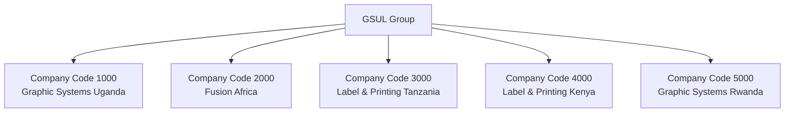

## **2.2 Plant and Location Structure**

Plants represent physical manufacturing and administrative locations where business operations are conducted. Each plant is assigned to a company code and serves specific operational functions.

### **2.2.1 Plant Configuration by Company Code**

**Graphic Systems (U) Limited (1000):**

| **Plant** | **Plant Description** | **Location** | **Plant Type** | **Primary Operations**                      |
| --------- | --------------------- | ------------ | -------------- | ------------------------------------------- |
| 1100      | Corporate Office      | Luzira       | Administrative | Administration, Sales, Finance              |
| 1200      | Luzira Plant          | Luzira       | Manufacturing  | Offset, Digital, Large Format Printing      |
| 1300      | LIPA I Plant          | LIPA         | Manufacturing  | Gravure,Pouching, Flexographic, Letterpress |
| 1400      | Namanve Plant         | Namanve      | Manufacturing  | Cello Tape,Core, PE/PVC Extrusion           |

**Fusion Africa Limited (2000):**

| **Plant** | **Plant Description** | **Location** | **Plant Type** | **Primary Operations**            |
| --------- | --------------------- | ------------ | -------------- | --------------------------------- |
| 2100      | Corporate Office      | Luzira       | Administrative | Administration, Sales, Finance    |
| 2200      | Lipa III Plant        | Lipa         | Manufacturing  | Garment Manufacturing, Embroidery |

**Regional Operations:**

| **Plant** | **Plant Description**                | **Company Code** | **Primary Operations** |
| --------- | ------------------------------------ | ---------------- | ---------------------- |
| 3100      | Label & Printing Systems (T) Limited | 3000             | Trading                |
| 4100      | Label & Printing Systems (K) Limited | 4000             | Trading                |
| 5100      | Graphic Systems (R) Ltd              | 5000             | Trading                |

### **2.2.2 Manufacturing Capabilities by Plant**

**Luzira Plant (1200) - Graphics Production:**

- Offset Printing: Commercial jobs, brochures, books
- Digital Printing: Short runs, variable data printing
- Large Format Printing: Banners, posters, signage

**LIPA I Plant (1300) - Printing & flexiable Packaging:**

- Gravure Printing: High-volume flexible packaging
- Flexographic Printing: Labels, flexible packaging
- Letterpress Printing: Labels, security printing
- Lamination: Multi-layer packaging materials
- Pouching Manufacturing

**Namanve Plant (1400) - Extrusion Operations:**

- Core Manufacturing
- Cello Tape Manufacturing: Adhesive tape production
- PVC Extrusion: Rigid and flexible PVC products
- LD Extrusion: Low-density polyethylene products

**LIPA III Plant (2200) - Garment Operations:**

- Cutting: Fabric cutting operations
- Stitching: Garment assembly
- Embroidery: Decorative embroidery services
- Printing & Sublimation: Textile printing
- Packing: Final garment packaging

## **2.3 Storage Location Strategy**

Storage locations are configured to support specific operational requirements and inventory management needs across all manufacturing plants.

### **2.3.1 Luzira Plant (1200) Storage Locations**

| Storage Location | Description       | Purpose                    | Material Types      | GSUL Proposed |
| :--------------- | ----------------- | -------------------------- | ------------------- | ------------- |
| LU02             | Lz  Central Store | Paper, Inks, Chemicals     | Films, Papers, Inks | Lz01          |
| LU03             | Lz Chemical       | Chemicals, Solvents        | Chemicals           | Lz02          |
| LU04             | Lz FGs            | Finished Goods             | Finished Goods      | Lz03          |
| LU05             | LZ Prepress       |                            | WIP, Consumables    | Lz04          |
| LU06             | PF Offset         | WIP & Production Materials | WIP, Consumables    | Lz05          |
| LU07             | PF Digital        | WIP & Production Materials | WIP, Consumables    | Lz06          |
| LU08             | PF LargeFormat    | WIP & Production Materials | WIP, Consumables    | Lz07          |
| LU09             | LZ Maintenance    | Critical Parts             | Spare Parts         | Lz08          |
| LU10             | LZ Diesal Store   | Fuel Storage               |                     | Lz09          |
| LU11             | Lz Allied RM      | Paper                      | Films, Papers       | Lz10          |
| LU12             | Lz  Allied I&C    | Ink & Chemical             | Ink, Chemicals      | Lz11          |

### **2.3.2 LIPA I Plant (1300) Storage Locations**

| **Storage Location** | **Description**    | **Purpose**                | **Material Types**  |      |
| -------------------- | ------------------ | -------------------------- | ------------------- | ---- |
| LI01                 | Central Store      | Raw Material Storage       | Films, Papers, Inks | Li01 |
| LI02                 | LI Inks  and PET   | Raw Material Storage       | Films, Papers, Inks | Li02 |
| LI03                 | Li Chemicals       | Ink & Chemical Storage     | Inks, Chemicals     | Li03 |
| LI04                 | Li FG's            | Finished Products          | Finished Goods      | Li04 |
| LI05                 | Li Prepress        | WIP & Production Materials | WIP, Consumables    | Li05 |
| LI06                 | PF Gravuree        | WIP & Production Materials | WIP, Consumables    | Li06 |
| LI07                 | PF  Lamination     | WIP & Production Materials | WIP, Consumables    | Li07 |
| LI08                 | PF  Pouching       | WIP & Production Materials | WIP, Consumables    | Li08 |
| LI09                 | PF letterpress     | WIP & Production Materials | WIP, Consumables    | Li09 |
| LI10                 | PF Flexographic    | WIP & Production Materials | WIP, Consumables    | Li10 |
| LI11                 | LP & Flx  Toolings |                            |                     | Li11 |
| LI12                 | Li Maintenance     | Critical Components        | Spare Parts         | Li12 |
| LI13                 | Li Diesel Stores   |                            | Fuel                | Li13 |
| LI14                 | Allied RM          | Raw Material Storage       | Films, Papers       | Li14 |
| LI15                 | LI Allied L&C      | Raw Material Storage       | Inks, Chemicals     | Li15 |

### **2.3.3 Namanve Plant (1400) Storage Locations**

| **Storage Location** | **Description**  | **Purpose**                | **Material Types**   | GSUL Proposed |
| -------------------- | ---------------- | -------------------------- | -------------------- | ------------- |
| NA01                 | Nv Central Store | Raw Material Storage       | Polymers, Adhesives  | Nv01          |
| NA02                 | Nv FGs           | Finished Products          | Finished Goods       | Nv02          |
| NA03                 | PF Cello Tape    | WIP & Production Materials | WIP, Consumables     | Nv03          |
| NA04                 | PF Core Making   | WIP & Production Materials | WIP, Consumables     | Nv04          |
| NA05                 | PF PVC Extrusion | WIP & Production Materials | WIP, Consumables     | Nv05          |
| NA06                 | PF LD Extrusion  | WIP & Production Materials | WIP, Consumables     | Nv06          |
| NA07                 | Nv Maintenance   | Critical Components        | Spare Parts          | Nv07          |
| NB01                 | Nv Diesel        | Consignment Stock          | Customer Consignment | Nv08          |

### **2.3.4 LIPA III Plant (2200) Storage Locations**

| **Storage Location** | **Description**  | **Purpose**          | **Material Types** | GSUL Proposed |
| -------------------- | ---------------- | -------------------- | ------------------ | ------------- |
| FU02                 | Fu Central Store | Raw Material Storage | Fabrics, Threads   | Fu01          |
| FU03                 | Fu FGs Store     | Finished Products    | Finished Goods     | Fu02          |
| FU04                 | Fu Maintenance   | Critical Components  | Spare Parts        | Fu03          |
| FU05                 | PF Garmenting    | WIP & Materials      | WIP, Consumables   | Fu04          |


### 2.3.5 LPST Plant (4100) Storage Locations (To be finalized)

| **Storage Location** | **Description**  | **Purpose**          | **Material Types** | GSUL Proposed |
| -------------------- | ---------------- | -------------------- | ------------------ | ------------- |
| TZ01                 | Tz Central Store | Raw Material Storage | Finished Goods     | Tz01          |
| TZ02                 | Arusha FGs Store | Finished Products    | Finished Goods     | Tz02          |
| TZ03                 | Mwanza FGs Store | Critical Components  | Spare Parts        | Tz03          |
| TZ04                 | Mbuya FGs Store  | WIP & Materials      | WIP, Consumables   | Tz04          |

### 2.3.6 LPSK Plant (3100) Storage Locations

| **Storage Location** | **Description**  | **Purpose**          | **Material Types** | GSUL Proposed |
| -------------------- | ---------------- | -------------------- | ------------------ | ------------- |
| KN01                 | Ke Central Store | Raw Material Storage | Finished Goods     | Ke01          |


### 2.3.7 GSRL Plant (5100) Storage Locations

| **Storage Location** | **Description**  | **Purpose**          | **Material Types** | GSUL Proposed |
| -------------------- | ---------------- | -------------------- | ------------------ | ------------- |
| RW01                 | Rw Central Store | Raw Material Storage | Finished Goods     | Rw01          |


### **2.4 Purchasing and Sales Organization Structure**

### **2.4.1 Purchasing Organization Structure**

Each company code operates with its own purchasing organization to maintain legal procurement responsibilities and local supplier relationships.

| **Purchasing Organization** | **Company Code** | **Description**                      | **Procurement Focus**          |
| --------------------------- | ---------------- | ------------------------------------ | ------------------------------ |
| 1000                        | 1000             | Graphic Systems (U) Limited          | Graphics materials, equipment  |
| 2000                        | 2000             | Fusion Africa Limited                | Textile materials, accessories |
| 3000                        | 3000             | Label & Printing Systems (T) Limited | Intercompany & Local           |
| 4000                        | 4000             | Label & Printing Systems (K) Limited | Intercompany & Local           |
| 5000                        | 5000             | Graphic Systems (R) Ltd              | Intercompany & Local           |

### **2.4.2 Sales Organization Structure**

Sales organizations align with company codes to manage customer relationships and sales operations within each legal entity.

| **Sales Organization** | **Company Code** | **Description**                      | **Market Focus**       |
| ---------------------- | ---------------- | ------------------------------------ | ---------------------- |
| 1000                   | 1000             | Graphic Systems (U) Limited          | Uganda graphics market |
| 2000                   | 2000             | Fusion Africa Limited                | Uganda textile market  |
| 3000                   | 3000             | Label & Printing Systems (T) Limited | Tanzania market        |
| 4000                   | 4000             | Label & Printing Systems (K) Limited | Kenya market           |
| 5000                   | 5000             | Graphic Systems (R) Ltd              | Rwanda market          |

### **2.4.3 Distribution Channels**

| **Distribution Channel** | **Description** | **Usage**                         |
| ------------------------ | --------------- | --------------------------------- |
| 10                       | Domestic Sales  | Local market sales within country |
| 20                       | Export Sales    | International sales and exports   |

### **2.4.4 Division Structure**

Divisions represent product lines and business segments across the organization.

| **Division** | **Description**      | **Product Categories**            | **Primary Plants** |
| ------------ | -------------------- | --------------------------------- | ------------------ |
| 00           | Common Customer      | Cross-division customers          | All Plants         |
| 01           | Offset Line          | Offset printing products          | 1200               |
| 02           | Digital Line         | Digital printing products         | 1200               |
| 03           | Large Format Line    | Large format printing products    | 1200               |
| 04           | Gravure Line         | Gravure printing products         | 1300               |
| 05           | Flexographic Line    | Flexographic printing products    | 1300               |
| 06           | Letterpress Line     | Letterpress printing products     | 1300               |
| 07           | Lamination Line      | Lamination products               | 1300               |
| 08           | Pouching Line        | Pouching Line                     | 1300               |
| 09           | Cello Tape Line      | Adhesive tape products            | 1400               |
| 10           | Core Making          | Core Making                       | 1400               |
| 11           | PVC Extrusion Line   | PVC extrusion products            | 1400               |
| 12           | LD Extrusion Line    | Low-density polyethylene products | 1400               |
| 13           | Promotional Line     | Promotional items                 | 2200               |
| 14           | Garmenting Line      | Garment manufacturing             | 2200               |
| 15           | Outsources & Trading | Trading and outsourced products   | All Plants         |

## **2.5 Controlling Area and Profit Center Configuration**

### **2.5.1 Controlling Area Configuration**

A single controlling area enables integrated cost accounting and management reporting across all company codes.

| **Controlling Area** | **Description**        | **Operating Chart of Accounts** | **Fiscal Year Variant** | **Company Codes Assigned**   |
| -------------------- | ---------------------- | ------------------------------- | ----------------------- | ---------------------------- |
| A000                 | GSUL Group Controlling | YCOA                            | K4                      | 1000, 2000, 3000, 4000, 5000 |

**Controlling Area Benefits:**

- Unified cost accounting across all entities
- Integrated planning and budgeting
- Cross-company cost allocation
- Consolidated management reporting
- Intercompany cost transfers

### **2.5.2 Profit Center Structure**

Profit centers enable performance evaluation of individual business areas and operational units.

**Graphic Systems (U) Limited (1000):**

| **Profit Center** | **Description**       | **Business Focus**                   | **Physical Location** |
| ----------------- | --------------------- | ------------------------------------ | --------------------- |
| 1100              | Corporate Office      | Administration, Finance              | Luzira                |
| 1200              | Luzira Profit Center  | Offset, Digital, Large Format        | Luzira                |
| 1300              | LIPA I Profit Center  | Gravure,Pouching, Flexo, Letterpress | LIPA                  |
| 1400              | Namanve Profit Center | Core,Cello Tape, Extrusion           | Namanve               |

**Fusion Africa Limited (2000):**

| **Profit Center** | **Description**        | **Business Focus**                      | **Physical Location** |
| ----------------- | ---------------------- | --------------------------------------- | --------------------- |
| 2100              | Corporate Office       | Administration, Finance                 | Luzira                |
| 2200              | LIPA III Profit Center | Garments, Promotional Items, Embroidery | LIPA                  |

**Regional Operations:**

| **Profit Center** | **Company Code** | **Description**                      | **Business Focus** |
| ----------------- | ---------------- | ------------------------------------ | ------------------ |
| 3100              | 3000             | Label & Printing Systems (T) Limited | Trading            |
| 4100              | 4000             | Label & Printing Systems (K) Limited | Trading            |
| 5100              | 5000             | Graphic Systems (R) Ltd              | Trading            |

## **2.6 Currency Management and Exchange Rates**

### **2.6.1 Local Currency Configuration**

Each company code operates with its local currency for day-to-day transactions while maintaining group reporting in USD.

| **Company Code** | **Local Currency** | **Currency Description** | **Decimal Places** |
| ---------------- | ------------------ | ------------------------ | ------------------ |
| 1000             | UGX                | Uganda Shilling          | 0                  |
| 2000             | UGX                | Uganda Shilling          | 0                  |
| 3000             | TZS                | Tanzanian Shilling       | 0                  |
| 4000             | KES                | Kenyan Shilling          | 2                  |
| 5000             | RWF                | Rwandan Franc            | 0                  |

**Note:** The decimal place in currency follow the **ISO Standard 4217** specifications in which UGX is having zero decimals and USD is having 2 decimals. And it cant be modify.

**Please refer the SAP note 3492731 for the same.**

### **2.6.2 Group Reporting Currency**

| **Currency** | **Usage**      | **Purpose**                       |
| ------------ | -------------- | --------------------------------- |
| USD          | Group Currency | Consolidation and group reporting |

### **2.6.3 Exchange Rate Management**

**Exchange Rate Types:**

- **M** - Average Rate (monthly average for consolidation)
- **B** - Bank Buying Rate (for purchases)
- **G** - Bank Selling Rate (for sales)

**Exchange Rate Sources:**

- Central Bank rates for each country
- Commercial bank rates for transactions
- Monthly average rates for reporting

## **2.7 Fiscal Year Configuration**

### **2.7.1 Fiscal Year Variant**

Standardized fiscal year configuration across all company codes ensures consistent financial reporting and period-end processing.

| **Fiscal Year Variant** | **Description**                  | **Normal Periods** | **Special Periods** | **Year-End** |
| ----------------------- | -------------------------------- | ------------------ | ------------------- | ------------ |
| K4                      | Calendar Year, 4 Special Periods | 12                 | 4                   | December 31  |

**Period Configuration:**

| **Period** | **From Date** | **To Date**    | **Description** |
| ---------- | ------------- | -------------- | --------------- |
| 001        | January 1     | January 31     | January         |
| 002        | February 1    | February 28/29 | February        |
| 003        | March 1       | March 31       | March           |
| 004        | April 1       | April 30       | April           |
| 005        | May 1         | May 31         | May             |
| 006        | June 1        | June 30        | June            |
| 007        | July 1        | July 31        | July            |
| 008        | August 1      | August 31      | August          |
| 009        | September 1   | September 30   | September       |
| 010        | October 1     | October 31     | October         |
| 011        | November 1    | November 30    | November        |
| 012        | December 1    | December 31    | December        |
| 013        | December 31   | December 31    | Year-end Adj. 1 |
| 014        | December 31   | December 31    | Year-end Adj. 2 |
| 015        | December 31   | December 31    | Year-end Adj. 3 |
| 016        | December 31   | December 31    | Year-end Adj. 4 |

**Special Periods Usage:**

- Period 013: Audit adjustments
- Period 014: Tax adjustments
- Period 015: Consolidation adjustments
- Period 016: Final closing adjustments

### **2.7.2 Posting Period Variants**

| **Posting Period Variant** | **Company Codes** | **Usage**                       |
| -------------------------- | ----------------- | ------------------------------- |
| 0001                       | All               | Standard posting period control |

**Period Control Features:**

- Automatic period determination
- Period-end closing controls
- Special period management
- Cross-period validation


# **3. Finance & Controlling (FICO) Module**

### **3.1.1 Document Purpose**

This Business Blueprint document serves as the definitive guide for GSUL's Finance and Controlling (FICO) module implementation in SAP S/4HANA Public Cloud. It outlines the organization's financial processes and requirements, aligning them with SAP's standard functionalities to design the future system setup. This blueprint acts as a key reference throughout the implementation, mapping current ("AS-IS") operations to the desired ("TO-BE") processes.

The document ensures all stakeholders share a common understanding, guides system configuration and testing, identifies necessary integrations or custom developments, and helps minimize risks—laying the groundwork for a successful SAP deployment.

### **3.1.2 Module Scope**

The FICO module implementation covers the complete financial management lifecycle including:

**Financial Accounting (FI):**

- General Ledger Accounting (Scope Item J58)
- Accounts Receivable Management (Scope Item J59)
- Accounts Payable Management (Scope Item J60)
- Asset Accounting (Scope Item J62)
- Bank Account Management (Scope Item BFA)
- Cash Journal Management (Scope Item 1GO)
- Tax Accounting and EFRIS Integration

**Controlling (CO):**

- Overhead Cost Accounting (Scope Item J54)
- Actual Costing (Scope Item 33Q)
- Margin Analysis (Scope Item J55)
- Financial Planning and Analysis (Scope Item 2FM)
- Profitability Analysis (COPA)

**Advanced Features:**

- Multi-Currency Processing
- Multi-GAAP Reporting (IFRS and Local GAAP)
- Intercompany Financial Posting
- Advanced Financial Closing Integration

------

## **3.2. Finance & Controlling Overview**

### **3.2.1 SAP Finance & Controlling (FICO) Module**

The Finance and Controlling module is the backbone of GSUL's financial operations, providing comprehensive financial management capabilities that ensure accurate financial reporting, effective cost control, and regulatory compliance across all business units.

**Key Activities in FICO:**

- Recording all financial transactions in real-time
- Managing customer and vendor relationships
- Controlling costs and analyzing profitability
- Managing fixed assets and depreciation
- Handling multiple currencies and exchange rates
- Ensuring compliance with local and international accounting standards
- Providing financial reporting and analytics

### **3.2.2 GSUL Financial Management Categories**

GSUL operates with integrated financial processes across multiple entities:

1. **Multi-Entity Financial Accounting**
   - Graphic Systems (U) Limited (Uganda)
   - Fusion Africa Limited (Uganda)
   - Label & Printing Systems (T) Limited (Tanzania)
   - Label & Printing Systems (K) Limited (Kenya)
   - Graphic Systems (R) Ltd (Rwanda)
2. **Cost Management**
   - Production cost tracking
   - Overhead allocation
   - Profitability analysis by product lines
   - Cost center management
3. **Compliance and Reporting**
   - IFRS reporting
   - Local GAAP compliance
   - Tax management and EFRIS integration
   - Multi-currency consolidation

------

## **3.3. Organizational Structure**

- Covered in preceding section (refer point 2.1, 2.5, 2.6, 2.7)

------

## **3.4. Chart of Accounts and Account Management**

### **3.4.1 Chart of Accounts Structure**

Standardized chart of accounts across all company codes:

| **Chart of Accounts** | **COA Length** | **Chart of Accounts Name** | **COA Name Length** | **General Ledger Length** |
| --------------------- | -------------- | -------------------------- | ------------------- | ------------------------- |
| YCOA                  | 8              | GSUL                       | 50                  | Default (8)               |

**Chart of Accounts Features:**

- 8-character account numbers for standardization
- Hierarchical structure supporting financial statement presentation
- Categorized into Balance Sheet, Profit & Loss, and Cash accounts
- Supports both IFRS and Local GAAP reporting requirements

### **3.4.2 Accounting Principles and Ledger Management**

Multi-GAAP support through parallel accounting:

| **Ledger Types** | **Company Codes** | **Ledger Description** | **Accounting Principle** |
| ---------------- | ----------------- | ---------------------- | ------------------------ |
| 0L               | All               | IFRS                   | International Standards  |
| 2L               | All               | Local GAAP             | Local Statutory          |

**Parallel Accounting Benefits:**

- Simultaneous posting to multiple ledgers
- IFRS compliance for international reporting
- Local GAAP compliance for statutory requirements
- Automated document splitting for detailed analysis
- Real-time financial reporting in multiple standards

### **3.4.3 Functional Areas**

Functional areas support cost-of-sales accounting and detailed P&L analysis:

| **Functional Area** | **Name**                       | **Usage**                     |
| ------------------- | ------------------------------ | ----------------------------- |
| YB10                | Sales Revenue                  | Revenue recognition           |
| YB15                | Sales discounts and allowances | Revenue adjustments           |
| YB18                | Cost of Goods Sold             | Direct product costs          |
| YB20                | Production                     | Manufacturing costs           |
| YB25                | Consulting/Services            | Service delivery costs        |
| YB30                | Sales and Distribution         | Sales support costs           |
| YB35                | Marketing                      | Marketing and promotion costs |
| YB40                | Administration                 | Administrative overhead       |
| YB50                | Research & Development         | R&D investments               |
| YB70                | Other gains                    | Miscellaneous income          |
| YB75                | Other expenses                 | Miscellaneous costs           |
| YB77                | Gain from investments          | Investment income             |
| YB79                | Gain from shares & loans       | Financial investments         |
| YB81                | Interest & similar gains       | Interest income               |
| YB83                | Amort.curr.Fin.Assets;Sec      | Financial asset amortization  |
| YB85                | Interest & similar costs       | Interest expenses             |
| YB87                | Extraordinary gain             | Exceptional items             |
| YB89                | Extraordinary expense          | Exceptional costs             |
| YB90                | Taxes from income and rev      | Income tax provisions         |
| YB98                | Other Taxes                    | Various tax obligations       |
| YB99                | Dummy functional area          | System placeholder            |

------

## **3.5. Master Data Configuration**

### **3.5.1 Customer Master Data Management**

#### **3.5.1.1 Customer Account Groups**

| **Account Group** | **Description** | **Number Range**      | **Internal/External** |
| ----------------- | --------------- | --------------------- | --------------------- |
| CUS1              | Sold to Party   | 0001000000-0001999999 | External              |

#### **3.5.1.2 Customer Groups**

**Industry-Based Customer Groups:** 

| **Customer Group** | **Name**                         | **Purpose**                |
| ------------------ | -------------------------------- | -------------------------- |
| BR                 | Breweries                        | Industry classification    |
| BV                 | Beverages                        | Industry classification    |
| CM                 | Cosmetics Industry               | Industry classification    |
| GP                 | Government/Parastatals Agencies  | Government sector clients  |
| HI                 | Hotel Industry                   | Hospitality sector         |
| AA                 | Advertisement Agencies           | Marketing industry         |
| IC                 | Insurance Companies              | Insurance sector           |
| PI                 | Pharmaceutical Industry          | Healthcare sector          |
| NG                 | NGOs                             | Non-profit organizations   |
| EI                 | Educational Institutions         | Education sector           |
| BF                 | Banks and Financial Institutions | Financial services         |
| FM                 | FMCG Industry                    | Fast-moving consumer goods |
| TI                 | Telecommunication Industry       | Telecom sector             |
| OM                 | Other Manufacturing Companies    | General manufacturing      |
| RD                 | Retailers and Distributors       | Retail and distribution    |
| OG                 | Oil & Gas                        | Energy sector              |
| SI                 | Service Industries               | Service providers          |
| CC                 | Construction Companies           | Construction industry      |
| IN                 | Individual                       | Individual customers       |

**Note:** To be finalized

**URA Category-Based Customer Groups:**

| **Customer Group 1** | **Name**  | **Tax Relevance**             |
| -------------------- | --------- | ----------------------------- |
| B2B                  | B2B       | Business to Business          |
| B2G                  | B2G       | Business to Government        |
| B2C                  | B2C       | Business to Consumer          |
| FRG                  | Foreigner | Foreign entity classification |

### **3.5.2 Vendor Master Data Management**

#### **3.5.2.1 Vendor Account Groups**

Similar structure to customer account groups with separate number ranges and reconciliation accounts for different vendor categories.

#### **3.5.2.2 Reconciliation Accounts**

Separate control accounts for different customer and vendor categories to enable detailed financial analysis and reporting.

------

## **3.6. Tax Configuration and EFRIS Integration**

### **3.6.1 Tax Jurisdiction and Legal Framework**

GSUL operates across multiple tax jurisdictions with different tax rates and regulations:

#### **3.6.1.1 Uganda Tax Configuration (Company Codes 1000 & 2000)**

**Input Tax Configuration:**

| **Tax Code** | **Description**          | **Tax Rate** | **Tax Type** | **Calculation Method** |
| ------------ | ------------------------ | ------------ | ------------ | ---------------------- |
| 01           | Input Tax Exempted       | 0%           | VAT          | Net                    |
| 02           | Input Tax (Unregistered) | 0%           | VAT          | Net                    |
| 03           | Input Tax 0%             | 0%           | VAT          | Net                    |
| 04           | Input Tax 18%            | 18%          | VAT          | Net                    |

**Output Tax Configuration:**

| **Tax Code** | **Description**           | **Tax Rate** | **Calculation Method** |
| ------------ | ------------------------- | ------------ | ---------------------- |
| A0           | VAT - Exempt Supplies     | 0%           | Net                    |
| A1           | VAT - Zero Rated Supplies | 0%           | Net                    |
| A2           | VAT - Standard Rate       | 18%          | Net                    |
| A3           | VAT - Deemed              | 18%          | Net                    |

#### **3.6.1.2 Tanzania Tax Configuration (Company Code 3000)**

**Input Tax Configuration:**

| **Tax Code** | **Description**          | **Tax Rate** | **Tax Type** | **Calculation Method** |
| ------------ | ------------------------ | ------------ | ------------ | ---------------------- |
| 01           | Input Tax Exempted       | 0%           | VAT          | Net                    |
| 02           | Input Tax (Unregistered) | 0%           | VAT          | Net                    |
| 03           | Input Tax 0%             | 0%           | VAT          | Net                    |
| 04           | Input Tax 18%            | 18%          | VAT          | Net                    |

**Output Tax Configuration:**

| **Tax Code** | **Description**           | **Tax Rate** | **Calculation Method** |
| ------------ | ------------------------- | ------------ | ---------------------- |
| A0           | VAT - Exempt Supplies     | 0%           | Net                    |
| AU           | Output Tax (Unregistered) | 0%           | Net                    |
| A1           | VAT - Zero Rated Supplies | 0%           | Net                    |
| A2           | VAT - Standard Rate       | 18%          | Net                    |

#### **3.6.1.3 Kenya Tax Configuration (Company Code 4000)**

**Input Tax Configuration:**

| **Tax Code** | **Description**          | **Tax Rate** | **Tax Type** | **Calculation Method** |
| ------------ | ------------------------ | ------------ | ------------ | ---------------------- |
| 01           | Input Tax Exempted       | 0%           | VAT          | Net                    |
| 02           | Input Tax (Unregistered) | 0%           | VAT          | Net                    |
| 03           | Input Tax 0%             | 0%           | VAT          | Net                    |
| 04           | Input Tax 16%            | 16%          | VAT          | Net                    |

**Output Tax Configuration:**

| **Tax Code** | **Description**           | **Tax Rate** | **Calculation Method** |
| ------------ | ------------------------- | ------------ | ---------------------- |
| A0           | Output Tax Exempt         | 0%           | Net                    |
| AU           | Output Tax (Unregistered) | 0%           | Net                    |
| A1           | Output Tax 0%             | 0%           | Net                    |
| A2           | Output 16%                | 16%          | Net                    |

#### **3.6.1.4 Rwanda Tax Configuration (Company Code 5000)**

**Input Tax Configuration:**

| **Tax Code** | **Description**          | **Tax Rate** | **Tax Type** | **Calculation Method** |
| ------------ | ------------------------ | ------------ | ------------ | ---------------------- |
| 01           | Input Tax Exempted       | 0%           | VAT          | Net                    |
| 02           | Input Tax (Unregistered) | 0%           | VAT          | Net                    |
| 03           | Input Tax 0%             | 0%           | VAT          | Net                    |
| 04           | Input Tax 18%            | 18%          | VAT          | Net                    |

**Output Tax Configuration:**

| **Tax Code** | **Description**           | **Tax Rate** | **Calculation Method** |
| ------------ | ------------------------- | ------------ | ---------------------- |
| A0           | Output Tax Exempt         | 0%           | Net                    |
| AU           | Output Tax (Unregistered) | 0%           | Net                    |
| A1           | Output Tax 0%             | 0%           | Net                    |
| A2           | Output 18%                | 18%          | Net                    |

### **3.6.2 Withholding Tax Configuration**

#### **3.6.2.1 Withholding Tax Types**

| **Country** | **WHT Type Code** | **Description**               | **Types** |
| ----------- | ----------------- | ----------------------------- | --------- |
| UG          | W0                | WHT 0%                        | Payment   |
| UG          | W1                | WHT Goods and Services Normal | Payment   |
| UG          | W2                | WHT Import of Services        | Payment   |
| UG          | W3                | WHT Interest                  | Payment   |
| TZ          | W0                | WHT 0%                        | Payment   |
| TZ          | W1                | WHT Supplies Normal           | Payment   |
| TZ          | W2                | WHT Services Normal           | Payment   |
| RW          | W0                | WHT 0%                        | Payment   |
| RW          | W1                | WHT Supplies Normal           | Payment   |
| RW          | W2                | WHT Services Normal           | Payment   |
| KE          | W0                | WHT 0%                        | Payment   |
| KE          | W1                | WHT Supplies Normal           | Payment   |
| KE          | W2                | WHT Services Normal           | Payment   |

#### **3.6.2.2 Withholding Tax Codes**

**Uganda (Company Codes 1000 & 2000):**

| **WHT Type** | **WHT Code** | **Percentage** | **Description**           |
| ------------ | ------------ | -------------- | ------------------------- |
| W0           | 01           | 0.00%          | WHT of 0% - Exemption     |
| W1           | 01           | 6.00%          | WHT of 6% Normal          |
| W1           | 02           | 6.00%          | WHT 6% - VAT              |
| W2           | 01           | 10.00%         | WHT 10% - Import Services |
| W2           | 02           | 15.00%         | WHT 15% - Import Services |
| W3           | 01           | 10.00%         | WHT 10% - Interest        |
| W3           | 02           | 15.00%         | WHT 15% - Interest        |

**Tanzania (Company Code 3000):**

| **WHT Type** | **WHT Code** | **Percentage** | **Description**       |
| ------------ | ------------ | -------------- | --------------------- |
| W0           | 01           | 0.00%          | WHT of 0% - Exemption |
| W2           | 02           | 5.00%          | VAT WHT 5%            |

**Kenya (Company Code 4000):**

| **WHT Type** | **WHT Code** | **Percentage** | **Description**            |
| ------------ | ------------ | -------------- | -------------------------- |
| W0           | 01           | 0.00%          | WHT of 0% - Exemption      |
| W2           | 01           | 5.00%          | WHT of 5% Normal for Filer |
| W3           | 01           | 2.00%          | WHT of 2% Normal for Filer |

**Rwanda (Company Code 5000):**

| **WHT Type** | **WHT Code** | **Percentage** | **Description**       |
| ------------ | ------------ | -------------- | --------------------- |
| W0           | 01           | 0.00%          | WHT of 0% - Exemption |

### **3.6.3 EFRIS Integration (Uganda Only)**

Electronic Fiscal Receipting and Invoicing Solution integration for Uganda Revenue Authority compliance:

**EFRIS Integration Scope:**

- Applicable only for Uganda company codes (1000 & 2000)
- Real-time invoice submission to URA
- Electronic signature validation
- Automated tax compliance reporting
- Credit memo and debit memo processing
- Direct customer invoice integration

**EFRIS Process Flow:**

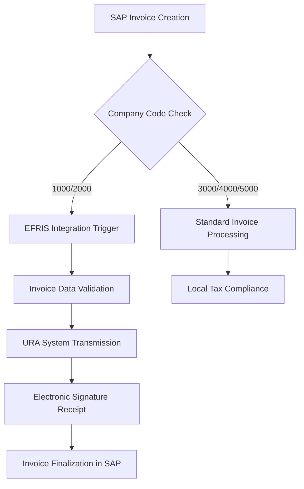

------

## **3.7. Payment Methods and Cash Management**

### **3.7.1 Payment Methods Configuration**

Standardized payment methods across all company codes:

| **Method Code** | **Description** | **Usage**                        |
| --------------- | --------------- | -------------------------------- |
| C               | Cheque          | URA Payment                      |
| T               | Bank Transfer   | Operational Payment              |
| E               | Direct Debit    | Recurring payments, bank charges |
| M               | Digital Payment | Airtel/MTN Mobile Money Payments |
| I               | Credit Card     | Online Subscription              |
| Z               | Cash Payment    | Cash Payment                     |

### **3.7.2 House Bank Configuration**

Comprehensive banking setup for multi-country operations:

#### **3.7.2.1 Uganda Banks (Company Codes 1000 & 2000)**

**GSUL Banking Relationships:**

| **Bank**    | **Account Description** | **Currency** | **Account Type** | **Account Number** |
| ----------- | ----------------------- | ------------ | ---------------- | ------------------ |
| ABSA        | ABSA UGX A/C            | UGX          | Current          | 0341447100         |
| ABSA        | ABSA USD A/C            | USD          | Current          | 0344232490         |
| ABSA        | ABSA EURO A/C           | EUR          | Current          | 6001542646         |
| Stanbic     | Stanbic UGX A/C         | UGX          | Current          | 9030005614448      |
| Stanbic     | Stanbic USD A/C         | USD          | Current          | 9030008175941      |
| DTB         | DTB UGX A/C             | UGX          | Current          | 0103740040         |
| DTB         | DTB USD A/C             | USD          | Current          | 0103740041         |
| DTB         | DTB KES A/C             | KES          | Current          | 0103740002         |
| DFCU        | DFCU UGX A/C            | UGX          | Current          | 01983501008957     |
| DFCU        | DFCU USD A/C            | USD          | Current          | 02413615680102     |
| KCB         | KCB UGX A/C             | UGX          | Current          | 2201201986         |
| KCB         | KCB USD A/C             | USD          | Current          | 2201201994         |
| Centenary   | Centenary UGX A/C       | UGX          | Current          | 3100004762         |
| BOB         | BOB UGX A/C             | UGX          | Current          | 95010200002133     |
| BOB         | BOB USD A/C             | USD          | Current          | 95010200002134     |
| BOA         | BOA UGX A/C             | UGX          | Current          | 10205267018        |
| Eco         | Eco UGX A/C             | UGX          | Current          | 95010200002133     |
| I&M         | I&M UGX A/C             | UGX          | Current          | 50257991001        |
| I&M         | I&M USD A/C             | USD          | Current          | 50257991002        |
| Equity      | Equity UGX A/C          | UGX          | Current          | 1001201035792      |
| Opportunity | Opportunity UGX A/C     | UGX          | Current          | 1325501090182      |

**Fusion Banking Relationships:**

| **Bank** | **Account Description** | **Currency** | **Account Type** | **Account Number** |
| -------- | ----------------------- | ------------ | ---------------- | ------------------ |
| ABSA     | ABSA UGX A/C            | UGX          | Current          | 6007234927         |
| ABSA     | ABSA USD A/C            | USD          | Current          | 6007234919         |
| ABSA     | ABSA EURO A/C           | EUR          | Current          | 6008163446         |
| DTB      | DTB UGX A/C             | UGX          | Current          | 0504998998         |
| DTB      | DTB USD A/C             | USD          | Current          | 0504998999         |
| DTB      | DTB KES A/C             | KES          | Current          | 0504998003         |
| DFCU     | DFCU UGX A/C            | UGX          | Current          | 01363618534433     |
| DFCU     | DFCU USD A/C            | USD          | Current          | 02363618534460     |
| EXIM     | EXIM UGX A/C            | UGX          | Current          | 8400000077         |

#### **3.7.2.2 Regional Banks (Company Codes 3000, 4000, 5000)**

**Tanzania (LPST):**

| **Bank** | **Account Description** | **Currency** | **Account Type** | **Account Number** |
| -------- | ----------------------- | ------------ | ---------------- | ------------------ |
| DTB      | DTB TZS A/C             | TZS          | Current          | 0009248001         |
| DTB      | DTB USD A/C             | USD          | Current          | 0009248002         |
| Stanbic  | Stanbic TZS A/C         | TZS          | Current          | TBD                |
| Stanbic  | Stanbic USD A/C         | USD          | Current          | TBD                |
| Stanbic  | Stanbic Euro A/C        | EUR          | Current          | TBD                |

**Kenya (LPSK):**

| **Bank** | **Account Description** | **Currency** | **Account Type** | **Account Number** |
| -------- | ----------------------- | ------------ | ---------------- | ------------------ |
| DTB      | DTB KES A/C             | KES          | Current          | 0402350001         |
| DTB      | DTB USD A/C             | USD          | Current          | 0402350002         |
| KCB      | Fixed Deposit KES       | KES          | Deposit          | TBD                |

**Rwanda (GSRL):**

| **Bank**       | **Account Description** | **Currency** | **Account Type** | **Account Number** |
| -------------- | ----------------------- | ------------ | ---------------- | ------------------ |
| Bank of Kigali | Bank of Kigali A/C      | RWF          | Current          | 100001022673       |

### **3.7.3 Cash Journal Management**

Comprehensive cash management across all entities:

#### **3.7.3.1 Cash Journal Configuration**

| **Company** | **Cash Journal** | **Cash Journal Name** | **Currency** |
| ----------- | ---------------- | --------------------- | ------------ |
| GSUL        | 1010             | Main Cash - USD       | USD          |
| GSUL        | 1020             | Petty Cash - USD      | USD          |
| GSUL        | 1030             | Main Cash - UGX       | UGX          |
| GSUL        | 1040             | Petty Cash - UGX      | UGX          |
| GSUL        | 1050             | Digital Cash - UGX    | UGX          |
| FUSION      | 2010             | Main Cash - USD       | USD          |
| FUSION      | 2020             | Petty Cash - USD      | USD          |
| FUSION      | 2030             | Main Cash - UGX       | UGX          |
| FUSION      | 2040             | Petty Cash - UGX      | UGX          |
| FUSION      | 2050             | Digital Cash - UGX    | UGX          |
| LPST        | 3010             | Petty Cash - TZS      | TZS          |
| LPST        | 3020             | Digital Cash - TZS    | TZS          |
| LPSK        | 4010             | Petty Cash - KES      | KSH          |
| LPSK        | 4020             | Digital Cash - KES    | KSH          |
| GSR         | 5010             | Petty Cash - RWF      | RWF          |

#### **3.7.3.2 Business Transaction Types for Cash Journal**

Comprehensive transaction categories for effective cash flow management:

| **Business Transaction Code** | **Business Transaction**      | **Nature** | **Long Text**                 |
| ----------------------------- | ----------------------------- | ---------- | ----------------------------- |
| E                             | Entertainment Exp             | Payment    | Entertainment Exp             |
| C                             | Cash to Bank                  | Payment    | Cash to Bank                  |
| C                             | Bank to Cash                  | Receipt    | Bank to Cash                  |
| E                             | Office Supplies               | Payment    | Office Supplies               |
| C                             | Receipt from Bank             | Receipt    | Receipt from Bank             |
| C                             | Deposit in Bank               | Payment    | Deposit in Bank               |
| E                             | Traveling Expense             | Payment    | Traveling Expense             |
| E                             | Boarding & Lodging            | Payment    | Boarding & Lodging            |
| E                             | Repair & Maintenance          | Payment    | Repair & Maintenance          |
| E                             | Loading & unloading           | Payment    | Loading & unloading           |
| E                             | Postage and Telecom           | Payment    | Postage and Telecom           |
| E                             | Repair & Maintenance Vehicles | Payment    | Repair & Maintenance Vehicles |
| E                             | Salaries & Wages              | Payment    | Salaries & Wages              |
| E                             | Medical Expenses              | Payment    | Medical Expenses              |
| E                             | Rent & Utilities              | Payment    | Rent & Utilities              |
| E                             | Freight Charges               | Payment    | Freight Charges               |
| K                             | Receipt from Vendor           | Receipt    | Receipt from Vendor           |
| D                             | Receipt from Customer         | Receipt    | Receipt from Customer         |
| K                             | Payment to Supplier           | Payment    | Payment to Supplier           |
| E                             | Misc. Expenses                | Payment    | Misc. Expenses                |
| B                             | Transfer FBCJ to FBCJ         | Payment    | Transfer FBCJ to FBCJ         |
| C                             | Receipt FBCJ to FBCJ          | Receipt    | Receipt FBCJ to FBCJ          |
| K                             | Loan to Employees             | Payment    | Loan to Employees             |
| K                             | Advance to Employees          | Payment    | Advance to Employees          |
| K                             | Receipt from IOU              | Receipt    | Receipt from IOU              |
| K                             | Payment for IOU               | Payment    | Payment for IOU               |
| D                             | Receipt for Scrap Sales       | Receipt    | Receipt for Scrap Sales       |
| K                             | Deposit to Mobile Money       | Payment    | Deposit to Mobile Money       |
| K                             | Receipt from Mobile Money     | Receipt    | Receipt from Mobile Money     |
| K                             | Receipt from Employee         | Receipt    | Receipt from Employee         |

### **3.7.4 Payment Terms Configuration**

Standardized payment terms for efficient cash flow management:

#### **3.7.4.1 Supplier Payment Terms**

| **Code** | **Payment Term Details** | **Baseline Date Method** | **Account Type** |
| -------- | ------------------------ | ------------------------ | ---------------- |
| ZK01     | 7 Days                   | Document Date            | Supplier         |
| ZK02     | 15 Days                  | Document Date            | Supplier         |
| ZK03     | 30 Days                  | Document Date            | Supplier         |
| ZK04     | 45 Days                  | Document Date            | Supplier         |
| ZK05     | 60 Days                  | Document Date            | Supplier         |
| ZK06     | 90 Days                  | Document Date            | Supplier         |
| ZK07     | 120 Days                 | Document Date            | Supplier         |
| ZK08     | 180 Days                 | Document Date            | Supplier         |
| ZK09     | Cash on Delivery         | Document Date            | Supplier         |

#### **3.7.4.2 Customer Payment Terms**

| **Code** | **Payment Term Details** | **Baseline Date Method** | **Account Type** |
| -------- | ------------------------ | ------------------------ | ---------------- |
| ZD01     | 7 Days                   | Document Date            | Customer         |
| ZD02     | 10 Days                  | Document Date            | Customer         |
| ZD03     | 15 Days                  | Document Date            | Customer         |
| ZD04     | 20 Days                  | Document Date            | Customer         |
| ZD05     | 30 Days                  | Document Date            | Customer         |
| ZD06     | 40 Days                  | Document Date            | Customer         |
| ZD07     | 45 Days                  | Document Date            | Customer         |
| ZD08     | 50 Days                  | Document Date            | Customer         |
| ZD09     | 55 Days                  | Document Date            | Customer         |
| ZD10     | 60 Days                  | Document Date            | Customer         |
| ZD11     | 70 Days                  | Document Date            | Customer         |
| ZD12     | 75 Days                  | Document Date            | Customer         |
| ZD13     | 90 Days                  | Document Date            | Customer         |
| ZD14     | 105 Days                 | Document Date            | Customer         |
| ZD15     | 120 Days                 | Document Date            | Customer         |
| ZD16     | 135 Days                 | Document Date            | Customer         |
| ZD17     | 155 Days                 | Document Date            | Customer         |
| ZD18     | Cash on Delivery         | Document Date            | Customer         |

------

## **3.8. Asset Accounting and Fixed Asset Management**

### **3.8.1 Chart of Depreciation**

Standardized depreciation framework across all company codes:

| **Chart of Depreciation** | **Description**              |
| ------------------------- | ---------------------------- |
| Default                   | Chart of Depreciation - GSUL |

### **3.8.2 Depreciation Areas**

Multi-book depreciation for different reporting requirements:

| **Depreciation Area** | **Short Name** | **Name of Depreciation Area** | **Purpose**             |
| --------------------- | -------------- | ----------------------------- | ----------------------- |
| 1                     | Book Dep.      | Book Depreciation Area        | Financial reporting     |
| 15                    | Tax Dep.       | Tax Depreciation Area         | Tax compliance          |
| 30                    | Group Dep.     | Group Depreciation Area       | Consolidation reporting |

### **3.8.3 Asset Classes Configuration**

Comprehensive asset classification for different types of fixed assets:

| **Asset Class** | **Asset Class Description** | **Status of AUC** | **Depreciation Applicable** |
| --------------- | --------------------------- | ----------------- | --------------------------- |
| Default         | Freehold Land               | Main Asset Class  | No                          |
| Default         | Leasehold Land              | Main Asset Class  | No                          |
| Default         | Building                    | Main Asset Class  | Yes                         |
| Default         | Plant and Machinery         | Main Asset Class  | Yes                         |
| Default         | Office Equipment            | Main Asset Class  | Yes                         |
| Default         | Computer Equipment          | Main Asset Class  | Yes                         |
| Default         | Vehicles                    | Main Asset Class  | Yes                         |
| Default         | Furniture and Fixtures      | Main Asset Class  | Yes                         |
| Default         | Intangible Asset            | Main Asset Class  | Yes                         |
| Default         | Leasehold Improvement       | Main Asset Class  | Yes                         |
| Default         | Freehold Land - CWIP        | CWIP              | No                          |
| Default         | Building - CWIP             | CWIP              | No                          |
| Default         | Plant and Machinery - CWIP  | CWIP              | No                          |
| Default         | Intangible Asset - CWIP     | CWIP              | No                          |

### **3.8.4 Depreciation Policy**

Standardized depreciation calculation methods ensuring compliance and consistency:

| **Depreciation Policy**                               | **None** | **Full** |
| ----------------------------------------------------- | -------- | -------- |
| Depreciation in the month of Acquisition - Book Depr. | -        | ✓        |
| Depreciation in the month of Disposal - Book Depr.    | ✓        | -        |
| Depreciation in the month of Acquisition - Tax Depr.  | -        | ✓        |
| Depreciation in the month of Disposal - Tax Depr.     | ✓        | -        |

### **3.8.5 Depreciation Keys and Methods**

Detailed depreciation configuration for different asset categories and reporting requirements:

#### **3.8.5.1 Book Depreciation**

| **Asset Class**        | **Depreciation Key** | **Method**       | **Useful Life** | **Rate** |
| ---------------------- | -------------------- | ---------------- | --------------- | -------- |
| Freehold Land          | 0000                 | No Depreciation  | 0               | 0%       |
| Leasehold Land         | 0000                 | No Depreciation  | 0               | 0%       |
| Leasehold Improvement  | AD02                 | Reducing Balance | 0               | 4%       |
| Factory Building       | AD02                 | Reducing Balance | 0               | 4%       |
| Plant and Machinery    | AD03                 | Reducing Balance | 0               | 15%      |
| Office Equipment       | AD04                 | Reducing Balance | 0               | 20%      |
| Computer Equipment     | AD04                 | Reducing Balance | 0               | 25%      |
| Vehicles               | AD05                 | Reducing Balance | 0               | 25%      |
| Furniture and Fixtures | AD03                 | Reducing Balance | 0               | 15%      |
| Intangible Asset       | AD04                 | Reducing Balance | 0               | 25%      |

#### **3.8.5.2 Tax Depreciation**

| **Asset Class**        | **Depreciation Key** | **Method**       | **Useful Life** | **Rate** |
| ---------------------- | -------------------- | ---------------- | --------------- | -------- |
| Freehold Land          | 0000                 | No Depreciation  | 0               | 0%       |
| Leasehold Land         | 0000                 | No Depreciation  | 0               | 0%       |
| Leasehold Improvement  | TD02                 | Reducing Balance | 0               | 5%       |
| Factory Building       | TD02                 | Reducing Balance | 0               | 5%       |
| Plant and Machinery    | TD04                 | Reducing Balance | 0               | 30%      |
| Office Equipment       | TD03                 | Reducing Balance | 0               | 20%      |
| Computer Equipment     | TD06                 | Reducing Balance | 0               | 40%      |
| Vehicles               | TD03                 | Reducing Balance | 0               | 20%      |
| Furniture and Fixtures | TD03                 | Reducing Balance | 0               | 20%      |
| Intangible Asset       | TD05                 | Reducing Balance | 0               | 25%      |

#### **3.8.5.3 Group Depreciation (IFRS)**

| **Asset Class**        | **Depreciation Key** | **Method**           | **Useful Life** | **Rate** |
| ---------------------- | -------------------- | -------------------- | --------------- | -------- |
| Freehold Land          | 0000                 | No Depreciation      | 0               | 0%       |
| Leasehold Land         | 0000                 | No Depreciation      | 0               | 0%       |
| Leasehold Improvement  | 0000                 | Straight Line Method | 0               | 0%       |
| Factory Building       | GR04                 | Straight Line Method | 20              | 0%       |
| Plant and Machinery    | GR03                 | Straight Line Method | 10              | 0%       |
| Office Equipment       | GR02                 | Straight Line Method | 5               | 0%       |
| Computer Equipment     | GR01                 | Straight Line Method | 3               | 0%       |
| Vehicles               | GR02                 | Straight Line Method | 5               | 0%       |
| Furniture and Fixtures | GR02                 | Straight Line Method | 5               | 0%       |
| Intangible Asset       | GR01                 | Straight Line Method | 3               | 0%       |

### **3.8.6 Asset Location Management**

Detailed asset location tracking for better asset management and maintenance:

**Selected Asset Locations for Plant 1000:**

| **Asset Location Code** | **Asset Location Description**        |
| ----------------------- | ------------------------------------- |
| P0000001                | Allied- Stores                        |
| P0000002                | LIPA 1- Common                        |
| P0000003                | LIPA 1- Flexo/Letter Press Production |
| P0000004                | LIPA 1- Gravure Production            |
| P0000005                | LIPA 1- Laminates                     |
| P0000006                | LIPA 1- Maintenance                   |
| P0000007                | LIPA 1- Power                         |
| P0000008                | LIPA 1- Prepress                      |
| P0000009                | LIPA 1- Quality                       |
| P0000010                | LIPA 1- Stores                        |
| P0000011                | LIPA 1- Utilities                     |
| P0000012                | Luzira-Common                         |
| P0000013                | Luzira- Digital                       |
| P0000014                | Luzira- Envelops                      |
| P0000015                | Luzira- Large Format                  |
| P0000016                | Luzira- Maintenance                   |
| P0000017                | Luzira- Offset Production             |
| P0000018                | Luzira- Pre Press                     |
| P0000019                | Luzira- Power                         |
| P0000020                | Luzira- Quality                       |
| P0000021                | Luzira- Stores                        |
| P0000022                | Luzira- Utilities                     |
| P0000023                | Luzira- Accounts                      |
| P0000024                | Marketing -Commercial                 |
| P0000025                | Marketing -Flexible                   |
| P0000026                | Marketing -Industrial                 |
| P0000027                | Namanve-Common                        |
| P0000028                | Namanve- Cello-Tape                   |
| P0000029                | Namanve- Core Making                  |
| P0000030                | Namanve- LD Extrusion                 |
| P0000031                | Namanve- Maintenance                  |
| P0000032                | Namanve- Power                        |
| P0000033                | Namanve- PVC Extrusion                |
| P0000034                | Namanve- Quality                      |
| P0000035                | Namanve- Stores                       |
| P0000036                | Namanve- Utilities                    |
| P0000037                | LIPA 2                                |
| P0000038                | Metro Warehouse                       |
| P0000039                | Blue-Wave Plot-1                      |
| P0000040                | Blue-Wave Plot-2                      |

**Note:** To be finalized

------

## **3.9. Cost Accounting and Controlling**

### **3.9.1 Cost Center Management**

Comprehensive cost center structure supporting detailed cost tracking and analysis across all business operations:

#### **3.9.1.1 Cost Center Hierarchy**

**GSUL Cost Centers (Company Code 1000):**

| **Main Group** | **Subgroup**                 | **Cost Center** | **Name**        | **Activity Types** |
| -------------- | ---------------------------- | --------------- | --------------- | ------------------ |
| Luzira         | Quality                      | 12100040        | Quality         | AT05               |
| Luzira         | Offset Printing              | 12101010        | Pre-press       | AT01 - AT05        |
| Luzira         | Offset Printing              | 12101020        | Printing        | AT01 - AT05        |
| Luzira         | Offset Printing              | 12101130        | Post-press      | AT01 - AT05        |
| Luzira         | Digital Printing             | 12101110        | Pre-press       | AT01 - AT05        |
| Luzira         | Digital Printing             | 12101120        | Printing        | AT01 - AT05        |
| Luzira         | Digital Printing             | 12101130        | Post-press      | AT01 - AT05        |
| Luzira         | Large Format Printing        | 12101210        | Pre-press       | AT01 - AT05        |
| Luzira         | Large Format Printing        | 12101220        | Printing        | AT01 - AT05        |
| Luzira         | Large Format Printing        | 12101230        | Post-press      | AT01 - AT05        |
| LIPA I         | Quality                      | 13100040        | Quality         | AT05               |
| LIPA I         | Gravure and Lamination       | 13101010        | Pre-press       | AT01 - AT05        |
| LIPA I         | Gravure and Lamination       | 13101020        | Printing        | AT01 - AT05        |
| LIPA I         | Gravure and Lamination       | 13101030        | Post-press      | AT01 - AT05        |
| LIPA I         | Flexographic and Letterpress | 13101110        | Pre-press       | AT01 - AT05        |
| LIPA I         | Flexographic and Letterpress | 13101120        | Printing        | AT01 - AT05        |
| LIPA I         | Flexographic and Letterpress | 13101130        | Post-press      | AT01 - AT05        |
| Namanve        | Quality                      | 14100040        | Quality         | AT05               |
| Namanve        | Cello Tape                   | 14101010        | Processing      | AT01 - AT05        |
| Namanve        | Cello Tape                   | 14101020        | Post-processing | AT01 - AT05        |
| Namanve        | Core Making                  | 14101110        | Processing      | AT01 - AT05        |
| Namanve        | PVC Extrusion                | 14101210        | Processing      | AT01 - AT05        |
| Namanve        | PVC Extrusion                | 14101220        | Post-processing | AT01 - AT05        |
| Namanve        | LD Extrusion                 | 14101310        | Processing      | AT01 - AT05        |
| Namanve        | LD Extrusion                 | 14101320        | Post-processing | AT01 - AT05        |

**Fusion Cost Centers (Company Code 2000):**

| **Main Group** | **Subgroup**          | **Cost Center** | **Name**                 | **Activity Types** |
| -------------- | --------------------- | --------------- | ------------------------ | ------------------ |
| Fusion         | Quality               | 22100040        | Quality                  | AT05               |
| Fusion         | Luzira III Production | 22101010        | Cutting                  | AT01 - AT05        |
| Fusion         | Luzira III Production | 22101020        | Stitching                | AT01 - AT05        |
| Fusion         | Luzira III Production | 22101030        | Embroidery               | AT01 - AT05        |
| Fusion         | Luzira III Production | 22101040        | Printing and Sublimation | AT01 - AT05        |
| Fusion         | Luzira III Production | 22101050        | Packing                  | AT01 - AT05        |

### **3.9.2 Activity Types Configuration**

Activity types enable accurate cost allocation from cost centers to cost objects:

| **Activity Types Code** | **Name**                   | **Plant** | **Activity UOM** | **Purpose**                     |
| ----------------------- | -------------------------- | --------- | ---------------- | ------------------------------- |
| AT01                    | Electricity consumption    | All       | Hour             | Utility cost allocation         |
| AT02                    | Machine hours              | All       | Hour             | Machine time tracking           |
| AT03                    | Labor hours                | All       | Hour             | Direct labor allocation         |
| AT04                    | Maintenance services       | All       | EA               | Maintenance cost distribution   |
| AT05                    | Quality Assurance services | All       | EA               | Quality control cost allocation |
| AT20                    | External Maintenance       | All       | Hour             | External service cost tracking  |

### **3.9.3 Cost Allocation and Distribution**

#### **3.9.3.1 General Ledger Allocation Cycle**

Automated cost allocation processes for accurate cost distribution:

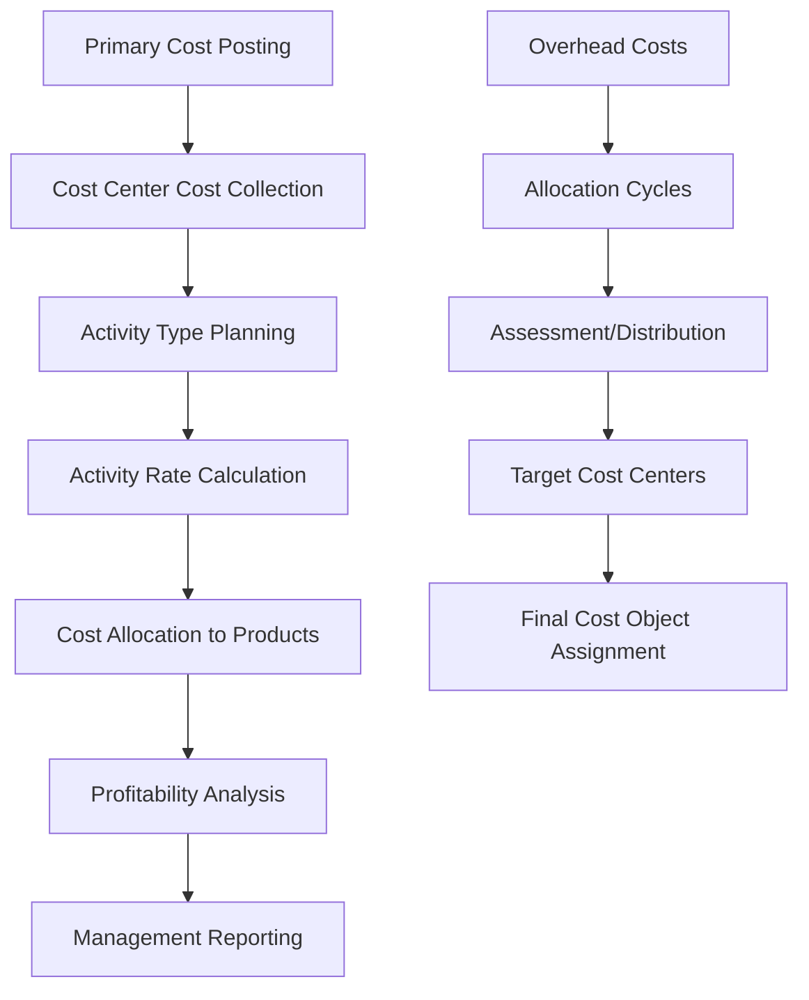

#### **3.9.3.2 Profitability Analysis (COPA)**

**Product Profitability Dimensions:**

- **Customer Groups:** Industry-based and tax-based segmentation
- **Material Groups:** Product line profitability
- **Plant/Profit Center:** Location-based performance
- **Sales Organization:** Channel profitability
- **Product Lines:** Individual product performance

### **3.9.4 Management Accounting and Reporting**

#### **3.9.4.1 Cost Object Controlling**

**Cost Objects Supported:**

- Production Orders
- Sales Orders
- Projects
- Cost Centers
- Profit Centers
- Products/Materials

#### **3.9.4.2 Planning and Budgeting**

**Planning Scope:**

- Cost center budgeting
- Activity type planning
- Resource planning
- Profitability planning
- Cash flow planning

------

## **3.10. Financial Integration and Business Processes**

### **3.10.1 Key Financial Process Flows**

#### **3.10.1.1 Order-to-Cash Financial Integration**

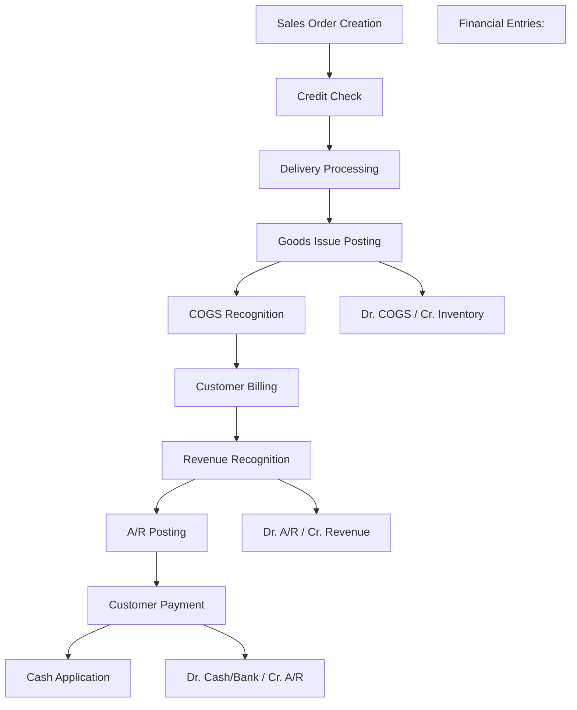

#### **3.10.1.2 Purchase-to-Pay Financial Integration**

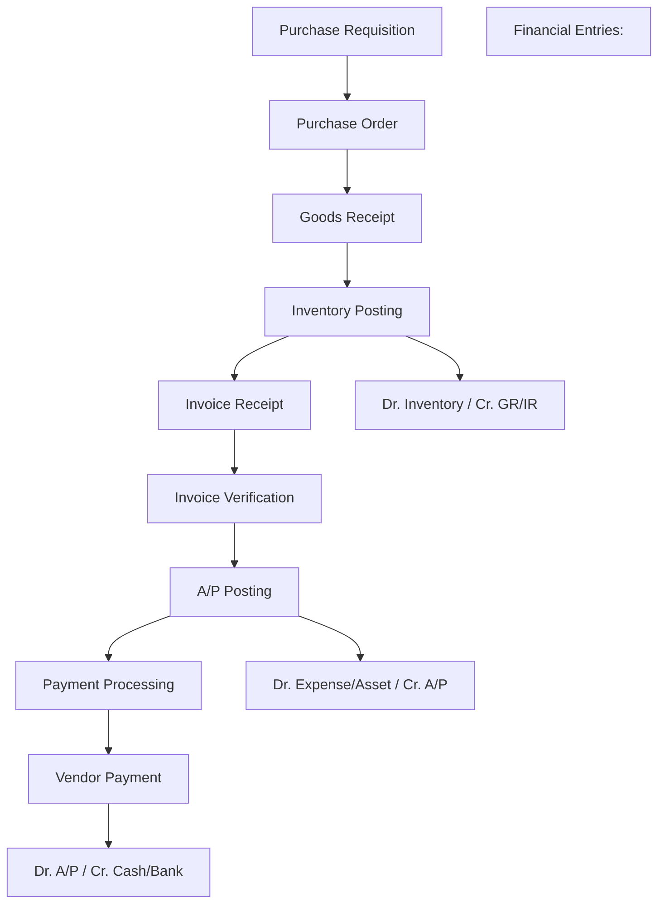

#### **3.10.1.3 Production Financial Integration**

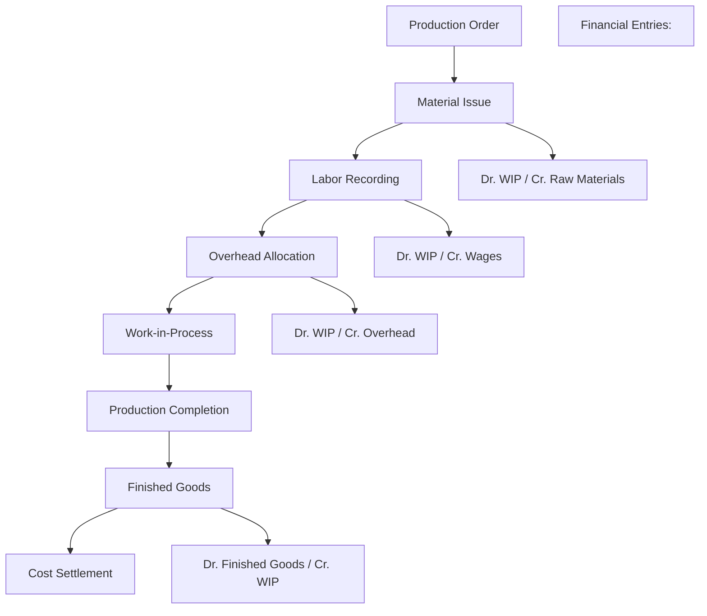

### **3.10.2 Payroll Integration with Magner**

Third-party payroll system integration for seamless financial processing:

#### **3.10.2.1 Integration Architecture**

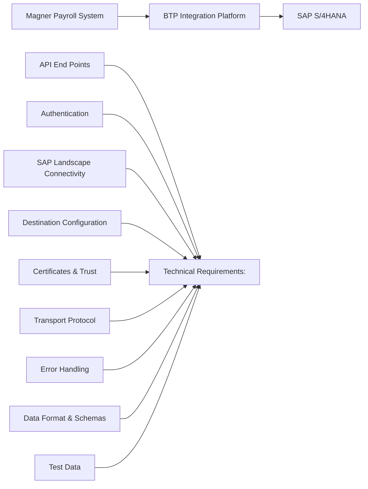

#### **3.10.2.2 Functional Requirements**

**Master Data Mapping:**

- SAP Cost Center mapping with Magner Cost Center/Department
- Salary element mapping with SAP GL Account

**Integration Data Flow:**

- Payroll processing in Magner
- Financial summary extraction
- Automated posting to SAP GL accounts
- Cost center allocation
- Employee advance and loan tracking

#### **3.10.2.3 Payroll Element Mapping**

| **Element Types**        | **Magner Element**                   | **GL Type** | **Offset Account** | **Debit** | **Credit** |
| ------------------------ | ------------------------------------ | ----------- | ------------------ | --------- | ---------- |
| **Allowance**            | Basic Salary                         | P/L         | Salary Payable     | XXX       | -          |
| **Allowance**            | House Rent Allowance                 | P/L         | -                  | XXX       | -          |
| **Allowance**            | Medical Allowance                    | P/L         | -                  | XXX       | -          |
| **Allowance**            | Transportation Allowance             | P/L         | -                  | XXX       | -          |
| **Allowance**            | Bonus                                | P/L         | -                  | XXX       | -          |
| **Deduction**            | PAYE (Pay as you earn)               | B/S         | -                  | -         | XXX        |
| **Deduction**            | LST (Local Service Tax)              | B/S         | -                  | -         | XXX        |
| **Deduction**            | NSSF (National Social Security Fund) | P/L         | -                  | -         | XXX        |
| **Deduction**            | Loan Installments                    | B/S         | -                  | XXX       | -          |
| **Accruals**             | Gratuity Provision                   | B/S         | -                  | -         | XXX        |
| **Accruals**             | Leave Provision                      | B/S         | -                  | -         | XXX        |
| **Company Contribution** | NSSF (Employer)                      | B/S         | -                  | -         | XXX        |
| **Offset Account**       | Salary Payable                       | B/S         | Above All          | -         | XXX        |

### **3.10.3 Month-End and Year-End Financial Closing**

#### **3.10.3.1 Month-End Closing Process**

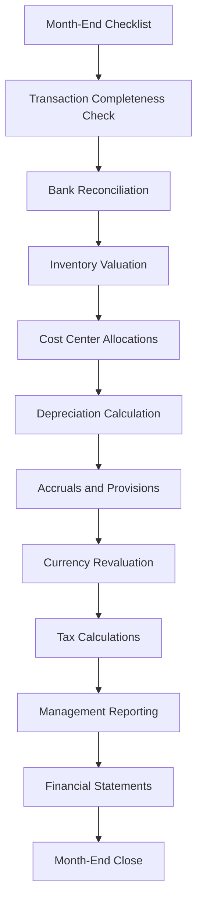

#### **3.10.3.2 Year-End Closing Process**

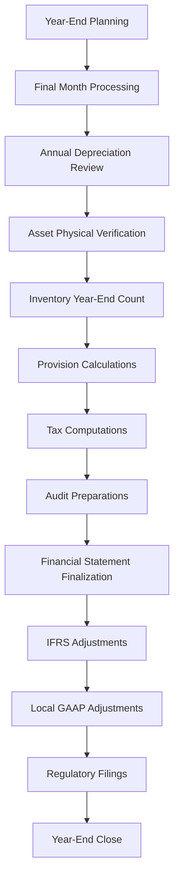

------

## **3.11. Scope Items and Implementation Requirements**

### **3.11.1 Activated Scope Items**

Comprehensive list of SAP scope items activated for GSUL's FICO implementation:

#### **3.11.1.1 Financial Accounting Scope Items**

| **Scope Item ID** | **Description**                | **Status** | **Priority** |
| ----------------- | ------------------------------ | ---------- | ------------ |
| J58               | Accounting and Financial Close | Activated  | High         |
| J59               | Accounts Receivable            | Activated  | High         |
| J60               | Accounts Payable               | Activated  | High         |
| J62               | Asset Accounting               | Activated  | High         |
| BFA               | Basic Bank Account Management  | Activated  | Medium       |
| BFB               | Basic Cash Operations          | Activated  | Medium       |
| 1GO               | Cash Journal                   | Activated  | Medium       |
| 4Q2               | External Tax Calculation       | Activated  | High         |
| BD6               | Basic Credit Management        | Activated  | Medium       |

#### **3.11.1.2 Controlling Scope Items**

| **Scope Item ID** | **Description**                 | **Status** | **Priority** |
| ----------------- | ------------------------------- | ---------- | ------------ |
| J54               | Overhead Cost Accounting        | Activated  | High         |
| J55               | Margin Analysis                 | Activated  | High         |
| 2FM               | Financial Planning and Analysis | Activated  | Medium       |
| 33Q               | Actual Costing                  | Required   | High         |
| 1GI               | General Ledger Allocation Cycle | Activated  | Medium       |
| 2QL               | Universal Allocation            | Activated  | Medium       |

#### **3.11.1.3 Asset Accounting Scope Items**

| **Scope Item ID** | **Description**                                              | **Status** | **Priority** |
| ----------------- | ------------------------------------------------------------ | ---------- | ------------ |
| J62               | Asset Accounting                                             | Activated  | High         |
| 5HG               | Asset Accounting -- Additional Depreciation Area             | Required   | Medium       |
| 6VB               | Asset Accounting - Additional Depreciation Keys for Local GAAPs | Required   | Medium       |
| 1GB               | Asset Accounting - Group Ledger IFRS                         | Required   | Medium       |
| BFH               | Asset Under Construction                                     | Activated  | Medium       |
| 5KF               | Asset Under Construction -- Additional Depreciation Area     | Required   | Low          |
| 1GF               | Asset Under Construction - Group Ledger IFRS                 | Required   | Low          |

#### **3.11.1.4 Advanced Financial Features**

| **Scope Item ID** | **Description**                                      | **Status** | **Priority** |
| ----------------- | ---------------------------------------------------- | ---------- | ------------ |
| 1GA               | Accounting and Financial Close - Group Ledger IFRS   | Required   | High         |
| 1GP               | Intercompany Financial Posting                       | Required   | High         |
| 40Y               | Intercompany Reconciliation Process                  | Required   | High         |
| 4HG               | Advanced Financial Closing Integration               | Required   | Medium       |
| 78I               | Intercompany Matching and Reconciliation for Banking | Required   | Medium       |

### **3.11.2 Requirements and Gap Analysis**

#### **3.11.2.1 FIT Requirements**

Requirements that align with standard SAP functionality:

**General Ledger Accounting:**

- Multi-currency transaction processing
- Parallel accounting (IFRS and Local GAAP)
- Automated journal entry workflows
- Exchange rate management
- Attachment capabilities during posting
- Document reversal functionality
- Financial reporting and export capabilities

**Accounts Receivable:**

- Customer master data management
- Invoice-wise payment tracking
- Credit limit management
- Automatic payment clearing
- Customer aging reports
- Multi-address customer management

**Accounts Payable:**

- Vendor master data management
- Three-way matching process
- Automatic payment programs
- Vendor aging and payment reports
- Cross-currency payment handling

**Asset Accounting:**

- Pro-rata depreciation calculation
- Multiple depreciation areas
- Asset location tracking
- Depreciation policy management

#### **3.11.2.2 GAP Requirements**

Requirements requiring customization or workarounds:

| **Functional Area**     | **Requirement**                   | **Gap Description**                        | **Proposed Solution**                                        |
| ----------------------- | --------------------------------- | ------------------------------------------ | ------------------------------------------------------------ |
| **General Ledger**      | Multiple document reversals       | SAP doesn't support reversal of reversals  | Process re-design: Clear documents before reversal           |
| **Accounts Receivable** | Customer master workflow approval | No standard workflow for master data       | Authorization matrix control                                 |
| **Accounts Receivable** | Document flow extraction to Excel | Not available in standard                  | In UAT GSUL team will identify to go with BTP based development or not. |
| **Accounts Receivable** | Down payment PDF generation       | No standard PDF output                     | Custom form development                                      |
| **Accounts Receivable** | Customer-wise ledger format       | Custom format requirement                  | In UAT GSUL team will identify to go with BTP based development or not. |
| **Accounts Payable**    | Default entry date behavior       | Entry date doesn't default to current date | User training and process adjustment                         |
| **Cash Journal**        | Approval workflow                 | No standard approval mechanism             | Authorization matrix and control procedures                  |
| **Tax Integration**     | EFRIS FDN number requirement      | Integration requirement with EFRIS         | BTP integration development                                  |
| **Output Forms**        | Manual approval forms             | Bank receipts, payments, cash vouchers     | In UAT GSUL team will identify to go with BTP based development or not. |

#### **3.11.2.3 WRICEF Requirements**

Custom development requirements:

| **Type**        | **Requirement**              | **Description**                                 | **Development Platform** |
| --------------- | ---------------------------- | ----------------------------------------------- | ------------------------ |
| **Report**      | Customer-wise ledger         | Custom ledger format as per GSUL template       | BTP                      |
| **Interface**   | Magner payroll integration   | Real-time payroll posting from Magner to SAP    | BTP                      |
| **Conversion**  | Master data upload templates | Customer and vendor mass upload programs        | BTP                      |
| **Enhancement** | EFRIS integration            | Uganda Revenue Authority compliance integration | BTP                      |
| **Form**        | Cash journal vouchers        | Printable cash payment and receipt vouchers     | BTP                      |
| **Form**        | Bank payment vouchers        | Bank payment and receipt form generation        | BTP                      |

------

## **3.12. Integration Architecture**

### **3.12.1 System Integration Overview**

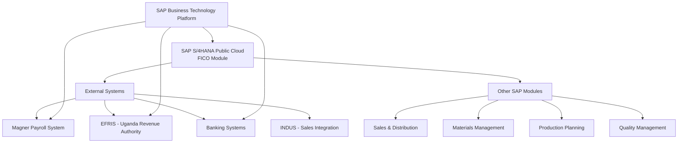

### **3.12.2 Data Flow Architecture**

#### **3.12.2.1 Inbound Interfaces**

| **Source System** | **Data Type**     | **Frequency** | **Integration Method** |
| ----------------- | ----------------- | ------------- | ---------------------- |
| Magner Payroll    | Payroll postings  | Monthly       | BTP REST API           |
| INDUS             | Customer invoices | Real-time     | BTP Integration        |
| Banking Systems   | Bank statements   | Daily         | File upload/MT940      |
| Excel Templates   | Master data       | As needed     | Standard upload        |

#### **3.12.2.2 Outbound Interfaces**

| **Target System**    | **Data Type**      | **Frequency** | **Integration Method** |
| -------------------- | ------------------ | ------------- | ---------------------- |
| EFRIS                | Tax invoices       | Real-time     | BTP REST API           |
| Management Reporting | Financial reports  | Monthly       | Standard SAP reports   |
| External Auditors    | Financial data     | Annually      | Standard export        |
| Regulatory Bodies    | Compliance reports | As required   | Standard reports       |


# **4. Materials Management (MM) Module**

## **4.1 MM Module Overview and Business Processes**

Materials Management handles GSUL's complete procure-to-pay cycle across all manufacturing operations, supporting procurement of raw materials, production consumables, spare parts, services, and capital equipment.

### **4.1.1 Procure-to-Pay Cycle Overview**

**Core MM Business Processes:**

- Purchase requisition creation and approval workflows
- RFQ processing and vendor quotation management
- Purchase order creation with multi-level approvals
- Goods receipt processing with quality integration
- Invoice verification with three-way matching
- Vendor evaluation and performance management
- Inventory management across multiple storage locations
- Subcontracting operations with component provision
- Returns processing and vendor reconciliation

### **4.1.2 Key MM Activities**

**Procurement Activities:**

- Strategic sourcing and vendor selection
- Contract negotiations and framework agreements
- Purchase order processing with approval workflows
- Delivery monitoring and expediting
- Quality inspection coordination
- Supplier relationship management

**Inventory Activities:**

- Stock level monitoring and replenishment
- Inter-plant stock transfers
- Physical inventory counting and reconciliation
- Slow-moving and obsolete stock management
- Consignment stock management at customer locations

**Financial Activities:**

- Purchase invoice verification and approval
- Vendor payment processing
- Purchase price variance analysis
- Accrual management for goods received
- Cost allocation to production orders and cost centers

## **4.2 MM Master Data Configuration**

### **4.2.1 Business Partner and Vendor Management (Scope Item BNE)**

**Vendor Account Groups:**

| **BP Grouping** | **Account Group** | **Description**    | **Number Range** | **Usage**               |
| --------------- | ----------------- | ------------------ | ---------------- | ----------------------- |
| BP01            | ZLOC              | Domestic Suppliers | 10000-19999      | Local vendors           |
| BP02            | ZIMP              | Import Suppliers   | 20000-29999      | International vendors   |
| BPEE            | BPEE              | Employee Master    | 30000-39999      | Employee advances/loans |

**Partner Functions:**

| **Function**     | **Code** | **Description**              | **Usage**                   |
| ---------------- | -------- | ---------------------------- | --------------------------- |
| Vendor           | VN       | Primary vendor relationship  | Main vendor contact         |
| Ordering Address | OA       | Alternative ordering address | Different ordering location |
| Goods Supplier   | GS       | Physical goods delivery      | Delivery point contact      |
| Invoicing Party  | IP       | Invoice processing entity    | Billing and payment contact |

**Vendor Classification by Business:**

**Raw Material Suppliers:**

- Paper and board suppliers (local and import)
- Ink and chemical suppliers
- Film and packaging material suppliers
- Adhesive and coating suppliers

**Equipment Suppliers:**

- Printing machinery suppliers
- Maintenance equipment suppliers
- IT hardware and software suppliers
- Factory equipment and tools

**Service Providers:**

- Maintenance service providers
- Professional services (legal, audit, consulting)
- Logistics and transportation services
- Utility service providers

### **4.2.2 Material Master Configuration (Scope Items BJY, BNT, BNS, BNR, BNF, 31X, 31Y)**

**Material Types and Classifications:**

| **Material Type** | **Description**       | **Number Range** | **Valuation Class** | **Price Control** |
| ----------------- | --------------------- | ---------------- | ------------------- | ----------------- |
| ROH               | Raw Materials         | 1000000-1999999  | 3000                | V (Moving Avg)    |
| FERT              | Finished Goods        | 2000000-2999999  | 7920                | S (Standard)      |
| HALB              | Semi Finished Goods   | 3000000-3599999  | 7900                | S (Standard)      |
| ERSA              | Spare Parts           | 4000000-4599999  | 3040                | V (Moving Avg)    |
| HIBE              | Consumables           | 4600000-4999999  | 3030                | V (Moving Avg)    |
| PLAN              | Trading Goods         | 5000000-5599999  | 3100                | V (Moving Avg)    |
| SERV              | Service Material      | 5600000-5999999  | 3200                | S (Standard)      |
| VERP              | Packaging Material    | 6000000-6599999  | 3050                | V (Moving Avg)    |
| UNBW              | Non-valuated Material | 6600000-6999999  | YB00                | No valuation      |
| FHMI              | Tooling               | 7000000-7599999  | -                   | No valuation      |
| NLAG              | Non Stock Materials   | 8000000-8599999  | -                   | No valuation      |

**Material Groups by Category:** To be Finalized

**Raw Materials:**

- Aluminum Foil (various grades and thicknesses)
- Art Paper (Embossed, Glossy, Matt finishes)
- BOPP Film (Biaxially Oriented Polypropylene)
- Chromolux Paper (high-gloss coated paper)
- Kraft Paper (various weights and grades)
- Printing Inks (Digital, Flexographic, Gravure, Offset)
- Chemical additives and solvents
- Adhesives and binding materials

**Finished Goods:**

- Commercial printing jobs (brochures, catalogs, books)
- Industrial packaging products
- Large format printing (banners, posters, signage)
- Pre-press services and proofs

**Semi-Finished Goods:**

- Cello Tape (various widths and adhesive types)
- Label Paper (pre-cut and roll form)
- LD/LLD Film (Low Density/Linear Low Density)
- PVC Blown Film (various thicknesses)
- Envelope materials (cut sheets and blanks)

**Spare Parts by Equipment Type:**

- Flexographic press spares (cylinders, plates, doctor blades)
- Gravure press spares (cylinders, squeegees, ink systems)
- Offset press spares (plates, blankets, rollers)
- Extrusion line spares (screws, dies, heating elements)
- General electrical components
- Bearings and mechanical components
- Compressor parts and pneumatic components

### **4.2.3 Valuation Configuration**

**Valuation Principles:**

- **Valuation Area:** Plant level valuation for accurate cost tracking
- **Price Control:** Moving average for procurement items, standard price for manufactured items
- **Currency:** Local currency with group currency translation
- **Costing:** Actual costing with periodic price updates

**Material Valuation by Type:**

| **Material Type** | **Valuation Method** | **Price Updates** | **Variance Handling**  |
| ----------------- | -------------------- | ----------------- | ---------------------- |
| Raw Materials     | Moving Average       | Each receipt      | Direct to cost         |
| Finished Goods    | Standard Price       | Monthly review    | Price variance account |
| Semi-Finished     | Standard Price       | Monthly review    | Price variance account |
| Spare Parts       | Moving Average       | Each receipt      | Direct to cost         |
| Consumables       | Moving Average       | Each receipt      | Direct to cost         |
| Trading Goods     | Moving Average       | Each receipt      | Direct to cost         |

## **4.3 Procurement Processes**

### **4.3.1 Purchase Requisition Process (Scope Item 18J)**

**PR Document Types:**

| **PR Type** | **Description**      | **Number Range**      | **Creation Method**  |
| ----------- | -------------------- | --------------------- | -------------------- |
| NB          | Purchase Requisition | 1000000000-1999999999 | Manual/MRP/Automatic |

**PR Creation Methods:**

**Manual Creation:**

- Department-initiated requests for materials and services
- Maintenance requisitions for spare parts and services
- Capital equipment requisitions
- Emergency procurement requests

**MRP Generation:**

- Automatic creation from planning run based on stock levels
- Production order component requirements
- Sales order component needs
- Safety stock replenishment

**Reservation Conversion:**

- Convert material reservations to purchase requisitions	
- Project-specific material requirements
- Maintenance work order material needs

**PR Approval Workflow:**

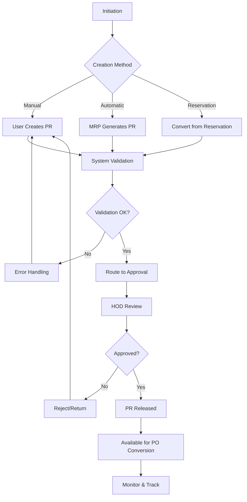

**Approval Matrix:**

| **PR Value Range** | **Approver**        | **Backup Approver** |
| ------------------ | ------------------- | ------------------- |
| Up to 1M UGX       | Department HOD      | Department Deputy   |
| 1M - 5M UGX        | Department HOD      | Finance Manager     |
| Above 5M UGX       | Department HOD + FM | General Manager     |

### **4.3.2 Request for Quotation Process (Scope Item 1XF)**

**RFQ Document Types:**

| **Document Type** | **Description**    | **Number Range**      | **Usage**                  |
| ----------------- | ------------------ | --------------------- | -------------------------- |
| RQ                | RFQ to PO          | 7000000000-7099999999 | Standard procurement RFQ   |
| RE                | RFQ to Contract    | 7100000000-7199999999 | Contract-based procurement |
| SQ                | Supplier Quotation | 8000000000-8099999999 | Vendor response quotes     |

**RFQ Process Flow:**

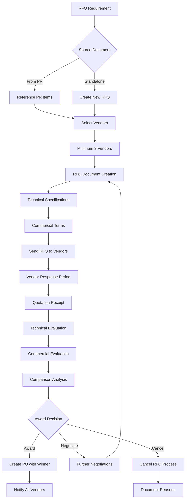

**RFQ Evaluation Criteria:**

- Total cost of ownership
- Payment terms and conditions
- Price validity period
- Currency and exchange rate risks

### **4.3.3 Purchase Order Process (Scope Item J45)**

**PO Document Types:**

| **PO Type** | **Description**       | **Number Range**      | **Usage**                    |
| ----------- | --------------------- | --------------------- | ---------------------------- |
| NB          | Standard PO           | 2000000000-2099999999 | Regular material procurement |
| UB          | Stock Transport Order | 2100000000-2199999999 | Inter-plant stock transfers  |

**PO Item Categories:**

| **Item Category** | **Description**     | **Account Assignment** | **Usage**                          |
| ----------------- | ------------------- | ---------------------- | ---------------------------------- |
| Standard          | Regular material    | Stock account          | Inventory materials                |
| Subcontracting    | Component to vendor | Stock account          | Subcontract processing             |
| Service           | External services   | Cost center/Order      | Maintenance, professional services |
| Consignment       | Consignment stock   | Consignment account    | Vendor-owned stock                 |

**Account Assignment Categories:**

| **Assignment**   | **Description**   | **Usage**                     |
| ---------------- | ----------------- | ----------------------------- |
| (blank)          | Stock material    | Inventory materials           |
| Asset            | Capital equipment | Fixed asset acquisition       |
| Cost Center      | Expense items     | Operational expenses          |
| Sales Order      | Project-specific  | Customer project materials    |
| Production Order | Manufacturing     | Production-specific materials |

**PO Approval Matrix (Delegation of Authority):**

| **PO Type**    | **Value Range** | **Level 1 Approver** | **Level 2 Approver** |
| -------------- | --------------- | -------------------- | -------------------- |
| Standard PO    | Up to 2.5M UGX  | Procurement Manager  | Not Required         |
| Standard PO    | Above 2.5M UGX  | Procurement Manager  | Director             |
| Assets PO      | Any Value       | Procurement Manager  | Director             |
| Subcontracting | Any Value       | Store Manager        | Procurement Manager  |
| Services PO    | Up to 1M UGX    | Department HOD       | Not Required         |
| Services PO    | Above 1M UGX    | Department HOD       | Procurement Manager  |

**Current Approvers:**

| **Role**            | **Person**         | **Backup**          |
| ------------------- | ------------------ | ------------------- |
| Procurement Manager | Mr. Chetan Zawar   | Procurement Officer |
| Director            | Mr. Irfan Hajee    | Mr. Khalil Hajee    |
| Store Manager       | Mr. Anil Choudhary | Assistant Store Mgr |

**PO Processing Flow:**

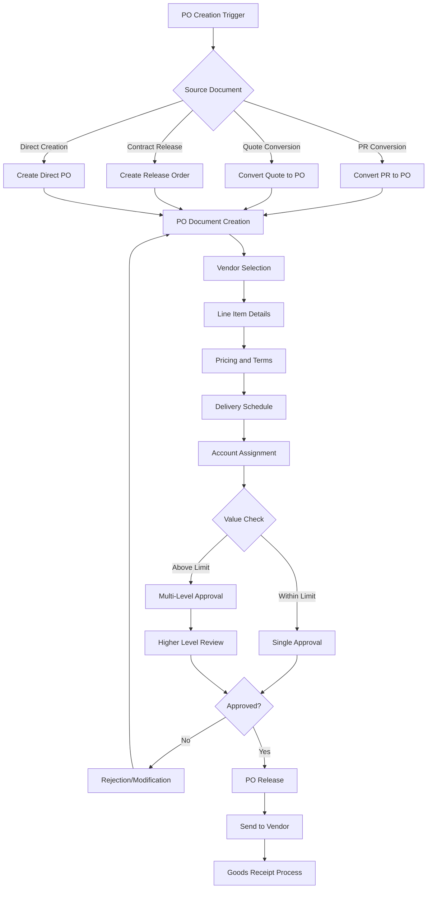

**Pricing Configuration:**

**Local Purchase Orders:**

| **Condition Type** | **Description**         | **Calculation**   | **Usage**                 |
| ------------------ | ----------------------- | ----------------- | ------------------------- |
| PB00               | Gross Price             | Amount/Percentage | Base material price       |
| PBXX               | Gross Price Alternative | Amount/Percentage | Alternative pricing       |
| ZDIS               | Line Item Discount      | Percentage/Amount | Volume/early pay discount |
| ZFRT               | Freight by Road         | Fixed Amount      | Transportation cost       |
| ZOTR               | Other Charges           | Fixed Amount      | Handling, documentation   |

**Import Purchase Orders:**

| **Condition Type** | **Description**                 | **Calculation** | **Usage**               |
| ------------------ | ------------------------------- | --------------- | ----------------------- |
| ZIMP               | Import Duty                     | Percentage      | Customs duty            |
| ZSEA               | Sea Freight                     | Amount          | Ocean transportation    |
| ZSRF               | Source Road Freight             | Amount          | Origin transportation   |
| ZDRF               | Destination Road Freight        | Amount          | Destination delivery    |
| ZLUN               | Loading/Unloading               | Amount          | Port handling           |
| ZPHC               | Port Handling Charges           | Amount          | Port operations         |
| ZCWC               | Custom Warehouse Charges        | Amount          | Customs warehousing     |
| ZCFC               | CFS (Container Freight Station) | Amount          | Container handling      |
| ZDEM               | Demurrage                       | Amount          | Port delays             |
| ZSLC               | Shipping Line Charges           | Amount          | Carrier charges         |
| ZFWA               | Forwarder Agent                 | Amount          | Customs clearance       |
| ZCCC               | Custom Clearance Charges        | Percentage      | Clearance services      |
| ZICD               | ICD Dry Port                    | Amount          | Inland container depot  |
| ZMIN               | Marine Insurance                | Percentage      | Cargo insurance         |
| ZINC               | Inspection Charges              | Amount          | Pre-shipment inspection |
| ZAFC               | Air Freight Cost                | Amount          | Air transportation      |
| ZHAZ               | Hazardous Clearance             | Amount          | Special handling        |
| ZVIN               | VAT to Inventory                | Tax             | Import VAT              |
|                    |                                 |                 |                         |

### **4.3.4 Contract Management Process (Scope Item BMD)**

**Contract Types:**

| **Contract Type** | **Description**   | **Number Range**      | **Usage**                 |
| ----------------- | ----------------- | --------------------- | ------------------------- |
| MK                | Quantity Contract | 3000000000-3099999999 | Fixed quantity agreements |
| WK                | Value Contract    | 3100000000-3199999999 | Fixed value agreements    |

**Contract Management Features:**

**Quantity Contracts:**

- Fixed quantities with delivery schedules
- Price per unit with potential volume discounts
- Automatic release order generation
- Quantity consumption tracking

**Value Contracts:**

- Fixed total value with flexible quantities
- Price lists for different materials
- Value consumption monitoring
- Automatic allocation to release orders

**Contract Approval Process:**

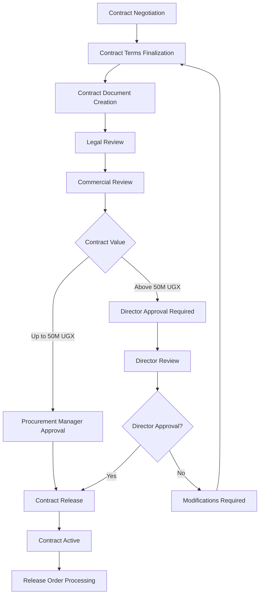

**Contract Monitoring:**

- Delivery performance tracking
- Price compliance monitoring
- Quantity/value consumption analysis
- Contract expiry alerts
- Renewal recommendation process

### **4.3.5 Subcontracting Process (Scope Item BMY)**

**Subcontracting Overview:**

GSUL provides raw materials to vendors for processing and receives finished or semi-finished products. This is common for specialized operations like:

- Embossing and special finishing
- Die-cutting and converting operations
- Specialized printing processes
- Surface treatment and coating

**Subcontracting Process Flow:**

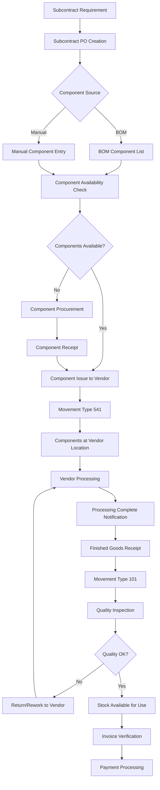

**BOM Integration:**

- Component definition based on finished product BOM
- Automatic component requirement calculation
- Multiple BOM alternatives for different vendors
- Component consumption tracking

**Financial Implications:**

- Components issued at cost to vendor location
- Processing charges invoiced by vendor
- Finished goods received at combined cost
- WIP tracking for components at vendor

### **4.3.6 Service Procurement Process (Scope Item 22Z)**

**Service Categories:**

**Maintenance Services:**

- Preventive maintenance contracts
- Breakdown repair services
- Equipment overhaul and refurbishment
- Calibration and testing services

**Professional Services:**

- Legal and advisory services
- Audit and accounting services
- Consulting and training services
- IT services and support

**Facility Services:**

- Cleaning and housekeeping services
- Security services
- Utilities and infrastructure
- Waste management services

**Service Entry Sheet Process:**

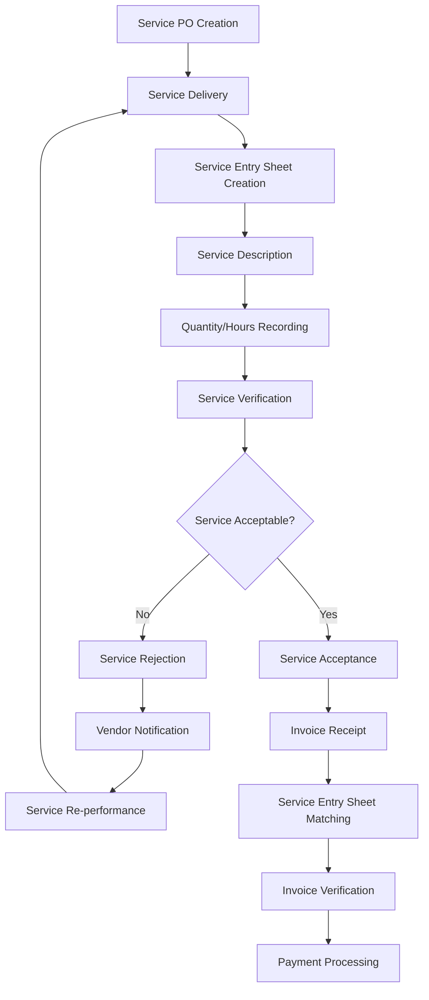

**Service Master Data:**

- Service specifications and requirements
- Standard operating procedures
- Quality criteria and acceptance standards
- Service level agreements (SLAs)

## **4.4 Inventory Management Processes**

### **4.4.1 Goods Receipt Process (Scope Item BMC)**

**Goods Receipt Types:**

| **Movement Type** | **Description**            | **Usage**                 |
| ----------------- | -------------------------- | ------------------------- |
| 101               | GR for Purchase Order      | Standard goods receipt    |
| 102               | Reversal of 101            | Cancel goods receipt      |
| 103               | GR to Blocked Stock        | Quality hold              |
| 104               | Reversal of 103            | Release from quality hold |
| 105               | Release from Blocked Stock | Quality approval          |

**Goods Receipt Process Flow:**

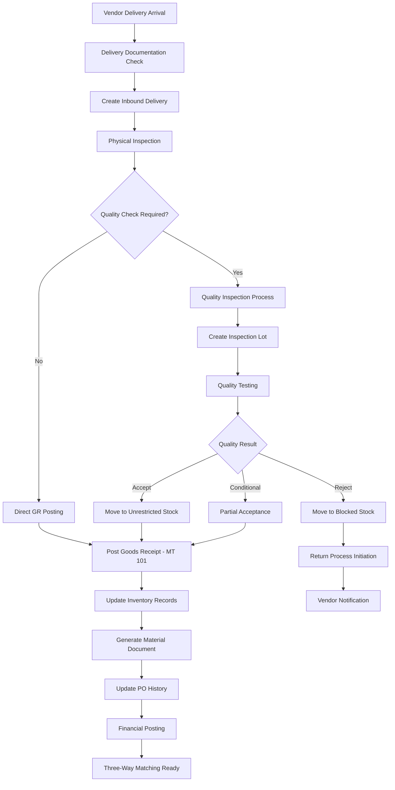

**Three-Way Matching:**

- **Purchase Order:** Approved procurement document
- **Goods Receipt:** Physical receipt confirmation
- **Invoice Receipt:** Vendor invoice verification

**Quality Integration:**

- Automatic inspection lot creation for quality-relevant materials
- QM stock types: Unrestricted, Quality Inspection, Blocked
- Quality decision impacts stock movement
- Automatic stock transfer based on usage decision

**GR Tolerance Management:**

- Quantity tolerance: ±5% for most materials
- Date tolerance: Delivery date variance acceptance
- Price tolerance: Price variation acceptance limits
- Under/over delivery handling procedures

### **4.4.2 Stock Transfer Process (Scope Item BMC)**

**Stock Transfer Types:**

**Intra-Plant Transfers:**

| **Movement Type** | **Description**                    | **Usage**         |
| ----------------- | ---------------------------------- | ----------------- |
| 311               | Transfer between storage locations | Within same plant |
| 312               | Transfer to quality inspection     | Quality testing   |
| 321               | Quality inspection to unrestricted | Quality approval  |
| 322               | Quality inspection to blocked      | Quality rejection |

**Inter-Plant Transfers:**

| **Movement Type** | **Description**                  | **Usage**                |
| ----------------- | -------------------------------- | ------------------------ |
| 351               | Goods issue from issuing plant   | STO goods issue          |
| 352               | Reversal of 351                  | Cancel STO goods issue   |
| 101               | Goods receipt in receiving plant | STO goods receipt        |
| 102               | Reversal of 101                  | Cancel STO goods receipt |

**Stock Transport Order (STO) Process:**

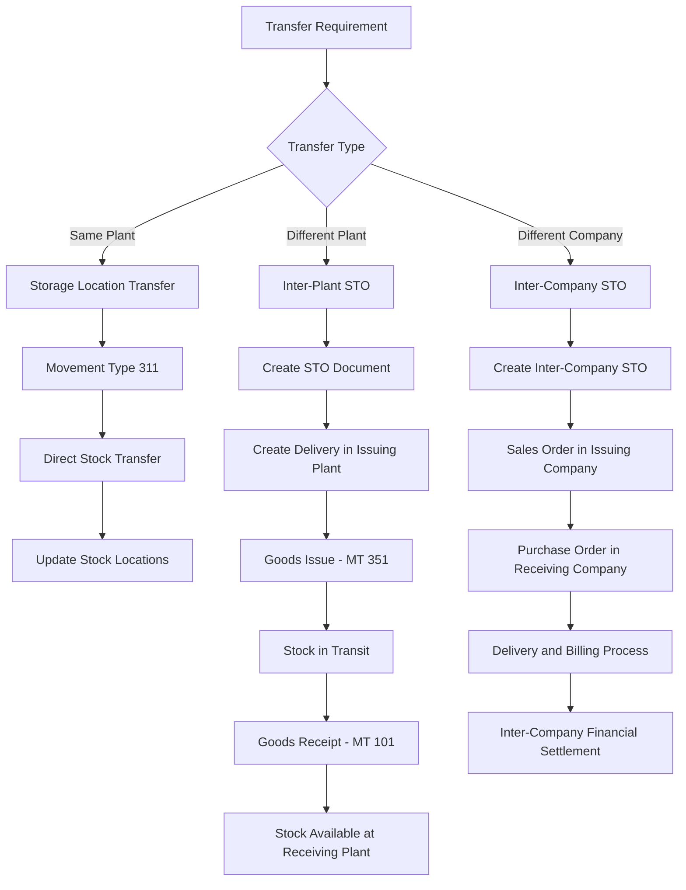

**STO Applications:**

- Raw material sharing between plants
- Finished goods distribution
- Emergency stock transfers
- Production planning optimization
- Seasonal stock redistribution

### **4.4.3 Physical Inventory Process (Scope Item BML)**

**Inventory Methods:**

**Annual Physical Count:**

- Complete inventory verification for all materials
- Year-end stock reconciliation
- Regulatory compliance requirement
- Financial audit support

**Cycle Counting:**

- Ongoing rotation-based counting
- High-value item focus
- Fast-moving item priority
- ABC analysis-based frequency

**Ad-hoc Counts:**

- Issue-specific verification
- Investigation counts
- Spot checks and audits
- Exception handling

**Physical Inventory Process:**

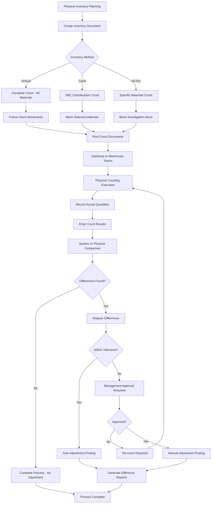

**Counting Procedures:**

- Team-based counting with cross-verification
- Blind counting (no book quantities shown)
- Bar code scanning where applicable
- Weight-based counting for bulk materials
- Sample counting for large quantities

**Tolerance Management:**

- Value-based tolerance limits
- Quantity-based tolerance limits
- Percentage-based tolerance limits
- Automatic adjustment within tolerance
- Management approval for excess variances

### **4.4.4 Returns to Supplier Process (Scope Item BMK)**

**Return Scenarios:**

**Quality-Related Returns:**

- Defective materials received
- Specification non-compliance
- Quality inspection failures
- Contaminated or damaged goods

**Commercial Returns:**

- Wrong materials delivered
- Excess quantity delivered
- Pricing disputes
- Contract violations

**Return Process Flow:**

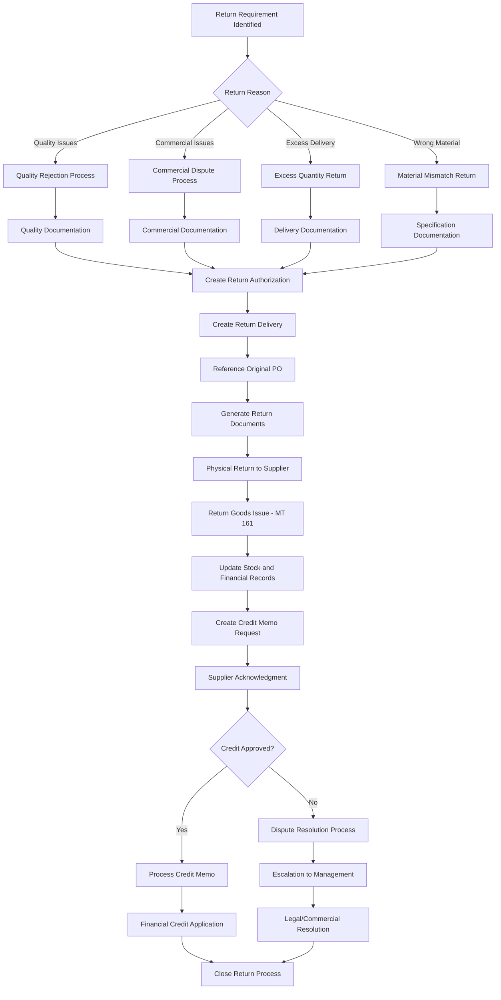

**Return Documentation:**

- Return authorization number
- Quality inspection reports (if applicable)
- Delivery receipt discrepancies
- Photographic evidence
- Vendor notification letters
- Credit memo requests

**Financial Settlement:**

- Credit memo processing
- Return freight cost allocation
- Handling charge settlements
- Quality cost recovery
- Dispute resolution costs

## **4.5 Purchasing Groups and Authorization**

### **4.5.1 Purchasing Groups Configuration**

Purchasing groups define buyer responsibilities and approval workflows across different material categories:

| **Purchase Group** | **Description**              | **Material Responsibility**                     | **Plants** |
| ------------------ | ---------------------------- | ----------------------------------------------- | ---------- |
| D01                | MRP (Procurement Department) | Raw Materials, Production Operating Consumables | All Plants |
| D02                | Production Department        | Tooling, Production Equipment                   | All Plants |
| D03                | Maintenance Department       | Spare Parts, Maintenance Services               | All Plants |
| D04                | IT Department                | IT Equipment, Software, Hardware                | All Plants |
| D05                | Directors                    | Capital Equipment (above threshold)             | All Plants |
| D06                | Accounts Department          | Professional Services, Office Supplies          | All Plants |
| D07                | Admin Department             | Administrative Services, Facility Management    | All Plants |
| D08                | Stock Transfer Order         | Inter-plant Stock Transfers                     | All Plants |
| D09                | Quality Assurance            |                                                 | All Plants |

### **4.5.2 Procurement Authority Matrix**

**Standard Procurement Authority:**

| **Purchase Group** | **Value Range** | **Primary Approver** | **Secondary Approver** |
| ------------------ | --------------- | -------------------- | ---------------------- |
| D01                | Up to 10M UGX   | Procurement Manager  | Not Required           |
| D01                | Above 10M UGX   | Procurement Manager  | Director               |
| D02                | Up to 5M UGX    | Production Manager   | Not Required           |
| D02                | Above 5M UGX    | Production Manager   | Director               |
| D03                | Up to 3M UGX    | Maintenance Manager  | Not Required           |
| D03                | Above 3M UGX    | Maintenance Manager  | Procurement Manager    |
| D04                | Up to 2M UGX    | IT Manager           | Not Required           |
| D04                | Above 2M UGX    | IT Manager           | Procurement Manager    |
| D05                | Any Value       | Procurement Manager  | Director               |
| D06                | Up to 1M UGX    | Finance Manager      | Not Required           |
| D06                | Above 1M UGX    | Finance Manager      | Director               |
| D07                | Up to 1M UGX    | Admin Manager        | Not Required           |
| D07                | Above 1M UGX    | Admin Manager        | Procurement Manager    |

## **4.6 Integration Points**

### **4.6.1 MM-FI Integration**

**Financial Postings from MM:**

- Purchase invoice verification creates AP entries
- Goods receipt creates inventory and GR/IR clearing entries
- Purchase returns create credit memo entries
- Stock transfers create inter-company entries
- Inventory adjustments create variance entries

**Real-time Financial Impact:**

- Immediate GL posting upon goods receipt
- Automatic accrual creation for goods received
- Purchase price variance calculation and posting
- Currency revaluation for foreign purchases
- Tax calculation and posting integration

### **4.6.2 MM-PP Integration**

**Production Material Supply:**

- MRP generates purchase requisitions for production
- Component availability checking for production orders
- Material staging for production order execution
- Backflushing integration for material consumption
- Subcontracting component provision and receipt

**Capacity and Planning:**

- Material lead time input to production planning
- Vendor capacity constraints affecting production
- Just-in-time delivery coordination
- Production-driven procurement scheduling

### **4.6.3 MM-QM Integration**

**Quality Control Integration:**

- Inspection lot creation upon goods receipt
- Quality-driven stock movements and decisions
- Vendor quality evaluation and rating
- Quality certificates and documentation
- Return authorization based on quality decisions

**Vendor Quality Management:**

- Vendor quality agreements and specifications
- Incoming inspection results affecting vendor rating
- Quality audit results integration
- Supplier development program tracking

### **4.6.4 MM-SD Integration**

**Customer Service Integration:**

- Stock availability checking for sales orders
- Customer-specific procurement for projects
- Consignment stock management at customer locations
- Inter-company sales and procurement
- Drop shipment coordination

### **4.6.5 External System Integration**

**INDUS Integration:**

- Material specifications from design system
- Customer-specific material requirements
- Cost estimation material inputs
- BOM component sourcing requirements

**Banking Integration:**

- Vendor payment processing
- Foreign exchange dealing for imports
- Letter of credit management
- Bank guarantee processing

## **4.7 Output Management and Documentation**

### **4.7.1 Business Forms**

**Purchase Order Forms:**

- Standard PO format with terms and conditions
- Subcontracting PO with component details
- Service PO with specifications and SLAs
- International PO with shipping and customs details

**Goods Receipt Documentation:**

- Material receipt vouchers
- Quality inspection certificates
- Return authorization documents
- Subcontracting receipt notes

**Other Forms:**

- Purchase requisition forms
- RFQ documentation
- Vendor evaluation reports
- Contract agreements and amendments

### **4.7.2 Output Determination**

**Automatic Output:**

- Email PO transmission to vendors
- SMS notifications for urgent requirements
- Automatic printing of goods receipt documents
- Electronic document archival

**Manual Output:**

- Special forms for specific vendors
- Government tender documentation
- Legal contract documentation
- Quality certificates and compliance documents

## **4.8 MM Reporting and Analytics**

### **4.8.1 Standard MM Reports**

| **Report Category**        | **Report Name**               | **Usage**                         | **Frequency** |
| -------------------------- | ----------------------------- | --------------------------------- | ------------- |
| **Purchase Order Reports** | Monitor Purchase Order Items  | PO tracking and status            | Daily         |
| **Purchase Order Reports** | Purchase Order Analysis       | Spend analysis by vendor/material | Weekly        |
| **Requisition Reports**    | Monitor Purchase Requisitions | PR workflow monitoring            | Daily         |
| **Vendor Reports**         | Supplier Evaluation           | Vendor performance analysis       | Monthly       |
| **Inventory Reports**      | Stock Multiple Materials      | Inventory overview                | Daily         |
| **Inventory Reports**      | Material Documents Overview   | Transaction history               | Daily         |
| **Financial Reports**      | Purchasing Spend Dashboard    | Expense analysis                  | Monthly       |
| **Quality Reports**        | Vendor Quality Performance    | Quality metrics by vendor         | Monthly       |

### **4.8.2 Key Performance Indicators (KPIs)**

**Procurement KPIs:**

- Purchase order cycle time (PR to PO)
- Vendor delivery performance (on-time delivery %)
- Purchase cost savings achieved
- Number of vendors per material category
- Contract compliance percentage

**Inventory KPIs:**

- Inventory turnover ratio
- Stock-out incidents
- Excess and obsolete stock value
- Inventory accuracy percentage
- Storage cost per unit

**Financial KPIs:**

- Purchase spend by category
- Payment term compliance
- Purchase price variance
- Cash flow impact of procurement
- Cost avoidance through negotiations

## **4.9 Gap Analysis Summary**

### **4.9.1 Standard SAP Functionality (FIT)**

**Processes Supported by Standard SAP:**

- Purchase requisition approval workflow with single-level HOD approval
- Purchase order processing with multi-level approval and tolerance management
- Contract management with quantity/value contracts and release strategies
- Stock transfer processing with STO functionality and inter-plant movements
- Physical inventory with material group selection and cycle counting capabilities
- RFQ and quotation management with comparison and evaluation functionality
- Service procurement using service entry sheets and lean service procurement
- Subcontracting with BOM integration and component tracking
- Returns to supplier with standard return delivery and credit memo processing
- Vendor management using business partner framework with role-based access

### **4.9.2 Configuration Requirements (FIT with Configuration)**

**Items Requiring Additional Configuration:**

- Weight measurement integration for future consideration
- Multiple currencies in single PO using standard multi-currency functionality
- Vendor creation approval through role-based authorization control
- Complex pricing schemas for import purchase orders with landed cost calculation

### **4.9.3 Dropped Requirements**

**Items Determined Unnecessary:**

- MIRO print forms (not needed per business confirmation)
- Email sender workflow for PO transmission (SAP standard email sufficient)
- Manual registers for PR/GR tracking (digital tracking in SAP eliminates need)
- Daily stock reports via email (real-time access preferred)


# **5. Production Planning (PP) Module**

## **5.1 Production Planning Overview**

Production Planning manages GSUL's complete plan-to-produce cycle across all manufacturing plants, supporting both custom manufacturing for specific customer orders and standard production for inventory replenishment.

### **5.1.1 Plan-to-Produce Cycle Overview**

**Core PP Business Processes:**

- Make-to-Order (MTO) cycles for customer-specific manufacturing
- Make-to-Stock (MTS) cycles for inventory replenishment
- Material requirements planning (MRP) for component procurement
- Production order creation and scheduling for manufacturing execution
- Capacity planning and resource allocation across production lines
- Shop floor control and production confirmation for real-time tracking
- Quality integration for in-process and final inspection
- Cost accounting integration for production cost tracking
- Rework processing for quality-driven waste management

### **5.1.2 GSUL Production Process Categories**

**Manufacturing Strategies:**

**Make-to-Order (MTO) Operations:**

- Custom manufacturing with order-specific BOMs integrated from INDUS system
- Standard manufacturing with predefined BOMs for regular customers
- Project-based production for large commercial contracts
- Sample production for customer approval and testing

**Make-to-Stock (MTS) Operations:**

- Forecast-driven production for standard products
- Replenishment-based production for fast-moving items
- Seasonal production for promotional materials
- Buffer stock production for critical components

**Production Types by Plant:**

**Luzira Plant (1200) - Graphics Production:**

- Offset printing for commercial jobs, brochures, books
- Digital printing for short runs and variable data
- Large format printing for banners, posters, signage
- Pre-press services for design and plate preparation

**LIPA I Plant (1300) - Flexible Packaging:**

- Gravure printing for high-volume flexible packaging
- Flexographic printing for labels and packaging
- Letterpress printing for security and specialty items
- Lamination for multi-layer packaging materials

**Namanve Plant (1400) - Extrusion Operations:**

- Cello tape manufacturing with adhesive application
- PVC extrusion for rigid and flexible products
- LD extrusion for polyethylene film and bags
- Core making for tape and film winding

**LIPA III Plant (2200) - Garment Operations:**

- Fabric cutting and pattern preparation
- Garment stitching and assembly
- Embroidery and decorative applications
- Textile printing and sublimation

## **5.2 Production Planning Configuration**

### **5.2.1 Order Types**

Production order types define the categorization and behavior of manufacturing orders:

| **Order Type** | **Description**      | **Number Range**  | **Production Strategy** | **Usage**                    |
| -------------- | -------------------- | ----------------- | ----------------------- | ---------------------------- |
| YBM4           | MTO Production Order | 10000000-10999999 | Make-to-Order           | Customer-specific production |
| YBM1           | MTS Production Order | 11000000-11999999 | Make-to-Stock           | Inventory replenishment      |
| PSM1           | Sample Order Type    | 12000000-12999999 | Sample Production       | Customer samples/testing     |
| YBW1           | Rework Order Type    | 13000000-13999999 | Rework Processing       | Quality-driven rework        |

### **5.2.2 Control Keys**

Control keys determine how routing operations are processed and confirmed:

| **Control Key** | **Description**                        | **Functionality**              | **Usage**              |
| --------------- | -------------------------------------- | ------------------------------ | ---------------------- |
| YBP1            | No Auto GR, Cost, Sched, Print, Conf   | Manual confirmation required   | Critical operations    |
| YBP2            | No GR, Cost, Print, Ext Proc, Can Conf | External processing allowed    | Subcontract operations |
| QM01            | INSP.operation: characteristics        | Quality inspection integration | Quality control points |

### **5.2.3 Strategy Groups**

Strategy groups control demand handling and production planning behavior:

| **Strategy Group** | **Description**                 | **Planning Strategy** | **Application**                           |
| ------------------ | ------------------------------- | --------------------- | ----------------------------------------- |
| 10                 | Make-to-Stock Production        | Stock replenishment   | Standard products                         |
| 20                 | Make-to-Order Production        | Sales order driven    | Custom products                           |
| 40                 | Planning with Final Assembly    | Assembly-to-order     | Standard products                         |
| 50                 | Planning without Final Assembly | Component planning    | Custom products with pre-planning for BOM |

### **5.2.4 Person Responsible**

Production managers responsible for different manufacturing areas and production lines:

| **Plant** | **Person Responsible** | **Description**                       | **Production Lines**            |
| --------- | ---------------------- | ------------------------------------- | ------------------------------- |
| 1200      | 100                    | Offset & Digital Production Manager   | Offset, Digital printing lines  |
| 1200      | 200                    | Large Format Production Manager       | Large format printing equipment |
| 1300      | 300                    | Gravure & Pouching Production Manager | Gravure printing and lamination |
| 1300      | 400                    | Flexo Production Manager              | Flexographic and letterpress    |
| 1400      | 500                    | Cello Tape & Core Production Manager  | Adhesive tape manufacturing     |
| 1400      | 600                    | PE & PV Production Manager            | Extrusion lines and converting  |
| 2200      | 700                    | Garmenting Production Manager         | Cutting, stitching, embroidery  |

### **5.2.5 MRP Controller**

MRP controllers manage material planning responsibilities by material category:

| **Plant** | **MRP Controller** | **Description**           | **Material Responsibility**      |
| --------- | ------------------ | ------------------------- | -------------------------------- |
| 1200      | 001                | Raw Material Controller   | Papers, inks, chemicals          |
| 1200      | 002                | SFG Controller            | Semi-finished graphics products  |
| 1200      | 003                | Finished Goods Controller | Commercial printing products     |
| 1300      | 001                | Raw Material Controller   | Films, adhesives, inks           |
| 1300      | 002                | SFG Controller            | Semi-finished packaging          |
| 1300      | 003                | Finished Goods Controller | Flexible packaging products      |
| 1400      | 001                | Raw Material Controller   | Polymers, adhesives, cores       |
| 1400      | 002                | SFG Controller            | Semi-finished extrusion products |
| 1400      | 003                | Finished Goods Controller | Tape and extrusion products      |
| 2200      | 001                | Raw Material Controller   | Fabrics, threads, accessories    |
| 2200      | 002                | SFG Controller            | Cut pieces, sub-assemblies       |
| 2200      | 003                | Finished Goods Controller | Garments and promotional items   |

### **5.2.6 Shift Sequences -- To be finalized**

Work center operating patterns for capacity planning and scheduling:

| **Shift Sequence** | **Description** | **Shift 1**   | **Shift 2**   | **Shift 3**   | **Operating Hours** |
| ------------------ | --------------- | ------------- | ------------- | ------------- | ------------------- |
| SQ1                | Normal 1 Shift  | 07:30 - 15:30 | -             | -             | 8 hours/day         |
| SQ2                | Normal 2 Shifts | 07:30 - 15:30 | 15:30 - 23:30 | -             | 16 hours/day        |
| SQ3                | Normal 3 Shifts | 07:30 - 15:30 | 15:30 - 23:30 | 23:30 - 07:30 | 24 hours/day        |

**Break Time Management:**

- Shift 1: 13:00 - 13:30 (lunch break)
- Shift 2: 19:30 - 20:00 (dinner break)
- Shift 3: 02:00 - 02:30 (night break)
- Tea breaks: 10:00-10:15, 16:00-16:15, 22:00-22:15

### **5.2.7 Standard Value Keys**

Standard value keys define time elements and activities for costing and capacity planning:

| **Standard Value Key** | **Description**          | **Activity Types**                                | **Plants**       |
| ---------------------- | ------------------------ | ------------------------------------------------- | ---------------- |
| ZGSU                   | Graphics Production      | Electricity, Machine, Labor, Maintenance, Quality | 1200, 1300, 1400 |
| ZFAL                   | Fusion Africa Production | Electricity, Machine, Labor, Maintenance, Quality | 2200             |

**Activity Type Details:**

| **Activity** | **Code** | **Description**            | **UOM** | **Application**               |
| ------------ | -------- | -------------------------- | ------- | ----------------------------- |
| Activity 1   | AT01     | Electricity Consumption    | Hour    | Utility cost allocation       |
| Activity 2   | AT02     | Machine Hours              | Hour    | Equipment time tracking       |
| Activity 3   | AT03     | Labor Hours                | Hour    | Direct labor allocation       |
| Activity 4   | AT04     | Maintenance Services       | EA      | Maintenance cost distribution |
| Activity 5   | AT05     | Quality Assurance Services | EA      | Quality control allocation    |

### **5.2.8 Work Center Number Ranges --To be Finalized**

Production line-based number ranges for work center identification:

| **Production Line** | **Number Range** | **Plant** |
| ------------------- | ---------------- | --------- |
| Offset Line         | 10100001         | 10199999  |
| Digital Line        | 10200001         | 10299999  |
| Large Format Line   | 10300001         | 10399999  |
| Gravure Line        | 10400001         | 10499999  |
| Flexographic Line   | 10600001         | 10599999  |
| Letterpress Line    | 10700001         | 10699999  |
| Lamination Line     | 10500001         | 10799999  |
| Garmenting Line     | 11200001         | 10899999  |
| Cellotape Line      | 10800001         | 10999999  |
| PVC Extrusion Line  | 10900001         | 11099999  |
| LD Extrusion Line   | 11000001         | 11299999  |
| Core Making         | 11700001         | 11799999  |
| Pouching            | 11800001         | 11899999  |

### **5.2.9 Special Procurement Keys**

Inter-plant stock transfer configuration for material movement between facilities:

| **Procurement Key** | **Description**                  | **Receiving Plant** | **Supplying Plant** | **Usage**                     |
| ------------------- | -------------------------------- | ------------------- | ------------------- | ----------------------------- |
| 41                  | Stock Transfer from 1200 to 1300 | 1300 (LIPA I)       | 1200 (Luzira)       | Semi-finished goods transfer  |
| 41                  | Stock Transfer from 1300 to 1200 | 1200 (Luzira)       | 1300 (LIPA)         | Finished goods distribution   |
| 41                  | Stock Transfer from 1200 to 1400 | 1400 (Namanve)      | 1200 (Luzira)       | Support material supply       |
| 41                  | Stock Transfer from 1200 to 2200 | 2200 (LIPA III)     | 1200 (Luzira)       | Graphics support for garments |
| 42                  | Stock Transfer from 1400 to 1200 | 1200 (Luzira)       | 1400 (Namanve)      | Packaging material supply     |
| 42                  | Stock Transfer from 1400 to 1300 | 1300 (LIPA 1)       | 1400 (Namanve)      | Packaging material supply     |
| 42                  | Stock Transfer from 1400 to 2200 | 2200 (LIPA III)     | 1400 (Namanve)      | Packaging for garments        |

## **5.3 GSUL Production Scenarios - Complete Process Flows**

### **5.3.1 Scenario 5.1: Make-to-Order (Dynamic BOM + Fixed Routing)**

This scenario represents custom manufacturing where products are made with order-specific BOMs integrated from the INDUS system for unique customer specifications.

**Scenario Characteristics:**

- Order-specific BOM creation from INDUS specifications
- Custom design and engineering requirements
- Variable material requirements per order
- Integration with sales order and customer specifications
- Quality control at multiple stages
- Customer approval and sign-off processes

**Process Flow:**

```mermaid
flowchart TD
    A[5.1.01<br/>Sales Order from INDUS] --> B[5.1.02<br/>BTP Integration]
    B --> C[5.1.03<br/>Sales Order Created in SAP]
    C --> D[5.1.04<br/>Order-Specific BOM Creation]
    
    D --> E[5.1.05<br/>MRP Run Execution]
    E --> F[5.1.06<br/>Planned Order Generation]
    F --> G[5.1.07<br/>Convert to Production Order]
    
    G --> H[5.1.08<br/>Component Availability Check]
    H --> I{5.1.09<br/>Materials Available?}
    I -->|No| J[5.1.10<br/>Purchase Requisition Generation]
    I -->|Yes| K[5.1.11<br/>Material Staging]
    J --> L[5.1.12<br/>Material Procurement]
    L --> K
    
    K --> M[5.1.13<br/>Production Order Release]
    M --> N[5.1.14<br/>Material Issue to Production]
    N --> O[5.1.15<br/>Production Execution]
    O --> P[5.1.16<br/>Operation Confirmation]
    
    P --> Q[5.1.17<br/>Quality Inspection]
    Q --> R{5.1.18<br/>Quality Approved?}
    R -->|No| S[5.1.19<br/>Rework Process]
    R -->|Yes| T[5.1.20<br/>Final Confirmation]
    S --> O
    
    T --> U[5.1.21<br/>Goods Receipt to Finished Goods]
    U --> V[5.1.22<br/>Quality After Production]
    V --> W{5.1.23<br/>Final Quality OK?}
    W -->|No| S
    W -->|Yes| X[5.1.24<br/>Order Settlement]
    X --> Y[5.1.25<br/>Order Completion]
```

**Module Integration Points:**

| **Process Step**          | **PP** | **MM** | **SD** | **QM** | **FI** | **CO** | **INDUS** | **BTP** |
| ------------------------- | ------ | ------ | ------ | ------ | ------ | ------ | --------- | ------- |
| Sales Order from INDUS    | -      | -      | X      | -      | -      | -      | X         | -       |
| BTP Integration           | -      | -      | -      | -      | -      | -      | -         | X       |
| Sales Order Created       | -      | -      | X      | -      | X      | X      | -         | -       |
| Order-Specific BOM        | X      | X      | -      | -      | -      | -      | -         | -       |
| MRP Run Execution         | X      | X      | -      | -      | -      | -      | -         | -       |
| Production Order Creation | X      | -      | -      | -      | -      | X      | -         | -       |
| Material Staging          | X      | X      | -      | -      | -      | -      | -         | -       |
| Production Execution      | X      | -      | -      | -      | -      | X      | -         | -       |
| Quality Inspection        | -      | X      | -      | X      | -      | -      | -         | -       |
| Quality After Production  | -      | X      | -      | X      | -      | -      | -         | -       |
| Goods Receipt             | X      | X      | -      | -      | X      | X      | -         | -       |
| Order Settlement          | X      | -      | -      | -      | X      | X      | -         | -       |

**Financial Impact:**

- Work-in-process accumulation during production
- Material cost allocation from raw materials to WIP
- Labor and overhead allocation to production order
- Quality costs for rework and inspection
- Finished goods receipt at accumulated cost
- Production variance analysis and settlement

### **5.3.2 Scenario 5.2: Make-to-Order (Fixed BOM + Fixed Routing)**

This scenario covers production of standard products with predefined BOMs for customer-specific orders but using established manufacturing processes.

**Scenario Characteristics:**

- Predefined BOM and routing structures
- Standard material specifications
- Established quality control points
- Customer-specific quantity and delivery
- Standardized production processes
- Predictable cost structure

**Process Flow:**

```mermaid
flowchart TD
    A[5.2.01<br/>Customer Sales Order] --> B[5.2.02<br/>ATP Check & Confirmation]
    B --> C[5.2.03<br/>MRP Run for Customer Order]
    
    C --> D[5.2.04<br/>Planned Order Generation]
    D --> E[5.2.05<br/>Convert to Production Order]
    E --> F[5.2.06<br/>Fixed BOM Explosion]
    F --> G[5.2.07<br/>Fixed Routing Assignment]
    
    G --> H[5.2.08<br/>Component Requirement Check]
    H --> I{5.2.09<br/>All Components Available?}
    I -->|No| J[5.2.10<br/>Purchase Planning]
    I -->|Yes| K[5.2.11<br/>Production Order Release]
    J --> L[5.2.12<br/>Material Procurement]
    L --> K
    
    K --> M[5.2.13<br/>Material Staging App]
    M --> N[5.2.14<br/>Component Issue]
    N --> O[5.2.15<br/>Production Execution]
    O --> P[5.2.16<br/>Progress Confirmation]
    
    P --> Q[5.2.17<br/>Quality Check]
    Q --> R{5.2.18<br/>Quality OK?}
    R -->|No| S[5.2.19<br/>Rework Order Creation]
    R -->|Yes| T[5.2.20<br/>Final Confirmation]
    S --> O
    
    T --> U[5.2.21<br/>Goods Receipt]
    U --> V[5.2.22<br/>Quality After Production]
    V --> W{5.2.23<br/>Final Quality OK?}
    W -->|No| S
    W -->|Yes| X[5.2.24<br/>Order Settlement & Closure]
```

**Key Process Features:**

- Available-to-Promise (ATP) checking against existing inventory
- Standard BOM explosion with known component requirements
- Established routing with predefined operation sequences
- Material staging using mobile applications for efficiency
- Progress confirmation at key manufacturing milestones
- Quality checkpoints integrated into the production flow

**Production Control Points:**

- Material availability confirmation before order release
- Real-time production progress tracking
- Quality gates preventing defective product progression
- Automatic goods receipt upon production completion
- Cost settlement and variance analysis

### **5.3.3 Scenario 5.3: Make-to-Stock (Fixed BOM + Fixed Routing)**

This scenario represents forecast-driven production for standard products to maintain inventory levels for immediate customer delivery.

**Scenario Characteristics:**

- Forecast-driven production planning
- Standard product configurations
- Inventory replenishment objectives
- High-volume production runs
- Automated material consumption (backflushing)
- Efficiency-focused operations

**Process Flow:**

```mermaid
flowchart TD
    A[5.3.01<br/>Demand Forecast Input] --> B[5.3.02<br/>Planned Independent Requirements]
    B --> C[5.3.03<br/>MRP Run Execution]
    
    C --> D[5.3.04<br/>Planned Order Generation]
    D --> E[5.3.05<br/>Production Program Planning]
    E --> F[5.3.06<br/>Convert to Production Order]
    F --> G[5.3.07<br/>Fixed BOM & Routing Assignment]
    
    G --> H[5.3.08<br/>Component Requirements Planning]
    H --> I[5.3.09<br/>Purchase Requisition Creation]
    I --> J[5.3.10<br/>Material Procurement Process]
    
    J --> K[5.3.11<br/>Production Order Release]
    K --> L[5.3.12<br/>Material Staging Process]
    L --> M[5.3.13<br/>Component Backflushing]
    M --> N[5.3.14<br/>Production Operations]
    N --> O[5.3.15<br/>Automatic Confirmations]
    
    O --> P[5.3.16<br/>Quality Inspection]
    P --> Q{5.3.17<br/>Quality Approved?}
    Q -->|No| R[5.3.18<br/>Quality Hold/Rework]
    Q -->|Yes| S[5.3.19<br/>Automatic Goods Receipt]
    R --> N
    
    S --> T[5.3.20<br/>Quality After Production]
    T --> U{5.3.21<br/>Final Quality OK?}
    U -->|No| R
    U -->|Yes| V[5.3.22<br/>Stock Replenishment]
    V --> W[5.3.23<br/>Order Settlement]
    W --> X[5.3.24<br/>Order Completion]
```

**Automation Features:**

- Planned Independent Requirements (PIR) for demand management
- Automatic material backflushing based on production confirmation
- Repetitive manufacturing with standardized operations
- Automatic goods receipt upon production completion
- Minimal manual intervention in the production flow

**Planning Integration:**

- Sales and operations planning input for forecast
- Safety stock maintenance for critical materials
- Production leveling for efficient resource utilization
- Capacity planning integration for bottleneck management

### **5.3.4 Scenario 5.4: Rework Processing**

This scenario handles quality-driven rework orders when waste exceeds approved limits or when customer returns require reprocessing.

**Scenario Characteristics:**

- Quality-driven production requirements
- Waste management and cost recovery
- Additional material requirements for rework
- Extended quality control processes
- Cost tracking for rework activities
- Customer return processing

**Process Flow:**

```mermaid
flowchart TD
    A[5.4.01<br/>Production Order with Excess Waste] --> B[5.4.02<br/>Waste Limit Analysis]
    B --> C{5.4.03<br/>Waste > Approved Limits?}
    C -->|No| D[5.4.04<br/>Normal Production Continuation]
    C -->|Yes| E[5.4.05<br/>Rework Authorization Required]
    
    E --> F[5.4.06<br/>Rework Order Creation YBW1]
    F --> G[5.4.07<br/>Rework BOM Assignment]
    G --> H[5.4.08<br/>Additional Material Requirements]
    
    H --> I[5.4.09<br/>Extra RM Requisition]
    I --> J[5.4.10<br/>Material Staging for Rework]
    J --> K[5.4.11<br/>Component Issue to Rework]
    
    K --> L[5.4.12<br/>Quality Inspection Setup]
    L --> M[5.4.13<br/>Inspection Lot Creation]
    M --> N[5.4.14<br/>Quality Inspection Execution]
    N --> O{5.4.15<br/>Rework Quality Decision}
    
    O -->|Accept| P[5.4.16<br/>Rework Completion]
    O -->|Reject| Q[5.4.17<br/>Scrap Decision]
    P --> R[5.4.18<br/>Goods Receipt to Main Order]
    Q --> S[5.4.19<br/>Scrap Processing]
    
    R --> T[5.4.20<br/>Rework Cost Settlement]
    S --> T
    T --> U[5.4.21<br/>Order Completion]
```

**Rework Triggers:**

- Production waste exceeding approved tolerance levels
- Customer quality complaints requiring reprocessing
- Internal quality failures detected during inspection
- Specification changes requiring product modification

**Cost Management:**

- Separate rework order for cost tracking
- Additional material cost allocation
- Rework labor and overhead tracking
- Scrap cost recognition and disposal
- Recovery cost analysis and reporting

**Quality Integration:**

- Enhanced quality inspection procedures
- Additional quality checkpoints
- Inspection lot creation for rework validation
- Quality decision documentation
- Supplier notification for material-related issues

## **5.4 Work Center Management**

### **5.4.1 Work Center Categories**

**Production Work Centers:**

- Primary production equipment (presses, extruders, cutting machines)
- Secondary processing equipment (laminators, slitters, winders)
- Quality control stations (inspection points, testing equipment)
- Packaging and finishing equipment (collators, stackers, packers)

**Support Work Centers:**

- Maintenance work centers for equipment service
- Setup and changeover work centers
- Material handling and transportation
- Warehouse and storage operations

### **5.4.2 Work Center Configuration by Plant - To be confirm(UAT)**

**Luzira Plant (1200) Work Centers:**

| **Work Center** | **Description**             | **Capacity**  | **Standard Value Key** |
| --------------- | --------------------------- | ------------- | ---------------------- |
| 10101001        | Offset Press 1 - KBA        | 1000 sh/hr    | ZGSU                   |
| 10101002        | Offset Press 2 - Heidelberg | 800 sh/hr     | ZGSU                   |
| 10101003        | Digital Press - HP Indigo   | 500 sh/hr     | ZGSU                   |
| 10101004        | Large Format - HP Latex     | 50 sqm/hr     | ZGSU                   |
| 10101005        | Finishing - Perfect Binder  | 2000 books/hr | ZGSU                   |

**LIPA Plant (1300) Work Centers:**

| **Work Center** | **Description**           | **Capacity** | **Standard Value Key** |
| --------------- | ------------------------- | ------------ | ---------------------- |
| 10401001        | Gravure Press 1 - PCMC    | 300 m/min    | ZGSU                   |
| 10401002        | Gravure Press 2 - Bobst   | 250 m/min    | ZGSU                   |
| 10501001        | Flexo Press 1 - Mark Andy | 200 m/min    | ZGSU                   |
| 10501002        | Flexo Press 2 - Nilpeter  | 180 m/min    | ZGSU                   |
| 10401003        | Laminator - Nordmeccanica | 400 m/min    | ZGSU                   |

**Namanve Plant (1400) Work Centers:**

| **Work Center** | **Description**     | **Capacity** | **Standard Value Key** |
| --------------- | ------------------- | ------------ | ---------------------- |
| 10601001        | Cello Tape Line 1   | 1000 m/min   | ZGSU                   |
| 10601002        | Cello Tape Line 2   | 800 m/min    | ZGSU                   |
| 10601003        | PVC Extrusion Line  | 50 kg/hr     | ZGSU                   |
| 10601004        | LD Extrusion Line   | 80 kg/hr     | ZGSU                   |
| 10601005        | Core Making Machine | 500 cores/hr | ZGSU                   |

**LIPA III Plant (2200) Work Centers:**

| **Work Center** | **Description**    | **Capacity** | **Standard Value Key** |
| --------------- | ------------------ | ------------ | ---------------------- |
| 10701001        | Cutting Table 1    | 100 pcs/hr   | ZFAL                   |
| 10701002        | Cutting Table 2    | 100 pcs/hr   | ZFAL                   |
| 10701003        | Stitching Line 1   | 50 pcs/hr    | ZFAL                   |
| 10701004        | Embroidery Machine | 20 pcs/hr    | ZFAL                   |
| 10701005        | Sublimation Press  | 30 pcs/hr    | ZFAL                   |

### **5.4.3 Capacity Planning**

**Capacity Types:**

- Available capacity based on shift patterns and calendar
- Required capacity calculated from production orders
- Capacity utilization monitoring and bottleneck identification
- Finite capacity scheduling for critical resources

**Capacity Units:**

- Machine hours for equipment-based operations
- Labor hours for manual operations
- Setup hours for changeover activities
- Queue time for material waiting

## **5.5 Bills of Material (BOM) Management**

### **5.5.1 BOM Categories**

**Production BOMs:**

- Manufacturing BOMs for finished goods production
- Semi-finished goods BOMs for intermediate processing
- Subcontracting BOMs for vendor processing
- Service BOMs for maintenance and setup activities

**BOM Types:**

- Material BOMs (standard component lists)
- Equipment BOMs (tooling and setup requirements)
- Document BOMs (specifications and procedures)
- Text BOMs (instructions and notes)

### **5.5.2 BOM Structure by Product Category**

**Graphics Products (Plants 1200, 1300):**

- Paper/substrate as primary component
- Ink systems (CMYK plus spot colors)
- Plates and tooling for setup
- Finishing materials (adhesives, binding wire)
- Packaging materials for final product

**Extrusion Products (Plant 1400):**

- Polymer resin as primary raw material
- Additives and colorants
- Cores and winding materials
- Adhesive systems for tape products
- Packaging materials and labels

**Garment Products (Plant 2200):**

- Fabric as primary material
- Thread and accessories (buttons, zippers)
- Interlining and support materials
- Labels and packaging materials
- Embroidery threads and materials

### **5.5.3 BOM Validation and Control**

**BOM Accuracy Controls:**

- Engineering change management
- Cost validation and approval
- Material availability verification
- Supplier qualification requirements
- Quality specification compliance

## **5.6 Routing Management**

### **5.6.1 Routing Structure**

**Operation Types:**

- Setup operations for machine preparation
- Processing operations for actual production
- Quality operations for inspection and testing
- Finishing operations for final processing
- Packaging operations for final packaging

### **5.6.2 Routing by Production Type**

**Offset Printing Routing:**

1. Pre-press setup and plate preparation
2. Press setup and ink preparation
3. Production run with quality checks
4. Finishing operations (cutting, binding)
5. Packaging and labeling

**Gravure Printing Routing:**

1. Cylinder setup and mounting
2. Ink system preparation
3. Production run with tension control
4. Lamination (if required)
5. Slitting and rewinding
6. Quality inspection and packaging

**Extrusion Routing:**

1. Material preparation and blending
2. Extruder setup and temperature control
3. Extrusion process with dimensional control
4. Cooling and winding
5. Quality testing and inspection
6. Packaging and storage

**Garment Manufacturing Routing:**

1. Pattern preparation and cutting
2. Stitching operations (multiple stages)
3. Quality inspection at each stage
4. Finishing operations (pressing, trimming)
5. Final packaging and labeling

### **5.6.3 Routing Validation**

**Time Standards:**

- Setup time standards based on historical data
- Processing time standards based on capacity
- Quality time standards for inspection activities
- Buffer time for queue and wait activities

**Resource Requirements:**

- Operator skill level requirements
- Equipment capability requirements
- Tool and fixture requirements
- Material handling requirements

## **5.7 Production Execution and Shop Floor Control**

### **5.7.1 Production Order Release**

**Release Criteria:**

- Material availability confirmation
- Capacity availability verification
- Tooling and equipment readiness
- Quality specification approval
- Customer requirement confirmation

**Release Process:**

- Automatic release based on start date
- Manual release by production planner
- Partial release for component availability
- Conditional release pending material receipt

### **5.7.2 Material Staging and Issue**

**Staging Methods:**

- Pull system for just-in-time delivery
- Push system for batch processing
- Kanban system for repetitive manufacturing
- Manual staging for special requirements

**Material Issue Process:**

- Reservation-based issue for specific orders
- Backflushing for high-volume production
- Manual issue for controlled materials
- Component substitution handling

### **5.7.3 Production Confirmation**

**Confirmation Types:**

- Operation-level confirmation for detailed tracking
- Order-level confirmation for simplified processing
- Milestone confirmation for long-running orders
- Final confirmation for order completion

**Confirmation Data:**

- Quantities produced (good and scrap)
- Time consumed (setup and processing)
- Resources utilized (labor and machine)
- Quality results and decisions

### **5.7.4 Exception Handling**

**Production Issues:**

- Material shortage handling
- Equipment breakdown response
- Quality failure management
- Schedule delay mitigation

**Escalation Procedures:**

- Automatic alerts for critical issues
- Management notification for delays
- Customer communication for delivery impact
- Corrective action tracking

## **5.8 Cost Accounting Integration**

### **5.8.1 Production Cost Elements**

**Material Costs:**

- Raw material consumption at standard or actual cost
- Component costs for manufactured parts
- Scrap and waste cost allocation
- Material overhead allocation

**Labor Costs:**

- Direct labor based on time confirmations
- Indirect labor allocation from cost centers
- Overtime and shift premiums
- Labor overhead allocation

**Machine Costs:**

- Machine hour rates based on depreciation and maintenance
- Utility costs allocated by consumption
- Setup and changeover costs
- Equipment overhead allocation

### **5.8.2 Cost Collection and Settlement**

**Work-in-Process (WIP) Tracking:**

- Real-time cost accumulation during production
- Material, labor, and overhead allocation
- Progress-based cost recognition
- Milestone-based cost updates

**Variance Analysis:**

- Material price and quantity variances
- Labor rate and efficiency variances
- Overhead spending and efficiency variances
- Total production cost variance analysis

## **5.9 Quality Integration with Production**

### **5.9.1 In-Process Quality Control**

**Quality Checkpoints:**

- Incoming material inspection before use
- In-process quality checks during production
- Final inspection before goods receipt
- Customer-specific quality requirements

**Quality Integration:**

- Automatic inspection lot creation
- Quality hold and release procedures
- Rework order generation for defects
- Scrap handling and cost allocation

### **5.9.2 Quality Data Management**

**Quality Documentation:**

- Inspection results recording
- Quality certificates generation
- Non-conformance documentation
- Corrective action tracking

## **5.10 Production Analytics and Reporting**

### **5.10.1 Standard Production Reports**

**Planning Reports:**

- MRP exception reports for planning issues
- Capacity utilization reports by work center
- Material shortage reports for procurement
- Production schedule adherence reports

**Execution Reports:**

- Production order status reports
- Work center efficiency reports
- Labor productivity reports
- Quality performance reports

**Cost Reports:**

- Production cost analysis by order
- Cost center performance reports
- Variance analysis reports
- Product profitability reports

### **5.10.2 Key Performance Indicators (KPIs)**

**Efficiency KPIs:**

- Labor productivity per hour
- Material utilization percentage
- Setup time reduction percentage
- Capacity utilization

**Quality KPIs:**

- First-pass yield percentage
- Scrap rate by product line
- Rework percentage
- Customer quality complaints

**Delivery KPIs:**

- On-time delivery percentage
- Production schedule adherence
- Lead time reduction
- Customer satisfaction rating

### **5.10.3 Management Information Systems**

**Real-time Dashboards:**

- Production status monitoring
- Capacity utilization tracking
- Quality performance indicators
- Cost performance metrics

**Exception Reporting:**

- Production delays and bottlenecks
- Quality issues and rejections
- Material shortages and expediting
- Cost overruns and variances

## **5.11 Gap Analysis and Implementation Requirements**

### **5.11.1 Standard SAP Functionality (FIT)**

**Supported Processes:**

- Make-to-order production with sales order integration
- Make-to-stock production with forecast-driven planning
- Rework processing with quality integration
- Material staging with mobile application support
- Production confirmations with real-time cost updating
- Order BOM management with dynamic BOM creation

### **5.11.2 Gap Requirements**

**Identified Gaps:**

| **Gap Item**                                | **Business Requirement**                  | **Standard SAP**              | **Proposed Solution**        |
| ------------------------------------------- | ----------------------------------------- | ----------------------------- | ---------------------------- |
| Technology-wise Machine Utilization Reports | Detailed machine efficiency by technology | Limited standard reporting    | SAC Dashboard development    |
| Production Cost Analysis by Product Line    | Cost breakdown by product category        | Basic cost reporting          | Custom SAC analytics         |
| Artwork Approval Hierarchy                  | Design approval workflow                  | Not available in Public Cloud | Process redesign outside SAP |
| Machine Programming and Scheduling          | Detailed equipment scheduling             | Basic capacity planning       | Enhanced with external tools |
| Machine Efficiency & Utilization Reports    | Performance monitoring by equipment       | Standard efficiency reports   | Enhanced reporting required  |

### **5.11.3 WRICEF Requirements**

**Custom Development Needs:**

| **Type**    | **Title**                          | **Description**                        | **Priority** |
| ----------- | ---------------------------------- | -------------------------------------- | ------------ |
| Report      | Technology-wise Utilization Report | Machine utilization by technology type | High         |
| Report      | Production Cost Analysis Report    | Product line cost breakdown analysis   | High         |
| Report      | Machine Efficiency Report          | Equipment efficiency and productivity  | Medium       |
| Interface   | INDUS BOM Integration              | Order-specific BOM integration         | High         |
| Enhancement | Order BOM Management               | Enhanced order BOM functionality       | Medium       |

### **5.11.4 Workaround Solutions**

**Process Redesign:**

- Artwork approval managed outside SAP in INDUS system
- Machine programming handled through separate scheduling tools
- Detailed machine scheduling managed manually with SAP integration points

**Manual Procedures:**

- Complex scheduling decisions managed through production meetings
- Detailed efficiency analysis conducted through extracted data
- Advanced capacity planning supplemented with external planning tools


# **6. Quality Management (QM) Module**

## **6.1 Quality Management Overview**

### **6.1.1 Quality Lifecycle Management**

Quality Management (QM) is the SAP module that helps GSUL ensure product quality throughout the entire supply chain and production process. It provides comprehensive quality control capabilities from incoming raw materials to finished goods delivery.

**Key QM Activities:**

- **Quality Planning:** Defining inspection procedures, characteristics, and specifications
- **Quality Inspection:** Performing inspections at various stages of the process
- **Quality Control:** Recording inspection results and making usage decisions
- **Quality Assurance:** Ensuring compliance with quality standards and regulations
- **Quality Analytics:** Monitoring quality trends and performance indicators
- **Quality Documentation:** Generating certificates, reports, and compliance documents

**Note on Financial Integration:** Quality Management (QM) is primarily an operational module focused on quality control processes. Unlike other SAP modules, QM does not directly generate financial postings. Quality-related costs and financial impacts are handled through integration with Materials Management (MM), Production Planning (PP), and other modules that trigger the actual financial transactions.

### **6.1.2 GSUL Quality Process Categories**

GSUL operates with five main quality inspection scenarios:

1. Quality Management in Procurement (Scope Item 1FM)
   - Incoming inspection for purchased materials
   - Vendor quality evaluation
   - Goods receipt quality control
2. In-Process Inspection (Scope Item 1E1)
   - Production quality monitoring
   - Work-in-progress quality checks
   - Manufacturing process control
3. Goods Receipt Inspection from Production (Scope Item 1E1)
   - Final product inspection
   - Finished goods quality verification
   - Production completion quality control
4. Stock Transfer Inspection
   - Inter-plant transfer quality checks
   - Storage location transfer inspection
   - Stock movement quality control
5. Manual Inspection
   - Ad-hoc quality checks
   - Sample testing procedures
   - Special inspection requirements

## **6.2 QM Master Data Configuration**

### **6.2.1 Material Master Configuration**

Material Master data is the foundation for Quality Management processes in SAP. The QM view of material master contains control parameters for quality inspections throughout the supply chain.

#### **Material Types for Quality Management**

| **Material Type** | **Description**     | **QM Relevance**                 |
| ----------------- | ------------------- | -------------------------------- |
| ROH               | Raw Materials       | Incoming inspection required     |
| FERT              | Finished Goods      | Final inspection from production |
| HALB              | Semi-Finished Goods | In-process inspection required   |
| FHMI              | Tooling             | Equipment and tooling inspection |

#### **Quality Management View Settings**

**Key Fields in Material Master QM View:**

| **Field**               | **Description**                       | **Configuration** |
| ----------------------- | ------------------------------------- | ----------------- |
| **QM Active Indicator** | Enables/disables QM for the material  | Material-specific |
| **Inspection Type**     | Defines when inspection should occur  | Multiple types    |
| **QM Control Key**      | Links to inspection plan selection    | Plan-specific     |
| **Certificate Type**    | Defines required quality certificates | As required       |

### **6.2.2 Inspection Type Configuration**

Inspection types define when and how quality inspections are triggered in the system:

| **Inspection Type** | **Short Text**                           | **Number Range**          | **Trigger Point**             |
| ------------------- | ---------------------------------------- | ------------------------- | ----------------------------- |
| 01                  | Goods Receipt Insp. for Purchase Order   | 010000000000-019999999999 | Goods Receipt (MIGO)          |
| 03                  | In-process insp. for manufacturing order | 030000000000-039999999999 | Production Order Release      |
| 04                  | Goods receipt inspection from production | 040000000000-049999999999 | Goods Receipt from Production |
| 08                  | Stock transfer Inspection                | 080000000000-089999999999 | Stock Transfer Posting        |
| 89                  | Other (Manual) Inspection                | 890000000000-909999999999 | Manual Creation               |

### **6.2.3 Task List Type Configuration**

Task list types are used to categorize different types of inspection plans:

| **Task List Type** | **Description** | **Material Type** | **Material Type Description** |
| ------------------ | --------------- | ----------------- | ----------------------------- |
| Q                  | Inspection Plan | ROH               | Raw Materials                 |
| Q                  | Inspection Plan | FERT              | Finished Goods                |
| Q                  | Inspection Plan | HALB              | Semi-Finished Goods           |
| Q                  | Inspection Plan | FHMI              | Tooling                       |

### **6.2.4 Inspection Plan Usage Configuration**

Inspection plan usage defines where and how inspection plans can be applied:

| **Usage** | **Description** | **Inspection Type** | **Description**                                   |
| --------- | --------------- | ------------------- | ------------------------------------------------- |
| 5         | Goods receipt   | 01                  | Goods receipt inspection for purchase order       |
| 5         | Goods receipt   | 04                  | Final inspection at goods receipt from production |
| 9         | Material check  | 08                  | Stock transfer to QM                              |
| 3         | Universal       | 89                  | Manual inspection                                 |

### **6.2.5 Master Inspection Characteristics (MIC)**

Master Inspection Characteristics are reusable quality parameters that define what needs to be inspected:

#### **Quantitative Characteristics**

Quantitative MICs are used for measurable parameters with numerical values:

| **Sr. No.** | **MIC Description**   | **Unit of Measure** | **Lower Limit** | **Upper Limit** | **Target Value** |
| ----------- | --------------------- | ------------------- | --------------- | --------------- | ---------------- |
| 1           | Cobb Value            | g/m²                | Variable        | Variable        | Variable         |
| 2           | Weight Stabilities    | g/m²                | Variable        | Variable        | Variable         |
| 3           | Dimension Stabilities | mm                  | Variable        | Variable        | Variable         |
| 4           | Tensile Strength MD   | N/m                 | Variable        | Variable        | Variable         |

#### **Qualitative Characteristics**

Qualitative MICs are used for visual inspections and subjective evaluations:

| **Sr. No.** | **MIC Description** | **Selected Set** | **Evaluation Method** |
| ----------- | ------------------- | ---------------- | --------------------- |
| 1           | Surface Quality     | Z_SURFACE        | Visual Inspection     |
| 2           | Color Consistency   | Z_COLOR          | Visual Comparison     |
| 3           | Print Quality       | Z_PRINT          | Visual Assessment     |
| 4           | Packaging Integrity | Z_PACKAGE        | Physical Check        |

### **6.2.6 Selected Sets and Catalog Codes**

#### **Selected Set Configuration**

Selected sets contain predefined values for qualitative inspection characteristics:

| **Selected Set** | **Code** | **Short Description** | **Valuation**    |
| ---------------- | -------- | --------------------- | ---------------- |
| Z_SURFACE        | 001      | Perfect               | A (Accepted)     |
| Z_SURFACE        | 002      | Good                  | A (Accepted)     |
| Z_SURFACE        | 003      | Minor Defects         | N (No Influence) |
| Z_SURFACE        | 004      | Major Defects         | R (Rejected)     |
| Z_COLOR          | 001      | Exact Match           | A (Accepted)     |
| Z_COLOR          | 002      | Acceptable Variation  | A (Accepted)     |
| Z_COLOR          | 003      | Outside Tolerance     | R (Rejected)     |
| Z_PRINT          | 001      | Excellent             | A (Accepted)     |
| Z_PRINT          | 002      | Good                  | A (Accepted)     |
| Z_PRINT          | 003      | Poor                  | R (Rejected)     |

#### **Catalog Code Groups**

Catalog codes are organized into groups for systematic classification:

| **Catalog Type**    | **Code Group** | **Code** | **Short Description** | **Valuation** |
| ------------------- | -------------- | -------- | --------------------- | ------------- |
| 1 (Characteristics) | ZCOLOR         | 1        | Blue                  | A (Accepted)  |
| 1 (Characteristics) | ZCOLOR         | 2        | Red                   | R (Rejected)  |
| 2 (Defects)         | ZDEFECT        | 101      | Surface Crack         | R (Rejected)  |
| 2 (Defects)         | ZDEFECT        | 102      | Color Variation       | R (Rejected)  |
| 3 (Tasks)           | ZACTION        | 201      | Rework                | A (Accepted)  |
| 3 (Tasks)           | ZACTION        | 202      | Quarantine            | R (Rejected)  |

## **6.3 GSUL Quality Management Scenarios - Complete Process Flows**

### **6.3.1 Scenario 5.1: Quality Management in Procurement (Scope Item 1FM)**

This scenario ensures that all incoming materials from vendors meet GSUL's quality standards before being accepted into inventory.

#### **Process Flow Diagram**

```mermaid
flowchart TD
    A[5.1.01<br/>Purchase Order Creation] --> B[5.1.02<br/>Vendor Material Delivery]
    B --> C[5.1.03<br/>Goods Receipt Posting MIGO]
    C --> D{5.1.04<br/>Material QM Active?}
    D -->|No| E[5.1.05<br/>Direct Stock Posting]
    D -->|Yes| F[5.1.06<br/>Inspection Lot Creation Type 01]
    
    F --> G[5.1.07<br/>Stock Posted to Quality Inspection]
    G --> H[5.1.08<br/>Inspection Plan Assignment]
    H --> I[5.1.09<br/>Quality Inspector Assignment]
    I --> J[5.1.10<br/>Physical Inspection Execution]
    
    J --> K[5.1.11<br/>Results Recording QE01/QA32]
    K --> L[5.1.12<br/>Characteristic Evaluation]
    L --> M{5.1.13<br/>Results Satisfactory?}
    
    M -->|Yes| N[5.1.14<br/>Usage Decision: Accept]
    M -->|No| O[5.1.15<br/>Record Defects]
    O --> P[5.1.16<br/>Usage Decision: Reject]
    
    N --> Q[5.1.17<br/>Stock Transfer to Unrestricted]
    P --> R[5.1.18<br/>Stock Transfer to Blocked]
    R --> S[5.1.19<br/>Vendor Notification]
    S --> T[5.1.20<br/>Return to Vendor Process]
    
    Q --> U[5.1.21<br/>Material Available for Use]
    T --> V[5.1.22<br/>Purchase Return Processing]
    U --> W[5.1.23<br/>Quality Certificate Generation]
    V --> W
    W --> X[5.1.24<br/>Process Complete]
```

#### **Module Integration Matrix**

| **Process ID** | **Process Name**                   | **QM** | **MM** | **PP** | **SD** | **PM** |
| -------------- | ---------------------------------- | ------ | ------ | ------ | ------ | ------ |
| 5.1.01         | Purchase Order Creation            |        | X      |        |        |        |
| 5.1.02         | Vendor Material Delivery           |        | X      |        |        |        |
| 5.1.03         | Goods Receipt Posting MIGO         |        | X      |        |        |        |
| 5.1.04         | Material QM Active?                | X      | X      |        |        |        |
| 5.1.05         | Direct Stock Posting               |        | X      |        |        |        |
| 5.1.06         | Inspection Lot Creation Type 01    | X      | X      |        |        |        |
| 5.1.07         | Stock Posted to Quality Inspection | X      | X      |        |        |        |
| 5.1.08         | Inspection Plan Assignment         | X      |        |        |        |        |
| 5.1.09         | Quality Inspector Assignment       | X      |        |        |        |        |
| 5.1.10         | Physical Inspection Execution      | X      |        |        |        |        |
| 5.1.11         | Results Recording QE01/QA32        | X      |        |        |        |        |
| 5.1.12         | Characteristic Evaluation          | X      |        |        |        |        |
| 5.1.13         | Results Satisfactory?              | X      |        |        |        |        |
| 5.1.14         | Usage Decision: Accept             | X      | X      |        |        |        |
| 5.1.15         | Record Defects                     | X      |        |        |        |        |
| 5.1.16         | Usage Decision: Reject             | X      | X      |        |        |        |
| 5.1.17         | Stock Transfer to Unrestricted     | X      | X      |        |        |        |
| 5.1.18         | Stock Transfer to Blocked          | X      | X      |        |        |        |
| 5.1.19         | Vendor Notification                |        | X      |        |        |        |
| 5.1.20         | Return to Vendor Process           |        | X      |        | X      |        |
| 5.1.21         | Material Available for Use         |        | X      |        |        |        |
| 5.1.22         | Purchase Return Processing         |        | X      |        |        |        |
| 5.1.23         | Quality Certificate Generation     | X      |        |        |        |        |
| 5.1.24         | Process Complete                   |        |        |        |        |        |

### **6.3.2 Scenario 5.2: In-Process Inspection (Scope Item 1E1)**

This scenario monitors quality during the production process to ensure intermediate products meet specifications.

#### **Process Flow Diagram**

```mermaid
flowchart TD
    A[5.2.01<br/>Production Order Creation CO01] --> B[5.2.02<br/>Production Order Release CO02]
    B --> C[5.2.03<br/>Material Staging]
    C --> D[5.2.04<br/>Goods Issue Against Production Order]
    
    D --> E{5.2.05<br/>In-Process Inspection Required?}
    E -->|No| F[5.2.06<br/>Continue Production]
    E -->|Yes| G[5.2.07<br/>Inspection Lot Creation Type 03]
    
    G --> H[5.2.08<br/>Production Operation Confirmation]
    H --> I[5.2.09<br/>Process Inspection Lot Worklist QA32]
    I --> J[5.2.10<br/>In-Process Quality Inspection]
    
    J --> K[5.2.11<br/>Results Recording QA32]
    K --> L[5.2.12<br/>Process Parameter Evaluation]
    L --> M{5.2.13<br/>Quality Parameters OK?}
    
    M -->|Yes| N[5.2.14<br/>Usage Decision: Accept/Continue]
    M -->|No| O[5.2.15<br/>Record Process Defects]
    O --> P[5.2.16<br/>Usage Decision: Rework Required]
    
    N --> Q[5.2.17<br/>Production Continuation]
    P --> R[5.2.18<br/>Production Hold/Rework]
    R --> S[5.2.19<br/>Rework Process Execution]
    S --> T[5.2.20<br/>Re-inspection After Rework]
    T --> K
    
    Q --> U[5.2.21<br/>Production Order Confirmation CO11N]
    U --> V[5.2.22<br/>Technically Complete TECO CO02]
    V --> W[5.2.23<br/>Process Documentation]
    W --> X[5.2.24<br/>Process Complete]
```

#### **Module Integration Matrix**

| **Process ID** | **Process Name**                     | **QM** | **MM** | **PP** | **PM** |
| -------------- | ------------------------------------ | ------ | ------ | ------ | ------ |
| 5.2.01         | Production Order Creation CO01       |        |        | X      |        |
| 5.2.02         | Production Order Release CO02        |        |        | X      |        |
| 5.2.03         | Material Staging                     |        | X      | X      |        |
| 5.2.04         | Goods Issue Against Production Order |        | X      | X      |        |
| 5.2.05         | In-Process Inspection Required?      | X      |        | X      |        |
| 5.2.06         | Continue Production                  |        |        | X      | X      |
| 5.2.07         | Inspection Lot Creation Type 03      | X      |        | X      |        |
| 5.2.08         | Production Operation Confirmation    |        |        | X      | X      |
| 5.2.09         | Process Inspection Lot Worklist QA32 | X      |        |        |        |
| 5.2.10         | In-Process Quality Inspection        | X      |        |        |        |
| 5.2.11         | Results Recording QA32               | X      |        |        |        |
| 5.2.12         | Process Parameter Evaluation         | X      |        |        |        |
| 5.2.13         | Quality Parameters OK?               | X      |        |        |        |
| 5.2.14         | Usage Decision: Accept/Continue      | X      |        | X      |        |
| 5.2.15         | Record Process Defects               | X      |        |        |        |
| 5.2.16         | Usage Decision: Rework Required      | X      |        | X      |        |
| 5.2.17         | Production Continuation              |        |        | X      | X      |
| 5.2.18         | Production Hold/Rework               |        |        | X      | X      |
| 5.2.19         | Rework Process Execution             |        |        | X      | X      |
| 5.2.20         | Re-inspection After Rework           | X      |        |        |        |
| 5.2.21         | Production Order Confirmation CO11N  |        |        | X      | X      |
| 5.2.22         | Technically Complete TECO CO02       |        |        | X      |        |
| 5.2.23         | Process Documentation                | X      |        |        |        |
| 5.2.24         | Process Complete                     |        |        |        |        |

### **6.3.3 Scenario 5.3: Goods Receipt Inspection from Production (Scope Item 1E1)**

This scenario ensures final product quality before goods are moved to finished goods inventory.

#### **Process Flow Diagram**

```mermaid
flowchart TD
    A[5.3.01<br/>Production Order Completion] --> B[5.3.02<br/>Production Confirmation CO11N]
    B --> C[5.3.03<br/>Technically Complete TECO CO02]
    C --> D[5.3.04<br/>Goods Receipt of Finished Goods MIGO]
    
    D --> E{5.3.05<br/>Final Inspection Required?}
    E -->|No| F[5.3.06<br/>Direct FG Stock Posting]
    E -->|Yes| G[5.3.07<br/>Inspection Lot Creation Type 04]
    
    G --> H[5.3.08<br/>FG Posted to Quality Inspection]
    H --> I[5.3.09<br/>Final Inspection Plan Assignment]
    I --> J[5.3.10<br/>Quality Inspector Assignment]
    J --> K[5.3.11<br/>Final Product Inspection]
    
    K --> L[5.3.12<br/>Quality Results Recording QA32]
    L --> M[5.3.13<br/>Final Quality Evaluation]
    M --> N{5.3.14<br/>Final Quality Approved?}
    
    N -->|Yes| O[5.3.15<br/>Usage Decision: Accept]
    N -->|No| P[5.3.16<br/>Record Product Defects]
    P --> Q{5.3.17<br/>Reworkable?}
    
    Q -->|Yes| R[5.3.18<br/>Usage Decision: Rework]
    Q -->|No| S[5.3.19<br/>Usage Decision: Reject/Scrap]
    
    O --> T[5.3.20<br/>Transfer to Finished Goods Stock]
    R --> U[5.3.21<br/>Return to Production for Rework]
    S --> V[5.3.22<br/>Transfer to Blocked/Scrap]
    
    T --> W[5.3.23<br/>FG Available for Sale]
    U --> X[5.3.24<br/>Rework Process]
    V --> Y[5.3.25<br/>Scrap/Disposal Process]
    
    X --> K
    W --> Z[5.3.26<br/>Quality Certificate Generation]
    Y --> Z
    Z --> AA[5.3.27<br/>Process Complete]
```

#### **Module Integration Matrix**

| **Process ID** | **Process Name**                     | **QM** | **MM** | **PP** | **SD** |
| -------------- | ------------------------------------ | ------ | ------ | ------ | ------ |
| 5.3.01         | Production Order Completion          |        |        | X      |        |
| 5.3.02         | Production Confirmation CO11N        |        |        | X      |        |
| 5.3.03         | Technically Complete TECO CO02       |        |        | X      |        |
| 5.3.04         | Goods Receipt of Finished Goods MIGO |        | X      | X      |        |
| 5.3.05         | Final Inspection Required?           | X      | X      |        |        |
| 5.3.06         | Direct FG Stock Posting              |        | X      |        |        |
| 5.3.07         | Inspection Lot Creation Type 04      | X      | X      |        |        |
| 5.3.08         | FG Posted to Quality Inspection      | X      | X      |        |        |
| 5.3.09         | Final Inspection Plan Assignment     | X      |        |        |        |
| 5.3.10         | Quality Inspector Assignment         | X      |        |        |        |
| 5.3.11         | Final Product Inspection             | X      |        |        |        |
| 5.3.12         | Quality Results Recording QA32       | X      |        |        |        |
| 5.3.13         | Final Quality Evaluation             | X      |        |        |        |
| 5.3.14         | Final Quality Approved?              | X      |        |        |        |
| 5.3.15         | Usage Decision: Accept               | X      | X      |        |        |
| 5.3.16         | Record Product Defects               | X      |        |        |        |
| 5.3.17         | Reworkable?                          | X      |        |        |        |
| 5.3.18         | Usage Decision: Rework               | X      | X      | X      |        |
| 5.3.19         | Usage Decision: Reject/Scrap         | X      | X      |        |        |
| 5.3.20         | Transfer to Finished Goods Stock     | X      | X      |        |        |
| 5.3.21         | Return to Production for Rework      | X      | X      | X      |        |
| 5.3.22         | Transfer to Blocked/Scrap            | X      | X      |        |        |
| 5.3.23         | FG Available for Sale                |        | X      |        | X      |
| 5.3.24         | Rework Process                       |        |        | X      |        |
| 5.3.25         | Scrap/Disposal Process               |        | X      |        |        |
| 5.3.26         | Quality Certificate Generation       | X      |        |        |        |
| 5.3.27         | Process Complete                     |        |        |        |        |

### **6.3.4 Scenario 5.4: Stock Transfer Inspection**

This scenario ensures quality is maintained during stock transfers between plants or storage locations.

#### **Process Flow Diagram**

```mermaid
flowchart TD
    A[5.4.01<br/>Stock Transfer Request] --> B[5.4.02<br/>Stock Transfer Order Creation]
    B --> C[5.4.03<br/>Source Location Stock Check]
    C --> D[5.4.04<br/>Stock Transfer Posting MB1B]
    
    D --> E{5.4.05<br/>Transfer Inspection Required?}
    E -->|No| F[5.4.06<br/>Direct Stock Transfer]
    E -->|Yes| G[5.4.07<br/>Inspection Lot Creation Type 08]
    
    G --> H[5.4.08<br/>Stock in Quality Inspection Status]
    H --> I[5.4.09<br/>Transfer Inspection Plan Assignment]
    I --> J[5.4.10<br/>Quality Inspector Assignment]
    J --> K[5.4.11<br/>Stock Transfer Quality Check]
    
    K --> L[5.4.12<br/>Inspection Results Recording QA32]
    L --> M[5.4.13<br/>Transfer Quality Evaluation]
    M --> N{5.4.14<br/>Transfer Quality OK?}
    
    N -->|Yes| O[5.4.15<br/>Usage Decision: Accept Transfer]
    N -->|No| P[5.4.16<br/>Record Transfer Issues]
    P --> Q[5.4.17<br/>Usage Decision: Reject Transfer]
    
    O --> R[5.4.18<br/>Stock Posted to Target Location]
    Q --> S[5.4.19<br/>Stock Returned to Source]
    
    R --> T[5.4.20<br/>Stock Available at Target]
    S --> U[5.4.21<br/>Investigation & Corrective Action]
    
    T --> V[5.4.22<br/>Transfer Documentation]
    U --> W[5.4.23<br/>Re-inspection if Required]
    W --> K
    
    V --> X[5.4.24<br/>Transfer Complete]
```

#### **Module Integration Matrix**

| **Process ID** | **Process Name**                    | **QM** | **MM** | **WM** |
| -------------- | ----------------------------------- | ------ | ------ | ------ |
| 5.4.01         | Stock Transfer Request              |        | X      |        |
| 5.4.02         | Stock Transfer Order Creation       |        | X      |        |
| 5.4.03         | Source Location Stock Check         |        | X      |        |
| 5.4.04         | Stock Transfer Posting MB1B         |        | X      |        |
| 5.4.05         | Transfer Inspection Required?       | X      | X      |        |
| 5.4.06         | Direct Stock Transfer               |        | X      |        |
| 5.4.07         | Inspection Lot Creation Type 08     | X      | X      |        |
| 5.4.08         | Stock in Quality Inspection Status  | X      | X      |        |
| 5.4.09         | Transfer Inspection Plan Assignment | X      |        |        |
| 5.4.10         | Quality Inspector Assignment        | X      |        |        |
| 5.4.11         | Stock Transfer Quality Check        | X      |        |        |
| 5.4.12         | Inspection Results Recording QA32   | X      |        |        |
| 5.4.13         | Transfer Quality Evaluation         | X      |        |        |
| 5.4.14         | Transfer Quality OK?                | X      |        |        |
| 5.4.15         | Usage Decision: Accept Transfer     | X      | X      |        |
| 5.4.16         | Record Transfer Issues              | X      |        |        |
| 5.4.17         | Usage Decision: Reject Transfer     | X      | X      |        |
| 5.4.18         | Stock Posted to Target Location     | X      | X      |        |
| 5.4.19         | Stock Returned to Source            | X      | X      |        |
| 5.4.20         | Stock Available at Target           |        | X      |        |
| 5.4.21         | Investigation & Corrective Action   | X      |        |        |
| 5.4.22         | Transfer Documentation              | X      |        |        |
| 5.4.23         | Re-inspection if Required           | X      |        |        |
| 5.4.24         | Transfer Complete                   |        |        |        |

### **6.3.5 Scenario 5.5: Manual Inspection**

This scenario handles ad-hoc quality checks and sample testing that are not triggered automatically by the system.

#### **Process Flow Diagram**

```mermaid
flowchart TD
    A[5.5.01<br/>Manual Inspection Requirement] --> B[5.5.02<br/>Cross-checking Material Based on Requirement]
    B --> C[5.5.03<br/>Inspection Plan for Material Review]
    C --> D[5.5.04<br/>Create Manual Inspection Lot QA01]
    
    D --> E[5.5.05<br/>Manual Inspection Lot Assignment]
    E --> F[5.5.06<br/>Quality Inspector Assignment]
    F --> G[5.5.07<br/>Sample Selection Process]
    G --> H[5.5.08<br/>Manual Quality Inspection Execution]
    
    H --> I[5.5.09<br/>Inspection Results Recording QE01/QA32]
    I --> J[5.5.10<br/>Manual Inspection Evaluation]
    J --> K{5.5.11<br/>Results Satisfactory?}
    
    K -->|Yes| L[5.5.12<br/>Usage Decision: OK]
    K -->|No| M[5.5.13<br/>Record Defects & Issues]
    M --> N[5.5.14<br/>Usage Decision: Not OK]
    
    L --> O[5.5.15<br/>Continue Normal Operations]
    N --> P[5.5.16<br/>Take Appropriate Action]
    P --> Q[5.5.17<br/>Inform Production/Purchase/Store]
    
    O --> R[5.5.18<br/>Manual Inspection Documentation]
    Q --> S[5.5.19<br/>Corrective Action Implementation]
    S --> T[5.5.20<br/>Follow-up Inspection if Required]
    T --> H
    
    R --> U[5.5.21<br/>Manual Inspection Report]
    U --> V[5.5.22<br/>Process Complete]
```

#### **Module Integration Matrix**

| **Process ID** | **Process Name**                             | **QM** | **MM** | **PP** |
| -------------- | -------------------------------------------- | ------ | ------ | ------ |
| 5.5.01         | Manual Inspection Requirement                | X      |        |        |
| 5.5.02         | Cross-checking Material Based on Requirement | X      | X      |        |
| 5.5.03         | Inspection Plan for Material Review          | X      |        |        |
| 5.5.04         | Create Manual Inspection Lot QA01            | X      | X      |        |
| 5.5.05         | Manual Inspection Lot Assignment             | X      |        |        |
| 5.5.06         | Quality Inspector Assignment                 | X      |        |        |
| 5.5.07         | Sample Selection Process                     | X      | X      |        |
| 5.5.08         | Manual Quality Inspection Execution          | X      |        |        |
| 5.5.09         | Inspection Results Recording QE01/QA32       | X      |        |        |
| 5.5.10         | Manual Inspection Evaluation                 | X      |        |        |
| 5.5.11         | Results Satisfactory?                        | X      |        |        |
| 5.5.12         | Usage Decision: OK                           | X      |        |        |
| 5.5.13         | Record Defects & Issues                      | X      |        |        |
| 5.5.14         | Usage Decision: Not OK                       | X      |        |        |
| 5.5.15         | Continue Normal Operations                   |        |        |        |
| 5.5.16         | Take Appropriate Action                      | X      | X      | X      |
| 5.5.17         | Inform Production/Purchase/Store             | X      | X      | X      |
| 5.5.18         | Manual Inspection Documentation              | X      |        |        |
| 5.5.19         | Corrective Action Implementation             | X      |        | X      |
| 5.5.20         | Follow-up Inspection if Required             | X      |        |        |
| 5.5.21         | Manual Inspection Report                     | X      |        |        |
| 5.5.22         | Process Complete                             |        |        |        |

## **6.4 Non-Conformance Reporting (NCR)**

### **6.4.1 Quality Notification Management (Scope Item QM610)**

Quality Notifications in SAP QM are used to create and manage Non-Conformance Reports (NCRs) for systematic quality issue tracking and resolution.

#### **Notification Types**

| **Notification Type** | **Use Case**       | **Description**                                    |
| --------------------- | ------------------ | -------------------------------------------------- |
| Q1                    | Internal Problem   | Issues detected during in-house inspections        |
| Q2                    | Customer Complaint | Triggered when customer returns faulty goods       |
| Q3                    | Vendor Complaint   | Used for nonconforming goods received from vendors |

#### **NCR Process Flow**

```mermaid
flowchart TD
    A[6.1.01<br/>Quality Issue Detection] --> B{6.1.02<br/>Issue Type?}
    B -->|Internal| C[6.1.03<br/>Create Q1 Notification]
    B -->|Customer| D[6.1.04<br/>Create Q2 Notification]
    B -->|Vendor| E[6.1.05<br/>Create Q3 Notification]
    
    C --> F[6.1.06<br/>Document Issue Details]
    D --> F
    E --> F
    
    F --> G[6.1.07<br/>Assign Defect Codes]
    G --> H[6.1.08<br/>Root Cause Analysis]
    H --> I[6.1.09<br/>Assign CAPA Tasks]
    I --> J[6.1.10<br/>Task Assignment & Tracking]
    
    J --> K[6.1.11<br/>Corrective Action Implementation]
    K --> L[6.1.12<br/>Preventive Action Implementation]
    L --> M[6.1.13<br/>Effectiveness Verification]
    M --> N{6.1.14<br/>Issue Resolved?}
    
    N -->|No| O[6.1.15<br/>Additional Actions Required]
    N -->|Yes| P[6.1.16<br/>Close Quality Notification]
    O --> I
    P --> Q[6.1.17<br/>Documentation & Lessons Learned]
    Q --> R[6.1.18<br/>NCR Process Complete]
```

### **6.4.2 Defect Catalog Configuration**

| **Defect Code** | **Description**             | **Category** | **Severity** |
| --------------- | --------------------------- | ------------ | ------------ |
| DEF001          | Surface Defects             | Physical     | Minor        |
| DEF002          | Dimensional Variation       | Measurement  | Major        |
| DEF003          | Color Mismatch              | Appearance   | Minor        |
| DEF004          | Contamination               | Chemical     | Critical     |
| DEF005          | Packaging Issues            | Packaging    | Minor        |
| DEF006          | Print Quality Issues        | Print        | Major        |
| DEF007          | Material Property Variation | Material     | Major        |
| DEF008          | Process Parameter Deviation | Process      | Critical     |

## **6.5 Quality Analytics and Reporting**

### **6.5.1 Standard QM Reports**

GSUL will utilize SAP's standard Quality Management reports and analytics for monitoring quality performance and compliance.

#### **Core Quality Reports**

| **Report/App Name**                          | **Purpose**                            | **Fiori App/T-Code**           | **Frequency** |
| -------------------------------------------- | -------------------------------------- | ------------------------------ | ------------- |
| **Manage Inspection Lots**                   | View and manage inspection lots        | F2343                          | Daily         |
| **Record Inspection Results**                | Enter and update inspection results    | F1685A                         | Daily         |
| **Make Usage Decision**                      | Final decision for inspection lots     | QA32                           | Daily         |
| **Display Quality Info Records**             | Check vendor/customer quality info     | Display Quality Info Records   | Weekly        |
| **Manage Defects**                           | Create and track quality defects       | Manage Defects                 | As Required   |
| **Manage Quality Notifications**             | Create and process NCRs                | QM01                           | As Required   |
| **Quality Score by Supplier**                | Analyze supplier quality performance   | Quality Score by Supplier      | Monthly       |
| **Inspection Results Overview**              | Summary of inspection results          | Inspection Results Overview    | Weekly        |
| **Stock Overview - Quality**                 | View stock in quality inspection       | Stock Overview - Quality       | Daily         |
| **Inspection Results Analytics**             | Analyze test results and trends        | Inspection Results Analytics   | Monthly       |
| **Notification Analytics**                   | Monitor notification status and trends | Notification Analytics         | Monthly       |
| **Defect Analysis**                          | Monitor defect frequencies and types   | Defect Analysis                | Monthly       |
| **Supplier Evaluation**                      | Quality rating for supplier evaluation | Supplier Evaluation by Quality | Quarterly     |
| **Create Inspection Plan**                   | Define inspection procedures           | QP01                           | As Required   |
| **Manage Master Inspection Characteristics** | Configure quality parameters           | QS21                           | As Required   |

### **6.5.2 Custom Quality KPIs**

| **KPI**                     | **Definition**                         | **Target**   | **Frequency** |
| --------------------------- | -------------------------------------- | ------------ | ------------- |
| **First Pass Yield**        | % of lots accepted on first inspection | >95%         | Daily         |
| **Inspection Cycle Time**   | Average time from lot creation to UD   | <24 hours    | Weekly        |
| **Supplier Quality Rating** | % of accepted lots from each supplier  | >98%         | Monthly       |
| **Customer Return Rate**    | % of products returned due to quality  | <2%          | Monthly       |
| **Rework Rate**             | % of lots requiring rework             | <5%          | Weekly        |
| **Cost of Quality**         | Total quality-related costs            | <3% of sales | Monthly       |

## **6.6 QM Integration Points**

### **Module Integration Architecture**

```mermaid
graph TB
    QM["Quality Management<br>QM Module"] --> MM["Materials Management<br>MM Module"] & PP["Production Planning<br>PP Module"] & SD["Sales & Distribution<br>SD Module"] & PM["Plant Maintenance<br>PM Module"]
    
    MM -- "Goods Receipt Inspection" --> MM1["Inventory Management"]
    MM -- "Stock Transfer Inspection" --> MM2["Warehouse Management"]
    PP -- "In-Process Inspection" --> PP1["Production Orders"]
    PP -- "Final Inspection" --> PP2["Goods Receipt"]
    SD -- "Customer Returns" --> SD1["Return Processing"]
    PM -- "Equipment Calibration" --> PM1["Maintenance Orders"]
```

### **QM Integration with Other Modules**

#### **Integration with Materials Management (MM)**

**Data Flow from MM to QM:**

- Purchase order information
- Goods receipt notifications
- Stock transfer requests
- Vendor master data

**Data Flow from QM to MM:**

- Inspection results
- Usage decisions
- Stock status updates
- Quality certificates

#### **Integration with Production Planning (PP)**

**Data Flow from PP to QM:**

- Production order status
- Operation confirmations
- Goods receipt from production
- BOM and routing information

**Data Flow from QM to PP:**

- In-process inspection results
- Production hold notifications
- Rework requirements
- Quality specifications

#### **Integration with Sales & Distribution (SD)**

**Data Flow from SD to QM:**

- Customer return notifications
- Sales order requirements
- Delivery documents
- Customer quality requirements

**Data Flow from QM to SD:**

- Quality certificates
- Return inspection results
- Quality hold notifications
- Certificate of analysis

## **6.7 QM Authorization and Security**

### **Role-Based Authorization Concept**

GSUL will implement role-based access control for Quality Management to ensure proper segregation of duties and data security.

#### **QM Authorization Principles**

- **Principle of Least Privilege:** Users receive minimum access required for their role
- **Segregation of Duties:** Quality inspectors cannot approve their own results
- **Quality Data Integrity:** Only authorized personnel can modify quality master data
- **Audit Trail:** All quality transactions maintain complete audit trails

### **Quality Management Roles**

#### **Quality Roles**

| **Role**                   | **Description**                    | **Key Authorizations**                            |
| -------------------------- | ---------------------------------- | ------------------------------------------------- |
| **Quality Inspector**      | Performs daily quality inspections | Create/change inspection results, usage decisions |
| **Quality Supervisor**     | Oversees quality operations        | All inspection transactions, defect management    |
| **Quality Manager**        | Strategic quality management       | All quality data, NCR approval, CAPA management   |
| **Quality Engineer**       | Quality system configuration       | Master data maintenance, inspection plans         |
| **Lab Technician**         | Laboratory testing operations      | Test equipment data, laboratory results           |
| **Calibration Specialist** | Equipment calibration management   | Calibration records, equipment maintenance        |

#### **Operational Roles**

| **Role**                   | **Description**                  | **Key Authorizations**                        |
| -------------------------- | -------------------------------- | --------------------------------------------- |
| **Production Operator**    | Production floor quality checks  | View inspection lots, record basic results    |
| **Warehouse Inspector**    | Incoming/outgoing quality checks | Goods receipt inspection, transfer inspection |
| **Maintenance Technician** | Equipment quality verification   | Equipment inspection, calibration support     |
| **Quality Auditor**        | Internal quality audits          | Read-only access to all quality data          |

### **Fiori App Authorization for QM**

#### **Core QM Applications**

| **Fiori App**                                | **App ID** | **Description**                | **Authorized Roles**              |
| -------------------------------------------- | ---------- | ------------------------------ | --------------------------------- |
| **Manage Inspection Lots**                   | F2343      | Process inspection lots        | Quality Inspector, Supervisor     |
| **Record Inspection Results**                | F1685A     | Enter inspection data          | Quality Inspector, Lab Technician |
| **Make Usage Decision**                      | QA32       | Approve/reject inspection lots | Quality Supervisor, Manager       |
| **Manage Quality Notifications**             | QM01       | Create and track NCRs          | Quality Inspector, Supervisor     |
| **Create Inspection Plan**                   | QP01       | Define inspection procedures   | Quality Engineer, Manager         |
| **Manage Master Inspection Characteristics** | QS21       | Configure quality parameters   | Quality Engineer, Manager         |
| **Quality Analytics Dashboard**              | QM007      | Monitor quality KPIs           | Quality Manager, Supervisor       |
| **Supplier Quality Scorecard**               | QM008      | Evaluate supplier performance  | Quality Manager, Procurement      |

### **Business Role Templates for QM**

#### **Quality Business Roles**

| **Business Role Template** | **Template ID**     | **Included Apps**              | **Target Users**    |
| -------------------------- | ------------------- | ------------------------------ | ------------------- |
| **Quality Inspector**      | SAP_BR_QUALITY_INSP | Inspection apps, result entry  | Quality Inspectors  |
| **Quality Supervisor**     | SAP_BR_QUALITY_SUP  | All inspection apps, analytics | Quality Supervisors |
| **Quality Manager**        | SAP_BR_QUALITY_MGR  | All QM apps, approvals         | Quality Managers    |
| **Quality Engineer**       | SAP_BR_QUALITY_ENG  | Master data, configuration     | Quality Engineers   |
| **Lab Technician**         | SAP_BR_LAB_TECH     | Lab testing apps, equipment    | Lab Technicians     |

### **Quality Approval Workflows**

#### **Inspection Result Approval Matrix**

| **Inspection Type**       | **Level 1 Approver** | **Level 2 Approver** | **Level 3 Approver** |
| ------------------------- | -------------------- | -------------------- | -------------------- |
| **Incoming Inspection**   | Quality Inspector    | -                    | -                    |
| **In-Process Inspection** | Quality Inspector    | Quality Supervisor   | -                    |
| **Final Inspection**      | Quality Inspector    | Quality Supervisor   | Quality Manager      |
| **Manual Inspection**     | Quality Supervisor   | Quality Manager      | -                    |
| **Critical Defects**      | Quality Manager      | Plant Manager        | -                    |

#### **NCR Approval Matrix**

| **NCR Severity**   | **Level 1 Approver** | **Level 2 Approver** | **Level 3 Approver** |
| ------------------ | -------------------- | -------------------- | -------------------- |
| **Minor**          | Quality Supervisor   | -                    | -                    |
| **Major**          | Quality Manager      | -                    | -                    |
| **Critical**       | Quality Manager      | Plant Manager        | -                    |
| **Safety-Related** | Quality Manager      | Plant Manager        | Managing Director    |


# **7. Sales & Distribution (SD) Module**

## **7.1 Sales & Distribution Overview**

### **7.1.1 Order-to-Cash Cycle Overview**

Sales and Distribution (SD) handles GSUL's complete order-to-cash process, from receiving customer inquiries to delivering products and billing customers. The module manages the entire sales lifecycle across multiple business models and geographical locations.

**Key SD Activities:**

- Taking customer orders and managing inquiries
- Checking product availability and pricing
- Managing pricing and contracts
- Processing deliveries and shipments
- Billing customers and revenue recognition
- Managing returns and credit memos
- Handling intercompany transactions
- Export sales processing and compliance

**Order-to-Cash Process Flow:**

Customer Inquiry → Quotation → Sales Order → Delivery → Goods Issue → Billing → Payment

### **7.1.2 GSUL Sales Process Categories**

GSUL operates with three main sales scenario categories covering eleven distinct business processes:

| **Main Category**  | **Sub-Process** | **Description**                             | **Business Model** |
| ------------------ | --------------- | ------------------------------------------- | ------------------ |
| **General Sales**  | Custom Mfg      | Product not in stock - custom manufacturing | Make-to-Order      |
| **General Sales**  | Stock Sales     | Product in stock - ready items              | Make-to-Stock      |
| **Contract Sales** | Consignment     | Consignment Sales Process                   | Consignment        |
| **Contract Sales** | PO Contract     | PO Based Contract                           | Contract           |
| **Contract Sales** | Framework       | Commercial Contracts (Framework Agreements) | Framework          |
| **Intercompany**   | IC - Fusion     | GSUL & Fusion Africa (Fusion products)      | Intercompany       |
| **Intercompany**   | IC - Graphics   | Fusion Africa & GSUL (Graphics products)    | Intercompany       |
| **Intercompany**   | Multi-Consign   | Multi-tier Consignment                      | Complex IC         |
| **Intercompany**   | Trading         | Trading Company Sales                       | Trading            |
| **Intercompany**   | Export - Fusion | Direct Export Fusion (Fusion products)      | Export             |
| **Intercompany**   | Export - Graph  | Direct Export Fusion (Graphics products)    | Export             |

## **7.2 SD Master Data Configuration**

### **7.2.1 Business Partner and Customer Management (Scope Item BND)**

**Business Partner Categories:**

- **Organization** - Corporate entities
- **Person** - Individual customers
- **Group** - Customer groups

**BP Grouping and Customer Account Groups:**

| **BP Grouping** | **Description** | **Customer Account Group** | **Number Range**      |
| --------------- | --------------- | -------------------------- | --------------------- |
| CUS1            | Sold to Party   | CUS1                       | 0001000000-0001999999 |

**Partner Functions:**

| **Partner Function** | **Code** | **Description**       |
| -------------------- | -------- | --------------------- |
| Sold-To Party        | SP       | Who places the order  |
| Ship-To Party        | SH       | Where goods delivered |
| Bill-To Party        | BP       | Who receives invoice  |
| Payer                | PY       | Who pays for invoice  |

**Industry-Based Customer Groups:** to be finialized

| **Customer Group** | **Name**                         |
| ------------------ | -------------------------------- |
| BR                 | Breweries                        |
| BV                 | Beverages                        |
| CM                 | Cosmetics Industry               |
| GP                 | Government/Parastatals Agencies  |
| HI                 | Hotel Industry                   |
| AA                 | Advertisement Agencies           |
| IC                 | Insurance Companies              |
| PI                 | Pharmaceutical Industry          |
| NG                 | NGOs                             |
| EI                 | Educational Institutions         |
| BF                 | Banks and Financial Institutions |
| FM                 | FMCG Industry                    |
| TI                 | Telecommunication Industry       |
| OM                 | Other Manufacturing Companies    |
| RD                 | Retailers and Distributors       |
| OG                 | Oil & Gas                        |
| SI                 | Service Industries               |
| CC                 | Construction Companies           |
| IN                 | Individual                       |

**URA Category-Based Customer Groups:**

| **Customer Group 1** | **Name**  |
| -------------------- | --------- |
| B2B                  | B2B       |
| B2G                  | B2G       |
| B2C                  | B2C       |
| FRG                  | Foreigner |

### **7.2.2 Material Master Configuration**

**Key Material Types for Sales:**

| **Material Type** | **Description**     | **Usage in Sales**   |
| ----------------- | ------------------- | -------------------- |
| FERT              | Finished Goods      | Standard sales items |
| HALB              | Semi-Finished Goods | Industrial sales     |
| PLAN              | Trading Goods       | Resale items         |

**Material Groups for Sales:**

| **Material Group** | **Description**       |
| ------------------ | --------------------- |
| Material Group 1   | Nature of Product     |
| Material Group 2   | Product Group         |
| Material Group 3   | Product Sub-Group     |
| Material Group 4   | Product Sub-Sub Group |

### **7.2.3 Condition Master Data (Pricing)**

**Condition Types:**

| **Condition Type** | **Description** | **Condition Class** | **Calculation Type** |
| ------------------ | --------------- | ------------------- | -------------------- |
| PCO2               | Actual Costing  | Price               | Amount               |
| PPRO               | Base Price      | Price               | Amount               |
| TXT1               | Output Tax      | Tax                 | Percentage           |

**Pricing Procedure:**

| **Step** | **Condition Type** | **Description** | **Pricing Procedure** |
| -------- | ------------------ | --------------- | --------------------- |
| 1        | PCO2/PPRO          | Base Price      | Z64101                |
| 4        | TXT1               | Output Tax      | Z64101                |
| 5        | -                  | Total           | Z64101                |

## **7.3 Credit Management**

### **7.3.1 Credit Segments**

Credit management organized by business segments:

| **Credit Segment** | **Name**                  |
| ------------------ | ------------------------- |
| 1000               | Industrial Credit Segment |
| 2000               | Commercial Credit Segment |
| 3000               | Flexible Credit Segment   |

### **7.3.2 Credit Management Process**

- **Credit Limit Assignment:** Customer-specific credit limits
- **Credit Checks:** Automatic during sales order processing
- **Credit Exposure:** Real-time monitoring of customer exposure
- **Approval Workflow:** Automated routing for credit limit exceptions

## **7.4 Tax Configuration**

**Tax Classification:**

| **Tax Category** | **Description** | **Tax Class** | **Material Description** | **Customer Description** |
| ---------------- | --------------- | ------------- | ------------------------ | ------------------------ |
| TXT1             | Output Tax      | 1             | Material 100%            | Taxable                  |
| TXT1             | Output Tax      | 0             | Material 0%              | Exempt                   |

## **7.5 Sales Document Configuration**

### **7.5.1 Sales Document Types**

| **Document Type** | **Description**          | **Usage**                       |
| ----------------- | ------------------------ | ------------------------------- |
| IN                | Inquiry                  | Customer inquiries              |
| QT                | Quotation                | Price quotations                |
| OR                | Sales Order (INDUS)      | Orders from INDUS integration   |
| ZOR               | Sales Order (Direct SAP) | Direct SAP orders               |
| F2                | Billing                  | Customer invoices               |
| LF                | Delivery                 | Outbound deliveries             |
| CR                | Credit Memo Request      | Credit requests                 |
| DR                | Debit Memo Request       | Debit requests                  |
| G2                | Credit Memo              | Posted credit memos             |
| L2                | Debit Memo               | Posted debit memos              |
| CCFU              | Consignment Fill Up      | Consignment stock replenishment |
| CCIU              | Consignment Issue        | Consignment usage               |
| CCPU              | Consignment Pick Up      | Consignment stock return        |
| CCRE              | Consignment Return       | Consignment returns             |
| CBAR              | Return Orders            | Customer returns                |
| CQ                | Quantity Contract        | Contract sales                  |

### **7.5.2 Order Reasons for Returns**

| **Order Reason** | **Description**                         |
| ---------------- | --------------------------------------- |
| 01               | Rejection due to quality issues         |
| 02               | Rejection due to delayed delivery       |
| 03               | LPO closed                              |
| 04               | LPO received after invoicing            |
| 05               | LPO mismatch / Price variation          |
| 06               | Change of client name/TIN number        |
| 07               | Change of particulars in the PO         |
| 08               | Incorrect currency used                 |
| 09               | Advance invoicing with delayed delivery |
| 10               | Incorrect tax calculation               |
| 11               | Partial delivery/invoicing              |
| 12               | Others (to be specified during entry)   |

## **7.6 GSUL Sales Scenarios - Complete Process Flows**

### **7.6.1 Scenario 7.1: Product Not in Stock (Custom Manufacturing)**

Core custom manufacturing process where products are made to order based on customer specifications.

#### **7.6.1.1 Process Flow Diagram**

```mermaid
flowchart TD
    %% Customer and Marketears
    A[7.1.01<br/>Customer Inquiry] --> B[7.1.02<br/>Marketears Team Review]
    B --> C[7.1.03<br/>Product Specification Analysis]
    
    %% INDUS Process
    C --> D[7.1.04<br/>INDUS: Cost Estimation & Quotation Engine]
    D --> E[7.1.05<br/>INDUS: Compute Cost & Sales Price]
    E --> F[7.1.06<br/>INDUS: Generate Quotation]
    F --> G[7.1.07<br/>Send Quotation to Customer]
    G --> H[7.1.08<br/>Customer Review]
    H --> I{7.1.09<br/>Customer Accepts?}
    I -->|No| J[7.1.10<br/>Revise or Archive]
    I -->|Yes| K[7.1.11<br/>Receive PO from Customer]
    
    %% INDUS Sales Order Creation
    K --> L[7.1.12<br/>INDUS: Create Sales Order]
    L --> M[7.1.13<br/>INDUS: Generate Sales Order BOM]
    
    %% BTP Integration
    M --> N[7.1.14<br/>BTP Integration: Copy to SAP]
    N --> O[7.1.15<br/>SAP: Sales Order Created with All Details]
    N --> P[7.1.16<br/>SAP: Sales Order Specific BOM Created]
    
    %% SAP Production Planning
    O --> Q[7.1.17<br/>SAP: MRP Run]
    Q --> R[7.1.18<br/>SAP: Create Planned Order]
    R --> S[7.1.19<br/>SAP: Convert to Production Order]
    
    %% Production Execution
    S --> T[7.1.20<br/>Production Execution]
    T --> U[7.1.21<br/>Production Confirmations]
    U --> V[7.1.22<br/>Quality Management]
    V --> W{7.1.23<br/>Quality Approved?}
    W -->|No| X[7.1.24<br/>Rework/Quality Hold]
    W -->|Yes| Y[7.1.25<br/>Goods Receipt to Stores]
    X --> T
    
    %% Delivery Process
    Y --> Z[7.1.26<br/>Create Outbound Delivery]
    Z --> AA[7.1.27<br/>Goods Issue]
    AA --> BB[7.1.28<br/>Delivery to Customer]
    
    %% Billing
    AA --> CC[7.1.29<br/>Billing Document Creation]
    CC --> DD[7.1.30<br/>Invoice Generation]
    DD --> EE[7.1.31<br/>EFRIS Integration]
    EE --> FF[7.1.32<br/>Customer Payment]
```

**Module Integration Matrix:**

| **Process Area**       | **Process ID** | **FI** | **CO** | **MM** | **SD** | **PP** | **QM** | **PM** | **INDUS** | **EFRIS** | **BTP** |
| ---------------------- | -------------- | ------ | ------ | ------ | ------ | ------ | ------ | ------ | --------- | --------- | ------- |
| Customer Inquiry       | 7.1.01-7.1.03  |        |        |        |        |        |        |        |           |           |         |
| INDUS Quotation Engine | 7.1.04-7.1.06  |        |        |        |        |        |        |        | X         |           |         |
| BTP Integration        | 7.1.14         |        |        |        |        |        |        |        |           |           | X       |
| Sales Order Creation   | 7.1.15-7.1.16  | X      | X      |        | X      |        |        |        |           |           |         |
| Production Planning    | 7.1.17-7.1.19  |        | X      | X      |        | X      |        |        |           |           |         |
| Production Execution   | 7.1.20-7.1.25  |        | X      | X      |        | X      |        | X      |           |           |         |
| Quality Management     | 7.1.22-7.1.24  |        |        | X      |        |        | X      |        |           |           |         |
| Delivery Processing    | 7.1.26-7.1.28  |        |        | X      | X      |        |        |        |           |           |         |
| Billing & Payment      | 7.1.29-7.1.32  | X      |        |        | X      |        |        |        |           | X         |         |

### **7.6.2 Scenario 7.2: Product in Stock (Ready Items)**

Sales of items readily available in stock, such as trading goods (promotional materials) and cellotape.

#### **7.6.2.1 Process Flow Diagram**

```mermaid
flowchart TD
    A[7.2.01<br/>Customer Inquiry] --> B[7.2.02<br/>Check Product Availability in Stock]
    B --> C{7.2.03<br/>Product Available?}
    C -->|No| D[7.2.04<br/>Redirect to Scenario 7.1]
    C -->|Yes| E[7.2.05<br/>Standard Product Pricing]
    
    E --> F[7.2.06<br/>Generate Quotation]
    F --> G[7.2.07<br/>Customer Accepts]
    G --> H[7.2.08<br/>SAP: Create Sales Order Directly]
    
    H --> I[7.2.09<br/>Credit Check]
    I --> J{7.2.10<br/>Credit Approved?}
    J -->|No| K[7.2.11<br/>Credit Hold]
    J -->|Yes| L[7.2.12<br/>Reserve Stock]
    
    L --> M[7.2.13<br/>Create Outbound Delivery]
    M --> N[7.2.14<br/>Goods Issue]
    N --> O[7.2.15<br/>Customer Delivery]
    
    N --> P[7.2.16<br/>Billing Document Creation]
    P --> Q[7.2.17<br/>Invoice Generation]
    Q --> R[7.2.18<br/>EFRIS Integration]
    R --> S[7.2.19<br/>Customer Payment]
```

**Module Integration Matrix:**

| **Process Area**     | **Process ID** | **FI** | **CO** | **MM** | **SD** | **PP** | **QM** | **EFRIS** |
| -------------------- | -------------- | ------ | ------ | ------ | ------ | ------ | ------ | --------- |
| Product Availability | 7.2.02-7.2.03  |        |        | X      | X      |        |        |           |
| Sales Order Creation | 7.2.08-7.2.12  | X      | X      |        | X      |        |        |           |
| Credit Check         | 7.2.09-7.2.11  | X      |        |        | X      |        |        |           |
| Delivery Processing  | 7.2.13-7.2.15  | X      | X      | X      | X      |        |        |           |
| Billing & Payment    | 7.2.16-7.2.19  | X      |        |        | X      |        |        | X         |

### **7.6.3 Scenario 7.3: Standard Consignment Sales Process**

Direct consignment sales between GSUL and customers, where GSUL maintains ownership of goods stored at customer location until consumption.

#### **7.6.3.1 Process Flow Diagram**

```mermaid
flowchart TD
    A[7.3.01<br/>Customer Consignment Request] --> B[7.3.02<br/>GSUL Sales Team Review]
    B --> C[7.3.03<br/>Consignment Agreement Negotiation]
    C --> D[7.3.04<br/>Define Consignment Terms & Conditions]
    
    %% Contract Setup
    D --> E[7.3.05<br/>SAP: Create Consignment Master Contract]
    E --> F[7.3.06<br/>Set Consignment Pricing Terms]
    F --> G[7.3.07<br/>Define Stock Level Parameters]
    G --> H[7.3.08<br/>Customer Approval & Contract Signing]
    
    %% Initial Stock Setup
    H --> I[7.3.09<br/>Customer Initial Stock Request]
    I --> J[7.3.10<br/>GSUL: Create Consignment Fill-Up Order CCFU]
    J --> K[7.3.11<br/>Stock Availability Check]
    K --> L{7.3.12<br/>Stock Available?}
    L -->|No| M[7.3.13<br/>Production Planning & Manufacturing]
    L -->|Yes| N[7.3.14<br/>Reserve Stock for Consignment]
    
    M --> O[7.3.15<br/>Production Completion]
    O --> N
    
    %% Consignment Fill-Up Process
    N --> P[7.3.16<br/>Create Consignment Fill-Up Delivery]
    P --> Q[7.3.17<br/>Goods Issue from GSUL Warehouse]
    Q --> R[7.3.18<br/>Consignment Stock Transfer]
    R --> S[7.3.19<br/>Stock Delivered to Customer Location]
    S --> T[7.3.20<br/>Customer Confirmation of Receipt]
    T --> U[7.3.21<br/>Stock Available in Customer Consignment]
    
    %% Stock Usage Monitoring
    U --> V[7.3.22<br/>Customer Stock Usage Monitoring]
    V --> W[7.3.23<br/>Customer Reports Usage]
    W --> X[7.3.24<br/>GSUL: Create Consignment Issue CCIU]
    X --> Y[7.3.25<br/>Stock Ownership Transfer to Customer]
    
    %% Billing Process
    Y --> Z[7.3.26<br/>GSUL: Generate Customer Invoice]
    Z --> AA[7.3.27<br/>EFRIS Integration]
    AA --> BB[7.3.28<br/>Invoice Sent to Customer]
    BB --> CC[7.3.29<br/>Customer Payment]
    
    %% Stock Replenishment
    V --> DD{7.3.30<br/>Stock Below Min Level?}
    DD -->|Yes| EE[7.3.31<br/>Replenishment Trigger]
    DD -->|No| V
    EE --> FF[7.3.32<br/>Create Additional Fill-Up CCFU]
    FF --> P
    
    %% Stock Return Process
    V --> GG{7.3.33<br/>Customer Return?}
    GG -->|Yes| HH[7.3.34<br/>Customer Stock Return Request]
    GG -->|No| V
    HH --> II[7.3.35<br/>GSUL: Create Consignment Pick-Up CCPU]
    II --> JJ[7.3.36<br/>Stock Collection from Customer]
    JJ --> KK[7.3.37<br/>Stock Return to GSUL Warehouse]
```

**Module Integration Matrix:**

| **Process Area**              | **Process ID** | **FI** | **CO** | **MM** | **SD** | **PP** | **QM** | **EFRIS** |
| ----------------------------- | -------------- | ------ | ------ | ------ | ------ | ------ | ------ | --------- |
| Consignment Contract Setup    | 7.3.05-7.3.08  | X      | X      |        | X      |        |        |           |
| Stock Availability & Planning | 7.3.11-7.3.15  |        | X      | X      | X      | X      |        |           |
| Consignment Fill-Up           | 7.3.16-7.3.21  | X      | X      | X      | X      |        |        |           |
| Stock Usage & Transfer        | 7.3.22-7.3.25  | X      | X      | X      | X      |        |        |           |
| Billing & Payment             | 7.3.26-7.3.29  | X      | X      |        | X      |        |        | X         |


### **7.6.4 Scenario 7.4: PO Based Contract Sales**

Long-term contract agreements with fixed pricing and delivery schedules.

#### **7.6.4.1 Process Flow Diagram**

```mermaid
flowchart TD
    A[7.4.01<br/>Customer Contract Request] --> B[7.4.02<br/>Bidding Process]
    B --> C[7.4.03<br/>Contract Terms Agreement]
    C --> D[7.4.04<br/>SAP: Create Sales Contract]
    
    D --> E[7.4.05<br/>Customer Request for Proforma]
    E --> F[7.4.06<br/>Issue Proforma based on agreed price]
    F --> G[7.4.07<br/>Receive Client PO/Order confirmation]
    G --> H[7.4.08<br/>Create Sales Order Against Contract]
    H --> I[7.4.09<br/>Production Planning]
    I --> J[7.4.10<br/>Manufacturing Execution]
    
    J --> K[7.4.11<br/>Quality Management]
    K --> L[7.4.12<br/>Delivery Process]
    L --> M[7.4.13<br/>Contract Pricing Application]
    M --> N[7.4.14<br/>Invoice Generation]
    N --> O[7.4.15<br/>EFRIS Integration]
    O --> P[7.4.16<br/>Customer Payment]

    %% Styling
    classDef startNode fill:#e1f5fe,stroke:#01579b,stroke-width:2px,color:#000
    classDef processNode fill:#f3e5f5,stroke:#4a148c,stroke-width:2px,color:#000
    classDef sapNode fill:#e8f5e8,stroke:#2e7d32,stroke-width:2px,color:#000
    classDef endNode fill:#fff3e0,stroke:#e65100,stroke-width:2px,color:#000
    
    class A,E,G startNode
    class B,C,F,H,I,J,K,L,M processNode
    class D,N,O sapNode
    class P endNode
```

**Module Integration Matrix:**

| **Process Area**     | **Process ID** | **FI** | **CO** | **MM** | **SD** | **PP** | **QM** | **EFRIS** |
| -------------------- | -------------- | ------ | ------ | ------ | ------ | ------ | ------ | --------- |
| Contract Setup       | 7.4.01-7.4.04  | X      | X      |        | X      |        |        |           |
| Production & Quality | 7.4.09-7.4.11  | X      | X      | X      |        | X      | X      |           |
| Delivery & Billing   | 7.4.12-7.4.16  | X      | X      | X      | X      |        |        | X         |


### **7.6.5 Scenario 7.5: Commercial Contracts (Framework Agreements)**

Framework agreements with order-specific costing and quotations.

#### **7.6.5.1 Process Flow Diagram**

```mermaid
flowchart TD
    A[7.5.01<br/>Customer Framework Contract Request] --> B[7.5.02<br/>Bidding Process]
    B --> C[7.5.03<br/>Framework Agreement]
    C --> D[7.5.04<br/>Contract Master Data Setup]
    
    D --> E[7.5.05<br/>Individual Order Process]
    E --> F[7.5.06<br/>Customer Inquiry Under Contract]
    F --> G[7.5.07<br/>Quotation done on agreed price]
    
    G --> H{7.5.08<br/>Customer Accepts?}
    H -->|Yes| I[7.5.09<br/>Sales Order Creation]
    H -->|No| J[7.5.10<br/>Revise Quotation]
    J --> F
    
    I --> K[7.5.11<br/>Production Planning]
    K --> L[7.5.12<br/>Manufacturing]
    L --> M[7.5.13<br/>Delivery]
    M --> N[7.5.14<br/>Framework Pricing Application]
    N --> O[7.5.15<br/>Invoice Generation]
    O --> P[7.5.16<br/>EFRIS Integration]
    P --> Q[7.5.17<br/>Customer Payment]
```

**Module Integration Matrix:**

| **Process Area**       | **Process ID** | **FI** | **CO** | **MM** | **SD** | **PP** | **QM** | **INDUS** | **EFRIS** |
| ---------------------- | -------------- | ------ | ------ | ------ | ------ | ------ | ------ | --------- | --------- |
| Framework Contract     | 7.5.01-7.5.04  | X      | X      |        | X      |        |        |           |           |
| Order-Specific Costing | 7.5.06-7.5.07  |        | X      |        | X      |        |        | X         |           |
| Production & Delivery  | 7.5.11-7.5.13  | X      | X      | X      | X      | X      | X      |           |           |
| Billing & Payment      | 7.5.15-7.5.17  | X      | X      |        | X      |        |        |           | X         |

### **7.6.6 Scenario 7.6: GSUL & Fusion Intercompany Sales (Fusion Products)**

Advanced Intercompany Sales where GSUL (Selling Company) sells Fusion products with Fusion (Delivering Company) handling production and delivery.

#### **7.6.6.1 Process Flow Diagram**

```mermaid
flowchart TD
    A[7.6.01<br/>Customer Inquiry to GSUL] --> B[7.6.02<br/>GSUL Marketears Review]
    B --> C{7.6.03<br/>Fusion Product?}
    C -->|Yes| D[7.6.04<br/>GSUL Forward to Fusion]
    
    D --> E[7.6.05<br/>Fusion: Product Assessment]
    E --> F[7.6.06<br/>Fusion: INDUS Costing]
    F --> G[7.6.07<br/>Fusion: IC Pricing to GSUL]
    G --> H[7.6.08<br/>GSUL: Add Markup]
    H --> I[7.6.09<br/>GSUL: Customer Quotation]
    
    I --> J[7.6.10<br/>Customer Accepts]
    J --> K[7.6.11<br/>GSUL: Create Customer Sales Order]
    
    %% Advanced Intercompany Process
    K --> L[7.6.12<br/>SAP: Create IC Sales Order in Fusion]
    L --> M[7.6.13<br/>SAP: Create Purchase Order in GSUL]
    
    %% Production Process
    M --> N[7.6.14<br/>Fusion: MRP Planning]
    N --> O[7.6.15<br/>Fusion: Production Order]
    O --> P[7.6.16<br/>Fusion: Manufacturing Execution]
    P --> Q[7.6.17<br/>Fusion: Quality Management]
    Q --> R{7.6.18<br/>Quality Approved?}
    R -->|No| S[7.6.19<br/>Rework Process]
    R -->|Yes| T[7.6.20<br/>Fusion: Goods Receipt]
    S --> P
    
    %% Advanced Stock Transfer Process
    T --> U[7.6.21<br/>Fusion: Create Outbound Delivery]
    U --> V[7.6.22<br/>Fusion: Stock Transfer to SIT Fusion]
    V --> W[7.6.23<br/>SAP: Stock Transfer Fusion to GSUL]
    W --> X[7.6.24<br/>GSUL: Goods Receipt from SIT]
    
    %% Customer Delivery
    X --> Y[7.6.25<br/>GSUL: Create Customer Delivery]
    Y --> Z[7.6.26<br/>GSUL: Goods Issue to Customer]
    Z --> AA[7.6.27<br/>Customer Delivery Confirmation]
    
    %% Advanced IC Billing
    V --> BB[7.6.28<br/>Fusion: IC Invoice Creation]
    BB --> CC[7.6.29<br/>GSUL: IC Supplier Invoice]
    Z --> DD[7.6.30<br/>GSUL: Customer Invoice]
    
    %% Financial Settlement
    DD --> EE[7.6.31<br/>Customer Payment]
    CC --> FF[7.6.32<br/>GSUL: IC Payment to Fusion]
    DD --> GG[7.6.33<br/>EFRIS Integration]
```

**Module Integration Matrix:**

| **Process Area**     | **Process ID** | **FI** | **CO** | **MM** | **SD** | **PP** | **QM** | **INDUS** | **EFRIS** | **IC** |
| -------------------- | -------------- | ------ | ------ | ------ | ------ | ------ | ------ | --------- | --------- | ------ |
| IC Quotation Process | 7.6.05-7.6.09  |        |        |        | X      |        |        | X         |           | X      |
| IC Order Creation    | 7.6.11-7.6.13  | X      | X      |        | X      |        |        |           |           | X      |
| Production & Quality | 7.6.15-7.6.20  | X      | X      | X      |        | X      | X      |           |           |        |
| IC Stock Transfer    | 7.6.21-7.6.24  | X      | X      | X      | X      |        |        |           |           | X      |
| IC Billing & Payment | 7.6.28-7.6.33  | X      | X      |        | X      |        |        |           | X         | X      |

### **7.6.7 Scenario 7.7: Fusion & GSUL Intercompany Sales (Graphics Products)**

Advanced Intercompany Sales where Fusion (Selling Company) sells GSUL products with GSUL (Delivering Company) handling production.

#### **7.6.7.1 Process Flow Diagram**

```mermaid
flowchart TD
    A[7.7.01<br/>Customer Inquiry to Fusion] --> B[7.7.02<br/>Fusion Marketears Review]
    B --> C{7.7.03<br/>GSUL Graphics Product?}
    C -->|Yes| D[7.7.04<br/>Fusion Forward to GSUL]
    
    D --> E[7.7.05<br/>GSUL: Product Assessment]
    E --> F[7.7.06<br/>GSUL: INDUS Costing]
    F --> G[7.7.07<br/>GSUL: IC Pricing to Fusion]
    G --> H[7.7.08<br/>Fusion: Add Markup]
    H --> I[7.7.09<br/>Fusion: Customer Quotation]
    
    I --> J[7.7.10<br/>Customer Accepts]
    J --> K[7.7.11<br/>Fusion: Create Customer Sales Order]
    
    %% Advanced Intercompany Process
    K --> L[7.7.12<br/>SAP: Create IC Sales Order in GSUL]
    L --> M[7.7.13<br/>SAP: Create Purchase Order in Fusion]
    
    %% Production Process
    M --> N[7.7.14<br/>GSUL: MRP Planning]
    N --> O[7.7.15<br/>GSUL: Production Order]
    O --> P[7.7.16<br/>GSUL: Manufacturing Execution]
    P --> Q[7.7.17<br/>GSUL: Quality Management]
    Q --> R{7.7.18<br/>Quality Approved?}
    R -->|No| S[7.7.19<br/>Rework Process]
    R -->|Yes| T[7.7.20<br/>GSUL: Goods Receipt]
    S --> P
    
    %% Advanced Stock Transfer Process
    T --> U[7.7.21<br/>GSUL: Create Outbound Delivery]
    U --> V[7.7.22<br/>GSUL: Stock Transfer to SIT GSUL]
    V --> W[7.7.23<br/>SAP: Stock Transfer GSUL to Fusion]
    W --> X[7.7.24<br/>Fusion: Goods Receipt from SIT]
    
    %% Customer Delivery
    X --> Y[7.7.25<br/>Fusion: Create Customer Delivery]
    Y --> Z[7.7.26<br/>Fusion: Goods Issue to Customer]
    Z --> AA[7.7.27<br/>Customer Delivery Confirmation]
    
    %% Advanced IC Billing
    V --> BB[7.7.28<br/>GSUL: IC Invoice Creation]
    BB --> CC[7.7.29<br/>Fusion: IC Supplier Invoice]
    Z --> DD[7.7.30<br/>Fusion: Customer Invoice]
    
    %% Financial Settlement
    DD --> EE[7.7.31<br/>Customer Payment]
    CC --> FF[7.7.32<br/>Fusion: IC Payment to GSUL]
    DD --> GG[7.7.33<br/>EFRIS Integration]
```

**Module Integration Matrix:**

| **Process Area**     | **Process ID** | **FI** | **CO** | **MM** | **SD** | **PP** | **QM** | **INDUS** | **EFRIS** | **IC** |
| -------------------- | -------------- | ------ | ------ | ------ | ------ | ------ | ------ | --------- | --------- | ------ |
| IC Quotation Process | 7.7.05-7.7.09  |        |        |        | X      |        |        | X         |           | X      |
| IC Order Creation    | 7.7.11-7.7.13  | X      | X      |        | X      |        |        |           |           | X      |
| Production & Quality | 7.7.15-7.7.20  | X      | X      | X      |        | X      | X      |           |           |        |
| IC Stock Transfer    | 7.7.21-7.7.24  | X      | X      | X      | X      |        |        |           |           | X      |
| IC Billing & Payment | 7.7.28-7.7.33  | X      | X      |        | X      |        |        |           | X         | X      |

### **7.6.8 Scenario 7.8: Multi-Tier Consignment Sales**

Combines Advanced Intercompany Sales with Consignment functionality across multiple companies.

#### **7.6.8.1 Process Flow Diagram**

```mermaid
flowchart TD
    A[7.8.01<br/>Multi-Party Consignment Agreement] --> B[7.8.02<br/>Contract Setup: GSUL-Fusion-LPST]
    
    %% Initial Stock Setup with Advanced IC
    B --> C[7.8.03<br/>Customer Initial PO to LPST]
    C --> D[7.8.04<br/>LPST: IC Sales Order to Fusion]
    D --> E[7.8.05<br/>SAP: IC Sales Order Fusion to GSUL]
    E --> F[7.8.06<br/>SAP: PO Chain Creation]
    
    %% GSUL Production
    F --> G[7.8.07<br/>GSUL: Production Process]
    G --> H[7.8.08<br/>GSUL: Quality Approval]
    H --> I[7.8.09<br/>GSUL: Goods Receipt]
    
    %% Multi-Level Stock Transfer
    I --> J[7.8.10<br/>GSUL: Consignment Fill-Up to Fusion]
    J --> K[7.8.11<br/>SAP: IC Stock Transfer to SIT]
    K --> L[7.8.12<br/>Fusion: Consignment Fill-Up to LPST]
    L --> M[7.8.13<br/>SAP: IC Stock Transfer to SIT]
    M --> N[7.8.14<br/>Stock at Customer Location]
    
    %% Usage Monitoring
    N --> O[7.8.15<br/>Customer Stock Usage]
    O --> P[7.8.16<br/>LPST: Consignment Issue]
    
    %% Multi-Tier Billing Chain
    P --> Q[7.8.17<br/>LPST: Invoice Customer]
    P --> R[7.8.18<br/>SAP: IC Consignment Issue Fusion]
    R --> S[7.8.19<br/>SAP: IC Consignment Issue GSUL]
    
    Q --> T[7.8.20<br/>Customer Payment]
    R --> U[7.8.21<br/>Fusion: IC Invoice to LPST]
    S --> V[7.8.22<br/>GSUL: IC Invoice to Fusion]
    
    %% Replenishment with Advanced IC
    O --> W{7.8.23<br/>Stock Below Threshold?}
    W -->|Yes| X[7.8.24<br/>Replenishment Trigger]
    X --> Y[7.8.25<br/>Multi-Level IC Stock Transfer]
    Y --> J
    
    %% EFRIS Integration
    Q --> Z[7.8.26<br/>EFRIS Integration]
```

**Module Integration Matrix:**

| **Process Area**           | **Process ID** | **FI** | **CO** | **MM** | **SD** | **PP** | **QM** | **EFRIS** | **IC** |
| -------------------------- | -------------- | ------ | ------ | ------ | ------ | ------ | ------ | --------- | ------ |
| Multi-Party Contract Setup | 7.8.01-7.8.06  | X      | X      |        | X      |        |        |           | X      |
| IC Production Chain        | 7.8.07-7.8.09  | X      | X      | X      |        | X      | X      |           | X      |
| Multi-Level Consignment    | 7.8.10-7.8.16  | X      | X      | X      | X      |        |        |           | X      |
| Multi-Level IC Billing     | 7.8.17-7.8.26  | X      | X      |        | X      |        |        | X         | X      |

### **7.6.9 Scenario 7.9: Trading Company Sales**

Multi-Level Advanced Intercompany Sales through regional trading partners.

#### **7.6.9.1 Process Flow Diagram**

```mermaid
flowchart TD
    A[7.9.01<br/>Customer Inquiry to GSUL] --> B[7.9.02<br/>GSUL: Route Determination]
    B --> C{7.9.03<br/>Trading Partner}
    C -->|Tanzania| D[7.9.04<br/>LPST]
    C -->|Kenya| E[7.9.05<br/>LPSK]
    C -->|Rwanda| F[7.9.06<br/>GSRL]
    
    %% Multi-Level Costing
    D --> G[7.9.07<br/>GSUL: Costing via Fusion to LPST]
    E --> H[7.9.08<br/>GSUL: Costing via Fusion to LPSK]
    F --> I[7.9.09<br/>GSUL: Costing via Fusion to GSRL]
    
    G --> J[7.9.10<br/>LPST: Customer Quotation]
    H --> K[7.9.11<br/>LPSK: Customer Quotation]
    I --> L[7.9.12<br/>GSRL: Customer Quotation]
    
    %% Customer Decision
    J --> M[7.9.13<br/>Customer Order with LPST]
    K --> N[7.9.14<br/>Customer Order with LPSK]
    L --> O[7.9.15<br/>Customer Order with GSRL]
    
    %% Multi-Level Advanced IC Orders
    M --> P[7.9.16<br/>SAP: IC Chain LPST→Fusion→GSUL]
    N --> Q[7.9.17<br/>SAP: IC Chain LPSK→Fusion→GSUL]
    O --> R[7.9.18<br/>SAP: IC Chain GSRL→Fusion→GSUL]
    
    %% GSUL Production
    P --> S[7.9.19<br/>GSUL: Production Execution]
    Q --> S
    R --> S
    S --> T[7.9.20<br/>GSUL: Quality & Goods Receipt]
    
    %% Multi-Level Delivery Chain
    T --> U[7.9.21<br/>SAP: IC Delivery Chain]
    U --> V[7.9.22<br/>GSUL→Fusion→Trading Company]
    V --> W[7.9.23<br/>Trading Company: Customer Delivery]
    
    %% Multi-Level Billing Chain
    U --> X[7.9.24<br/>SAP: IC Invoice Chain]
    X --> Y[7.9.25<br/>GSUL→Fusion→Trading Company→Customer]
    Y --> Z[7.9.26<br/>EFRIS Integration]
```

**Module Integration Matrix:**

| **Process Area**        | **Process ID** | **FI** | **CO** | **MM** | **SD** | **PP** | **QM** | **INDUS** | **EFRIS** | **IC** |
| ----------------------- | -------------- | ------ | ------ | ------ | ------ | ------ | ------ | --------- | --------- | ------ |
| Multi-Level IC Costing  | 7.9.07-7.9.12  |        | X      |        | X      |        |        | X         |           | X      |
| IC Chain Creation       | 7.9.16-7.9.18  | X      | X      | X      | X      |        |        |           |           | X      |
| Production & Quality    | 7.9.19-7.9.20  | X      | X      | X      |        | X      | X      |           |           |        |
| Multi-Level IC Delivery | 7.9.21-7.9.23  | X      | X      | X      | X      |        |        |           |           | X      |
| Multi-Level IC Billing  | 7.9.24-7.9.26  | X      | X      |        | X      |        |        |           | X         | X      |

### **7.6.10 Scenario 7.10: Direct Export Sales (Fusion Products)**

Advanced Intercompany Sales with export functionality for Fusion products.

#### **7.6.10.1 Process Flow Diagram**

```mermaid
flowchart TD
    A[7.10.01<br/>International Customer Inquiry] --> B[7.10.02<br/>Fusion Export Team]
    B --> C[7.10.03<br/>Export Requirements Analysis]
    C --> D[7.10.04<br/>Fusion: Export Costing & Pricing]
    
    D --> E[7.10.05<br/>Export Quotation]
    E --> F[7.10.06<br/>Customer Accepts]
    F --> G[7.10.07<br/>Fusion: Create Export Sales Order]
    
    %% Advanced IC for Export
    G --> H[7.10.08<br/>SAP: Export Credit Check & Compliance]
    H --> I[7.10.09<br/>Export Production Planning]
    I --> J[7.10.10<br/>Production Execution]
    J --> K[7.10.11<br/>Export Quality Management]
    
    %% Export Documentation
    K --> L[7.10.12<br/>SAP: Export Documentation]
    L --> M[7.10.13<br/>Commercial Invoice]
    M --> N[7.10.14<br/>Packing List & COO]
    N --> O[7.10.15<br/>Export Permits & Licenses]
    
    %% Export Delivery
    O --> P[7.10.16<br/>Fusion: Export Delivery Creation]
    P --> Q[7.10.17<br/>Export Goods Issue]
    Q --> R[7.10.18<br/>Customs Clearance - Export]
    R --> S[7.10.19<br/>International Shipment]
    S --> T[7.10.20<br/>Customer Delivery]
    
    %% Export Billing & Compliance
    Q --> U[7.10.21<br/>Fusion: Export Invoice]
    U --> V[7.10.22<br/>EFRIS Export Integration]
    V --> W[7.10.23<br/>Multi-Currency Processing]
    W --> X[7.10.24<br/>Foreign Exchange Management]
    X --> Y[7.10.25<br/>Export Compliance Reporting]
    Y --> Z[7.10.26<br/>Customer Payment]
```

**Module Integration Matrix:**

| **Process Area**          | **Process ID**  | **FI** | **CO** | **MM** | **SD** | **PP** | **QM** | **INDUS** | **EFRIS** | **FX** |
| ------------------------- | --------------- | ------ | ------ | ------ | ------ | ------ | ------ | --------- | --------- | ------ |
| Export Costing & Pricing  | 7.10.04-7.10.05 |        | X      |        | X      |        |        | X         |           | X      |
| Export Order & Compliance | 7.10.07-7.10.08 | X      | X      |        | X      |        |        |           |           |        |
| Production & Quality      | 7.10.09-7.10.11 | X      | X      | X      |        | X      | X      |           |           |        |
| Export Documentation      | 7.10.12-7.10.15 |        |        |        | X      |        |        |           |           |        |
| Export Delivery & Billing | 7.10.16-7.10.26 | X      | X      | X      | X      |        |        |           | X         | X      |

### **7.6.11 Scenario 7.11: Direct Export Sales (Graphics Products)**

Advanced Intercompany Sales with export functionality where Fusion exports GSUL products.

#### **7.6.11.1 Process Flow Diagram**

```mermaid
flowchart TD
    A[7.11.01<br/>International Customer Inquiry] --> B[7.11.02<br/>Fusion Export Team]
    B --> C{7.11.03<br/>GSUL Graphics Product?}
    C -->|Yes| D[7.11.04<br/>Fusion Forward to GSUL]
    
    D --> E[7.11.05<br/>GSUL: Export Costing]
    E --> F[7.11.06<br/>GSUL: IC Export Pricing to Fusion]
    F --> G[7.11.07<br/>Fusion: Export Quotation]
    
    G --> H[7.11.08<br/>Customer Accepts]
    H --> I[7.11.09<br/>Fusion: Create Export Sales Order]
    
    %% Advanced IC for Export
    I --> J[7.11.10<br/>SAP: IC Export Sales Order in GSUL]
    J --> K[7.11.11<br/>SAP: Export Purchase Order in Fusion]
    
    %% GSUL Production for Export
    K --> L[7.11.12<br/>GSUL: Export Production Planning]
    L --> M[7.11.13<br/>GSUL: Manufacturing]
    M --> N[7.11.14<br/>GSUL: Export Quality Management]
    N --> O[7.11.15<br/>GSUL: Goods Receipt]
    
    %% Advanced IC Transfer for Export
    O --> P[7.11.16<br/>GSUL: IC Export Delivery to Fusion]
    P --> Q[7.11.17<br/>SAP: IC Stock Transfer]
    Q --> R[7.11.18<br/>Fusion: Export Stock Receipt]
    
    %% Export Processing
    R --> S[7.11.19<br/>Fusion: Export Documentation]
    S --> T[7.11.20<br/>Export Permits & Compliance]
    T --> U[7.11.21<br/>Fusion: Export Delivery]
    U --> V[7.11.22<br/>International Shipping]
    V --> W[7.11.23<br/>Customer Delivery]
    
    %% IC & Export Billing
    P --> X[7.11.24<br/>GSUL: IC Export Invoice]
    U --> Y[7.11.25<br/>Fusion: Export Customer Invoice]
    X --> Z[7.11.26<br/>Fusion: IC Payment to GSUL]
    Y --> AA[7.11.27<br/>Customer Payment & FX Management]
    
    %% Export Compliance
    Y --> BB[7.11.28<br/>EFRIS Export Integration]
    BB --> CC[7.11.29<br/>Export Compliance Reporting]
```

**Module Integration Matrix:**

| **Process Area**             | **Process ID**  | **FI** | **CO** | **MM** | **SD** | **PP** | **QM** | **INDUS** | **EFRIS** | **IC** | **FX** |
| ---------------------------- | --------------- | ------ | ------ | ------ | ------ | ------ | ------ | --------- | --------- | ------ | ------ |
| IC Export Costing            | 7.11.05-7.11.07 |        | X      |        | X      |        |        | X         |           | X      | X      |
| IC Export Order Creation     | 7.11.09-7.11.11 | X      | X      |        | X      |        |        |           |           | X      |        |
| Production & Quality         | 7.11.12-7.11.15 | X      | X      | X      |        | X      | X      |           |           |        |        |
| IC Export Stock Transfer     | 7.11.16-7.11.18 | X      | X      | X      | X      |        |        |           |           | X      |        |
| Export Delivery & Compliance | 7.11.19-7.11.29 | X      | X      | X      | X      |        |        |           | X         |        | X      |

## **7.7 Advanced Intercompany Sales Framework**

### **7.7.1 SAP Advanced Intercompany Sales Overview**

GSUL implements SAP's Advanced Intercompany Sales functionality for seamless transactions between group companies.

**Key Benefits:**

1. **Seamless Automation:** SAP automatically creates related documents across companies
2. **Real-time Visibility:** VCM provides end-to-end process monitoring
3. **Compliance Integration:** Built-in product, trade, and export compliance
4. **Financial Accuracy:** Automated intercompany pricing and transfer pricing
5. **Stock Optimization:** Valuated stock-in-transit for proper ownership control
6. **Issue Resolution:** Automated error detection and posting services
7. **Revenue Recognition:** Automated COGS and revenue recognition based on transfer of control dates

### **7.7.2 Value Chain Monitoring (VCM)**

SAP's Value Chain Monitoring Framework provides:

**Process Visibility:**

- End-to-end process monitoring
- Real-time status tracking
- Issue detection and resolution
- Automated posting services

**Monitor Value Chains App:**

- Search for specific documents within E2E processes
- Overview of all supported E2E processes
- Overall status of E2E processes
- Graphical process flow visualization
- Message log for issue tracking

## **7.8 SD Integration Points**

**Module Integration Architecture:**

- **FI Integration:** Revenue recognition, customer management, accounts receivable
- **CO Integration:** Profitability analysis, cost allocation
- **PP Integration:** Sales demand, Available to Promise (ATP) check
- **MM Integration:** Stock availability, delivery processing, warehouse management
- **QM Integration:** Quality certificates, quality control

**Data Flow:**

**From Other Modules to SD:**

- Stock availability information (MM)
- Production capacity and ATP (PP)
- Quality certificates (QM)
- Customer financial data (FI)

**From SD to Other Modules:**

- Sales demand for production planning (PP)
- Delivery requirements for inventory management (MM)
- Revenue and billing data (FI)
- Profitability data (CO)

**External System Integrations:**

- **INDUS System:** Customer master data, sales inquiries, quotations, sales orders, pricing information
- **EFRIS:** Invoice submission, credit memo processing, tax compliance reporting (Uganda only)
- **Banking Systems:** Payment processing, foreign exchange management

## **7.9 SD Authorization and Security**

### **7.9.1 Sales & Distribution Roles**

**Sales Roles:**

| **Role**                | **Description**                 | **Key Authorizations**                         |
| ----------------------- | ------------------------------- | ---------------------------------------------- |
| Sales Representative    | Front-line sales execution      | Create/change sales orders, view customer data |
| Sales Manager           | Sales team management           | All sales transactions, customer credit review |
| Sales Director          | Strategic sales oversight       | All sales data, pricing approvals, contracts   |
| Export Sales Specialist | International sales management  | Export orders, documentation, compliance       |
| Commercial Manager      | Contract and pricing management | Pricing conditions, contract negotiations      |

**Operations Roles:**

| **Role**             | **Description**                | **Key Authorizations**                        |
| -------------------- | ------------------------------ | --------------------------------------------- |
| Warehouse Operator   | Delivery processing            | Create deliveries, goods issue, stock inquiry |
| Warehouse Supervisor | Warehouse operations oversight | All delivery transactions, stock movements    |
| Shipping Coordinator | Export and domestic shipping   | Shipping documents, delivery confirmation     |
| Operations Manager   | Overall operations management  | All operations data, exception handling       |

### **7.9.2 Fiori App Authorization**

**Core Sales Applications:**

| **Fiori App**              | **App ID** | **Description**                 | **Authorized Roles**                     |
| -------------------------- | ---------- | ------------------------------- | ---------------------------------------- |
| Create Sales Order         | F1481      | Create new sales orders         | Sales Rep, Sales Manager                 |
| Manage Sales Orders        | F1477      | Change and process sales orders | Sales Rep, Sales Manager                 |
| Track My Sales Orders      | F1478      | Monitor sales order status      | All Sales Users                          |
| Create Outbound Delivery   | F2056      | Create delivery documents       | Warehouse Operator, Supervisor           |
| Manage Outbound Deliveries | F1998      | Process delivery documents      | Warehouse Operator, Supervisor           |
| Create Billing Document    | F1548      | Create customer invoices        | Billing Clerk, Finance Manager           |
| Manage Billing Documents   | F1549      | Process billing documents       | Billing Clerk, Finance Manager           |
| Create Sales Contract      | F1679      | Create quantity/value contracts | Commercial Manager, Sales Director       |
| Manage Consignment Fill-Up | F2235      | Process consignment stock       | Warehouse Supervisor, Operations Manager |
| Manage Sales Quotations    | F1460      | Process customer quotations     | Sales Rep, Sales Manager, Commercial Mgr |

### **7.9.3 Business Role Templates**

**Sales Business Roles:**

| **Business Role Template** | **Template ID**  | **Included Apps**                  | **Target Users**      |
| -------------------------- | ---------------- | ---------------------------------- | --------------------- |
| Sales Representative       | SAP_BR_SALES_REP | Sales order apps, customer display | Sales Representatives |
| Sales Manager              | SAP_BR_SALES_MGR | All sales apps, analytics          | Sales Managers        |
| Commercial Manager         | SAP_BR_COMM_MGR  | Pricing, contracts, approvals      | Commercial Managers   |
| Export Sales Specialist    | SAP_BR_EXP_SPEC  | Export apps, documentation         | Export Sales Team     |

**Operations Business Roles:**

| **Business Role Template** | **Template ID**   | **Included Apps**               | **Target Users**    |
| -------------------------- | ----------------- | ------------------------------- | ------------------- |
| Warehouse Operator         | SAP_BR_WH_OPER    | Delivery processing apps        | Warehouse Staff     |
| Shipping Coordinator       | SAP_BR_SHIP_COORD | Shipping and delivery apps      | Shipping Team       |
| Operations Manager         | SAP_BR_OPS_MGR    | All operations apps, monitoring | Operations Managers |

### **7.9.4 Approval Workflows and Authorization**

**Sales Order Approval Matrix:**

| **Sales Order**                | **Process ID**                                         | **Level 1 Approver** | **Level 2 Approver** | **Level 3 Approver** |
| ------------------------------ | ------------------------------------------------------ | -------------------- | -------------------- | -------------------- |
| All Sales Order document types | 7.4.05, 7.5.09, 7.6.11, 7.7.11, 7.9.13, 7.9.14, 7.9.15 |                      |                      |                      |

**Credit Limit Approval Matrix:**

| **Credit Limit** | **Process ID**                           | **Level 1 Approver** | **Level 2 Approver** | **Level 3 Approver** |
| ---------------- | ---------------------------------------- | -------------------- | -------------------- | -------------------- |
| All credit limit | 7.2.09, 7.6.08, 7.7.08, 7.10.08, 7.11.08 | Managing Director    | -                    | -                    |


# **8. Cross-Module Integration Architecture**

## **8.1 System Integration Overview**

### **8.1.1 Integration Architecture Overview**

GSUL's SAP S/4HANA Public Cloud implementation requires comprehensive integration between modules and external systems to support complex business processes spanning multiple entities and geographical locations.

#### **8.1.1.1 System Integration Architecture

### **8.1.2 Integration Categories**

GSUL's integration architecture supports three primary integration categories:

**Real-Time Integrations:**

- INDUS to SAP sales order creation
- EFRIS tax compliance submissions
- Intercompany transaction processing
- Quality inspection results
- ATP and inventory checks

**Near Real-Time Integrations:**

- Production confirmations
- Goods movements
- Financial postings
- Credit limit updates

**Batch Integrations:**

- Magner payroll processing
- Bank statement imports
- Period-end financial consolidation
- Analytics data refresh

## **8.2 Module-to-Module Integration Points**

### **8.2.1 FI-CO Integration**

Financial Accounting and Controlling integration ensures accurate cost accounting and financial reporting.

#### **8.2.1.1 FI-CO Integration Flow Diagram**

```mermaid
flowchart TD
    A[8.1.01<br/>Business Transaction Posting] --> B{8.1.02<br/>Cost Object Assignment?}
    B -->|Yes| C[8.1.03<br/>Automatic CO Document Creation]
    B -->|No| D[8.1.04<br/>FI Posting Only]
    
    C --> E[8.1.05<br/>Cost Center Assignment]
    E --> F[8.1.06<br/>Profit Center Derivation]
    F --> G[8.1.07<br/>Activity Type Assignment]
    G --> H[8.1.08<br/>Cost Object Update]
    
    H --> I[8.1.09<br/>Real-time Profitability Update]
    I --> J[8.1.10<br/>Management Reporting Data]
    
    D --> K[8.1.11<br/>Period-End Allocation]
    K --> L[8.1.12<br/>Cost Center Allocations]
    L --> M[8.1.13<br/>Product Costing Update]
    M --> N[8.1.14<br/>Profitability Analysis]
```

**Key Integration Points:**

| **FI Document Type** | **CO Integration** | **Cost Object**  | **Real-time Update** |
| -------------------- | ------------------ | ---------------- | -------------------- |
| Vendor Invoice       | Automatic          | Cost Center      | Yes                  |
| Asset Acquisition    | Automatic          | Asset            | Yes                  |
| Payroll Posting      | Automatic          | Cost Center      | Yes                  |
| Revenue Recognition  | Automatic          | Profit Center    | Yes                  |
| Material Consumption | Automatic          | Production Order | Yes                  |

### **8.2.2 MM-PP Integration**

Materials Management and Production Planning integration supports material requirements and production execution.

#### **8.2.2.1 MM-PP Integration Flow Diagram**

```mermaid
flowchart TD
    A[8.2.01<br/>Production Order Creation] --> B[8.2.02<br/>BOM Explosion]
    B --> C[8.2.03<br/>Component Requirements]
    C --> D[8.2.04<br/>Stock Availability Check]
    D --> E{8.2.05<br/>Stock Available?}
    
    E -->|No| F[8.2.06<br/>Purchase Requisition Creation]
    E -->|Yes| G[8.2.07<br/>Reservation Creation]
    
    F --> H[8.2.08<br/>Procurement Process]
    H --> I[8.2.09<br/>Goods Receipt]
    I --> J[8.2.10<br/>Stock Update]
    J --> G
    
    G --> K[8.2.11<br/>Production Order Release]
    K --> L[8.2.12<br/>Material Staging]
    L --> M[8.2.13<br/>Component Issue]
    M --> N[8.2.14<br/>Production Execution]
    
    N --> O[8.2.15<br/>Production Confirmation]
    O --> P[8.2.16<br/>Backflushing]
    P --> Q[8.2.17<br/>Goods Receipt to FG]
    Q --> R[8.2.18<br/>Order Settlement]
```

**Key Integration Points:**

| **PP Process** | **MM Impact** | **Trigger** | **Document Created** |
| -------------- | ------------- | ----------- | -------------------- |
| MRP Run        | Purchase Req  | Shortage    | PR Document          |
| Order Release  | Reservation   | Automatic   | Reservation Document |
| Confirmation   | Backflush     | Automatic   | Material Document    |
| Goods Receipt  | Stock Update  | Automatic   | Material Document    |

### **8.2.3 PP-QM Integration**

Production Planning and Quality Management integration ensures quality control throughout production.

#### **8.2.3.1 PP-QM Integration Flow Diagram**

```mermaid
flowchart TD
    A[8.3.01<br/>Production Order Release] --> B{8.3.02<br/>Quality Plan Active?}
    B -->|Yes| C[8.3.03<br/>Inspection Lot Creation]
    B -->|No| D[8.3.04<br/>Standard Production Flow]
    
    C --> E[8.3.05<br/>Quality Inspection Required]
    E --> F[8.3.06<br/>Production Hold]
    F --> G[8.3.07<br/>Quality Inspection Execution]
    G --> H[8.3.08<br/>Inspection Results Recording]
    
    H --> I{8.3.09<br/>Quality Approved?}
    I -->|Yes| J[8.3.10<br/>Release Production Hold]
    I -->|No| K[8.3.11<br/>Quality Notification Creation]
    
    J --> L[8.3.12<br/>Production Continuation]
    K --> M[8.3.13<br/>Rework Order Creation]
    M --> N[8.3.14<br/>Rework Processing]
    N --> O[8.3.15<br/>Re-inspection]
    O --> H
    
    L --> P[8.3.16<br/>Final Goods Receipt]
    P --> Q{8.3.17<br/>Final Quality Required?}
    Q -->|Yes| R[8.3.18<br/>Final Inspection Lot]
    Q -->|No| S[8.3.19<br/>Stock Available]
    
    R --> T[8.3.20<br/>Final Quality Decision]
    T --> U{8.3.21<br/>Final Quality OK?}
    U -->|Yes| S
    U -->|No| V[8.3.22<br/>Blocked Stock]
```

**Key Integration Points:**

| **PP Trigger** | **QM Response**  | **Quality Action** | **PP Impact**   |
| -------------- | ---------------- | ------------------ | --------------- |
| Order Release  | Inspection Lot   | In-process Check   | Production Hold |
| Confirmation   | Sample Check     | Quality Control    | Continue/Stop   |
| Goods Receipt  | Final Inspection | Quality Decision   | Stock Release   |
| Rework         | Re-inspection    | Quality Validation | Order Closure   |

### **8.2.4 SD-FI Integration**

Sales & Distribution and Financial Accounting integration ensures accurate revenue recognition and customer accounting.

#### **8.2.4.1 SD-FI Integration Flow Diagram**

```mermaid
flowchart TD
    A[8.4.01<br/>Sales Order Creation] --> B[8.4.02<br/>Credit Check Execution]
    B --> C{8.4.03<br/>Credit Approved?}
    C -->|Yes| D[8.4.04<br/>Order Processing]
    C -->|No| E[8.4.05<br/>Credit Hold]
    
    D --> F[8.4.06<br/>Delivery Creation]
    F --> G[8.4.07<br/>Goods Issue Posting]
    G --> H[8.4.08<br/>Revenue Recognition]
    H --> I[8.4.09<br/>COGS Posting]
    
    I --> J[8.4.10<br/>Billing Document Creation]
    J --> K[8.4.11<br/>Customer Invoice Posting]
    K --> L[8.4.12<br/>A/R Account Update]
    L --> M[8.4.13<br/>Tax Calculation]
    
    M --> N[8.4.14<br/>EFRIS Integration]
    N --> O[8.4.15<br/>Invoice Transmission]
    O --> P[8.4.16<br/>Customer Payment]
    P --> Q[8.4.17<br/>Cash Application]
    Q --> R[8.4.18<br/>A/R Clearing]
    
    E --> S[8.4.19<br/>Credit Limit Review]
    S --> T[8.4.20<br/>Credit Decision]
    T --> U{8.4.21<br/>Credit Extended?}
    U -->|Yes| D
    U -->|No| V[8.4.22<br/>Order Cancellation]
```

**Key Integration Points:**

| **SD Process** | **FI Impact** | **Account Type** | **Financial Entry**     |
| -------------- | ------------- | ---------------- | ----------------------- |
| Goods Issue    | Revenue       | Revenue Account  | Dr. A/R, Cr. Revenue    |
| Goods Issue    | COGS          | COGS Account     | Dr. COGS, Cr. Inventory |
| Billing        | A/R           | Customer Account | Dr. A/R, Cr. Revenue    |
| Payment        | Cash          | Bank Account     | Dr. Bank, Cr. A/R       |
| Returns        | Revenue Rev   | Revenue Account  | Dr. Revenue, Cr. A/R    |

### **8.2.5 MM-QM Integration**

Materials Management and Quality Management integration ensures incoming material quality and inventory quality control.

#### **8.2.5.1 MM-QM Integration Flow Diagram**

```mermaid
flowchart TD
    A[8.5.01<br/>Purchase Order Receipt] --> B[8.5.02<br/>Goods Receipt Posting]
    B --> C{8.5.03<br/>Material QM Active?}
    C -->|Yes| D[8.5.04<br/>Inspection Lot Creation]
    C -->|No| E[8.5.05<br/>Direct Stock Update]
    
    D --> F[8.5.06<br/>Stock to Quality Inspection]
    F --> G[8.5.07<br/>Quality Inspection Execution]
    G --> H[8.5.08<br/>Inspection Results]
    H --> I{8.5.09<br/>Quality Decision}
    
    I -->|Accept| J[8.5.10<br/>Transfer to Unrestricted]
    I -->|Reject| K[8.5.11<br/>Transfer to Blocked]
    I -->|Rework| L[8.5.12<br/>Rework Processing]
    
    J --> M[8.5.13<br/>Stock Available for Use]
    K --> N[8.5.14<br/>Return to Vendor Process]
    L --> O[8.5.15<br/>Rework Completion]
    O --> P[8.5.16<br/>Re-inspection]
    P --> H
    
    M --> Q[8.5.17<br/>Production Consumption]
    N --> R[8.5.18<br/>Vendor Credit Process]
    
    %% Stock Transfer Inspection
    S[8.5.19<br/>Stock Transfer Request] --> T[8.5.20<br/>Transfer Posting]
    T --> U{8.5.21<br/>Transfer Inspection?}
    U -->|Yes| V[8.5.22<br/>Transfer Inspection Lot]
    U -->|No| W[8.5.23<br/>Direct Transfer]
    
    V --> X[8.5.24<br/>Transfer Quality Check]
    X --> Y{8.5.25<br/>Transfer Quality OK?}
    Y -->|Yes| Z[8.5.26<br/>Stock at Target Location]
    Y -->|No| AA[8.5.27<br/>Return to Source]
```

**Key Integration Points:**

| **MM Process** | **QM Trigger**    | **Quality Action**  | **Stock Impact** |
| -------------- | ----------------- | ------------------- | ---------------- |
| Goods Receipt  | Inspection Lot    | Incoming Inspection | Quality Stock    |
| Stock Transfer | Transfer Check    | Transfer Quality    | Quality Stock    |
| Return Process | Return Inspection | Return Quality      | Blocked Stock    |
| Vendor Return  | Quality Reject    | Vendor Quality      | Stock Reduction  |

### **8.2.6 SD-MM Integration**

Sales & Distribution and Materials Management integration supports order fulfillment and delivery processing.

#### **8.2.6.1 SD-MM Integration Flow Diagram**

```mermaid
flowchart TD
    A[8.6.01<br/>Sales Order Creation] --> B[8.6.02<br/>ATP Check Execution]
    B --> C{8.6.03<br/>Stock Available?}
    C -->|Yes| D[8.6.04<br/>Stock Reservation]
    C -->|No| E[8.6.05<br/>Backorder Processing]
    
    D --> F[8.6.06<br/>Delivery Creation]
    F --> G[8.6.07<br/>Picking Process]
    G --> H[8.6.08<br/>Goods Issue Posting]
    H --> I[8.6.09<br/>Inventory Reduction]
    
    I --> J[8.6.10<br/>Shipment Processing]
    J --> K[8.6.11<br/>Customer Delivery]
    
    E --> L[8.6.12<br/>Production Planning]
    L --> M[8.6.13<br/>Manufacturing Process]
    M --> N[8.6.14<br/>Goods Receipt]
    N --> O[8.6.15<br/>Stock Availability]
    O --> D
    
    %% Return Process
    P[8.6.16<br/>Customer Return Request] --> Q[8.6.17<br/>Return Authorization]
    Q --> R[8.6.18<br/>Return Delivery Creation]
    R --> S[8.6.19<br/>Return Goods Receipt]
    S --> T{8.6.20<br/>Return Quality Check?}
    T -->|Yes| U[8.6.21<br/>Quality Inspection]
    T -->|No| V[8.6.22<br/>Direct Stock Update]
    
    U --> W{8.6.23<br/>Return Quality OK?}
    W -->|Yes| X[8.6.24<br/>Return to Stock]
    W -->|No| Y[8.6.25<br/>Scrap Processing]
    
    %% Consignment Processing
    Z[8.6.26<br/>Consignment Fill-Up] --> AA[8.6.27<br/>Consignment Stock Transfer]
    AA --> BB[8.6.28<br/>Stock at Customer Location]
    BB --> CC[8.6.29<br/>Customer Stock Usage]
    CC --> DD[8.6.30<br/>Consignment Issue]
    DD --> EE[8.6.31<br/>Stock Ownership Transfer]
```

**Key Integration Points:**

| **SD Process** | **MM Response** | **Stock Movement** | **Document Type** |
| -------------- | --------------- | ------------------ | ----------------- |
| Sales Order    | ATP Check       | Stock Reservation  | Reservation       |
| Delivery       | Goods Issue     | Stock Reduction    | Material Document |
| Return         | Goods Receipt   | Stock Increase     | Material Document |
| Consignment    | Stock Transfer  | Consignment Stock  | Transfer Document |


## **8.3 External System Integrations**

### **8.3.1 INDUS System Integration**

INDUS system integration enables seamless quotation, order, and production planning for custom manufacturing.

#### **8.3.1.1 INDUS Integration Architecture**

```mermaid
graph LR
    A[INDUS System] --> B[SAP BTP]
    B --> C[SAP S/4HANA]
    
    A1[Customer Inquiry] --> B1[REST API Gateway]
    A2[Cost Estimation] --> B2[Data Transform]
    A3[Quotation Gen] --> B3[Error Handling]
    A4[Sales Orders] --> B4[Message Queue]
    A5[BOM Generation] --> B5[Security Layer]
    
    B1 --> C1[Sales Orders]
    B2 --> C2[BOM Management]
    B3 --> C3[Production Plan]
    B4 --> C4[Material Master]
    B5 --> C5[Customer Master]
```

#### **8.3.1.2 INDUS Integration Process Flow**

```mermaid
flowchart TD
    A[8.7.01 INDUS: Customer Inquiry] --> B[8.7.02 INDUS: Cost Estimation]
    B --> C[8.7.03 INDUS: Quotation Creation]
    C --> D[8.7.04 Customer Approval]
    D --> E[8.7.05 INDUS: Sales Order Creation]
    E --> F[8.7.06 INDUS: Order-Specific BOM]
    F --> G[8.7.07 BTP: Data Validation]
    G --> H{8.7.17 Validation OK?}
    H -->|Yes| I[8.7.08 BTP: Data Transformation]
    H -->|No| J[8.7.18 Error Notification]
    J --> K[8.7.19 Manual Correction]
    K --> G
    I --> L[8.7.09 SAP: Sales Order Creation]
    L --> M[8.7.10 SAP: BOM Creation]
    M --> N[8.7.11 SAP: MRP Processing]
    N --> O[8.7.12 SAP: Production Planning]
    O --> P[8.7.13 Production Execution]
    P --> Q[8.7.14 SAP: Order Confirmation]
    Q --> R[8.7.15 BTP: Status Update]
    R --> S[8.7.16 INDUS: Status Sync]
```

**INDUS Integration Data Flow:**

| Direction   | Data Type       | Frequency | Method   | Format |
| ----------- | --------------- | --------- | -------- | ------ |
| INDUS → SAP | Customer Master | Real-time | REST API | JSON   |
| INDUS → SAP | Sales Orders    | Real-time | REST API | JSON   |
| INDUS → SAP | BOMs            | Real-time | REST API | JSON   |
| INDUS → SAP | Pricing         | Real-time | REST API | JSON   |
| SAP → INDUS | Order Status    | Real-time | REST API | JSON   |
| SAP → INDUS | Delivery Status | Real-time | REST API | JSON   |
| SAP → INDUS | Stock Levels    | Batch     | REST API | JSON   |

### **8.3.2 EFRIS Integration (Uganda)**

EFRIS integration ensures tax compliance for Uganda Revenue Authority (applicable only to company codes 1000 and 2000).

#### **8.3.2.1 EFRIS Integration Architecture**

```mermaid
graph LR
    A[SAP S/4HANA] --> B[SAP BTP]
    B --> C[EFRIS System URA]
    
    A1[Sales Orders] --> B1[EFRIS Connector]
    A2[Billing Docs] --> B2[Digital Signature]
    A3[Credit Memos] --> B3[XML Generation]
    A4[Debit Memos] --> B4[Error Handling]
    A5[Tax Calculation] --> B5[Status Tracking]
    
    B1 --> C1[Invoice Validation]
    B2 --> C2[Tax Authority DB]
    B3 --> C3[Digital Receipt]
    B4 --> C4[Compliance Reports]
    B5 --> C5[Audit Trail]
```

#### **8.3.2.2 EFRIS Integration Process Flow**

```mermaid
flowchart TD
    A[8.8.01 SAP: Invoice Creation] --> B[8.8.02 Tax Calculation]
    B --> C{8.8.03 Uganda Company?}
    C -->|No| D[8.8.05 Standard Tax Processing]
    C -->|Yes| E[8.8.04 EFRIS Integration Trigger]
    E --> F[8.8.06 BTP: EFRIS Data Preparation]
    F --> G[8.8.07 XML Document Generation]
    G --> H[8.8.08 Digital Signature Application]
    H --> I[8.8.09 EFRIS Transmission]
    I --> J[8.8.10 URA: Document Validation]
    J --> K{8.8.11 Validation Successful?}
    K -->|Yes| L[8.8.12 Electronic Receipt]
    K -->|No| M[8.8.13 Error Response]
    L --> N[8.8.14 SAP: Update Document Status]
    N --> O[8.8.15 Invoice Finalization]
    O --> P[8.8.16 Customer Transmission]
    M --> Q[8.8.17 Error Handling Process]
    Q --> R[8.8.18 Manual Correction]
    R --> F
    
    S[8.8.19 Credit/Debit Memo] --> T[8.8.20 EFRIS Credit Note Process]
    T --> U[8.8.21 URA Validation]
    U --> V[8.8.22 Credit Note Approval]
    V --> W[8.8.23 Financial Adjustment]
```

**EFRIS Integration Scope:**

| Document Type    | EFRIS Required | Company Codes | Process              |
| ---------------- | -------------- | ------------- | -------------------- |
| Customer Invoice | Yes            | 1000, 2000    | Real-time submission |
| Credit Memo      | Yes            | 1000, 2000    | Real-time submission |
| Debit Memo       | Yes            | 1000, 2000    | Real-time submission |
| Export Invoice   | Yes            | 1000, 2000    | Export compliance    |
| Proforma Invoice | No             | All           | Standard processing  |

### **8.3.3 Magner Payroll Integration**

Magner payroll system integration enables automated financial posting of payroll expenses to SAP.

#### **8.3.3.1 Magner Integration Architecture**

```mermaid
graph LR
    A[Magner Payroll] --> B[SAP BTP]
    B --> C[SAP S/4HANA]
    
    A1[Employee Master] --> B1[Payroll Connector]
    A2[Payroll Process] --> B2[Data Mapping]
    A3[Salary Calc] --> B3[GL Account Mapping]
    A4[Deduction Process] --> B4[Cost Center Mapping]
    A5[Payroll Reports] --> B5[Validation Rules]
    
    B1 --> C1[GL Posting]
    B2 --> C2[Cost Center Accounting]
    B3 --> C3[Employee Advance]
    B4 --> C4[Loan Management]
    B5 --> C5[Financial Reports]
```

#### **8.3.3.2 Magner Integration Process Flow**

```mermaid
flowchart TD
    A[8.9.01 Magner: Payroll Processing] --> B[8.9.02 Salary Calculation]
    B --> C[8.9.03 Deduction Processing]
    C --> D[8.9.04 Payroll Summary Generation]
    D --> E[8.9.05 BTP: Payroll Data Extract]
    E --> F[8.9.06 Data Validation]
    F --> G{8.9.07 Data Valid?}
    G -->|No| H[8.9.09 Error Notification]
    G -->|Yes| I[8.9.08 GL Account Mapping]
    H --> J[8.9.17 Manual Correction]
    J --> F
    I --> K[8.9.10 Cost Center Assignment]
    K --> L[8.9.11 SAP Journal Entry Creation]
    L --> M[8.9.12 GL Posting]
    M --> N[8.9.13 Cost Center Update]
    N --> O[8.9.14 Employee Advance Processing]
    O --> P[8.9.15 Loan Processing]
    P --> Q[8.9.16 Payroll Completion]
    
    R[8.9.18 Month-End Process] --> S[8.9.19 Payroll Reconciliation]
    S --> T[8.9.20 Variance Analysis]
    T --> U[8.9.21 Adjustment Entries]
    U --> V[8.9.22 Final GL Update]
```

**Payroll Integration Mapping:**

| Magner Element | SAP GL Account | Cost Center   | Debit/Credit |
| -------------- | -------------- | ------------- | ------------ |
| Basic Salary   | 6000XX         | Department CC | Debit        |
| Allowances     | 6001XX         | Department CC | Debit        |
| PAYE           | 2001XX         | N/A           | Credit       |
| NSSF           | 2002XX         | N/A           | Credit       |
| Loans          | 1501XX         | N/A           | Credit       |
| Advances       | 1502XX         | N/A           | Credit       |
| Salary Payable | 2000XX         | N/A           | Credit       |

### **8.3.4 Weigh Bridge Integration**

Weigh bridge system integration supports automated weight capture and inventory management for accurate material tracking.

#### **8.3.4.1 Weigh Bridge Integration Architecture**

```mermaid
graph LR
    A[Weigh Bridge System] --> B[SAP BTP]
    B --> C[SAP S/4HANA]
    
    A1[Weight Capture] --> B1[Weight Connector]
    A2[Vehicle ID] --> B2[Data Validation]
    A3[Material ID] --> B3[Auto Processing]
    A4[Weighing Ticket] --> B4[Exception Handling]
    A5[Time Stamp] --> B5[Report Generation]
    
    B1 --> C1[Goods Receipt]
    B2 --> C2[Material Documents]
    B3 --> C3[Inventory Management]
    B4 --> C4[Quality Control]
    B5 --> C5[Delivery Confirmation]
```

#### **8.3.4.2 Weigh Bridge Integration Process Flow**

```mermaid
flowchart TD
    A[8.10.01 Vehicle Arrival at Weigh Bridge] --> B[8.10.02 Gross Weight Capture]
    B --> C[8.10.03 Material and Vehicle ID]
    C --> D[8.10.04 Tare Weight Capture]
    D --> E[8.10.05 Net Weight Calculation]
    E --> F[8.10.06 BTP: Weight Data Processing]
    F --> G[8.10.07 Data Validation and Quality Check]
    G --> H{8.10.18 Weight Discrepancy?}
    H -->|Yes| I[8.10.19 Manual Override Process]
    H -->|No| J[8.10.08 SAP: Goods Receipt Creation]
    I --> K[8.10.20 Quality Hold Process]
    K --> L[8.10.21 Exception Reporting]
    J --> M[8.10.09 Inventory Update]
    M --> N[8.10.10 Material Document Generation]
    
    O[8.10.11 Delivery Order Creation] --> P[8.10.12 Vehicle Loading]
    P --> Q[8.10.13 Loaded Weight Capture]
    Q --> R[8.10.14 Net Delivery Weight Calculation]
    R --> S[8.10.15 SAP: Delivery Confirmation]
    S --> T[8.10.16 Inventory Reduction]
    T --> U[8.10.17 Weighing Ticket Generation]
```

**Weigh Bridge Integration Scope:**

| Process Type        | Integration Method | Frequency | Data Captured           |
| ------------------- | ------------------ | --------- | ----------------------- |
| Inbound Materials   | Real-time          | Per load  | Gross, Tare, Net Weight |
| Outbound Deliveries | Real-time          | Per load  | Loaded, Empty Weight    |
| Quality Control     | Real-time          | As needed | Weight Variance Data    |
| Inventory Updates   | Real-time          | Per trans | Material Movement Data  |

### **8.3.5 BTP Integration Platform**

SAP Business Technology Platform serves as the central integration hub for all external system connections.

#### **8.3.5.1 BTP Platform Architecture**

```mermaid
graph TD
    subgraph "External Systems"
        A[INDUS]
        B[EFRIS]
        C[MAGNER]
        D[WEIGH BRIDGE]
    end
    
    subgraph "SAP BTP Platform"
        E[Integration Suite]
        F[API Management]
        G[Process Automation]
        H[Data Intelligence]
        I[Security Services]
        J[Monitoring & Alerting]
    end
    
    subgraph "SAP S/4HANA"
        K[All SAP Modules]
        L[Master Data]
        M[Transactional Data]
        N[Analytics Data]
    end
    
    A --> E
    B --> E
    C --> E
    D --> E
    
    E --> F
    F --> G
    G --> H
    H --> I
    I --> J
    
    J --> K
    K --> L
    L --> M
    M --> N
```

## **8.4 Data Flow Architecture**

### **8.4.1 Inbound Interfaces**

Data flowing from external systems into SAP S/4HANA.

#### **8.4.1.1 Inbound Data Flow**

```mermaid
graph LR
    subgraph "External Systems"
        A[INDUS Sales Orders]
        B[Magner Payroll Data]
        C[Weigh Bridge Data]
        D[Customer Master Data]
        E[Exchange Rates]
    end
    
    subgraph "BTP Processing"
        F[Data Validation]
        G[Data Transformation]
        H[Error Handling]
        I[Data Mapping]
        J[Business Rules]
    end
    
    subgraph "SAP S/4HANA"
        K[Sales Orders]
        L[GL Postings]
        M[Material Documents]
        N[Customer Master]
        O[Currency Tables]
    end
    
    A --> F
    B --> F
    C --> F
    D --> F
    E --> F
    
    F --> G
    G --> H
    H --> I
    I --> J
    
    J --> K
    J --> L
    J --> M
    J --> N
    J --> O
```

**Inbound Interface Summary:**

| Source System | Data Type       | Frequency | Method      | Target Module |
| ------------- | --------------- | --------- | ----------- | ------------- |
| INDUS         | Sales Orders    | Real-time | REST API    | SD            |
| INDUS         | BOMs            | Real-time | REST API    | PP            |
| INDUS         | Customer Master | Daily     | REST API    | SD            |
| Magner        | Payroll Data    | Monthly   | REST API    | FI/CO         |
| Weigh Bridge  | Weight Data     | Real-time | REST API    | MM            |
| Central Bank  | Exchange Rates  | Daily     | REST API    | FI            |
| External      | Master Data     | As needed | File Upload | All           |

### **8.4.2 Outbound Interfaces**

Data flowing from SAP S/4HANA to external systems.

#### **8.4.2.1 Outbound Data Flow**

```mermaid
graph LR
    subgraph "SAP S/4HANA"
        A[Order Confirmations]
        B[Delivery Status]
        C[Invoice Data]
        D[Stock Levels]
        E[Financial Reports]
    end
    
    subgraph "BTP Processing"
        F[Data Extraction]
        G[Data Formatting]
        H[Transmission]
        I[Status Tracking]
        J[Error Handling]
    end
    
    subgraph "External Systems"
        K[INDUS Updates]
        L[EFRIS Submissions]
        M[Analytics Refresh]
        N[Weigh Bridge Updates]
        O[Compliance Reports]
    end
    
    A --> F
    B --> F
    C --> F
    D --> F
    E --> F
    
    F --> G
    G --> H
    H --> I
    I --> J
    
    J --> K
    J --> L
    J --> M
    J --> N
    J --> O
```

**Outbound Interface Summary:**

| Source Module | Data Type       | Target System | Frequency | Method   |
| ------------- | --------------- | ------------- | --------- | -------- |
| SD            | Order Status    | INDUS         | Real-time | REST API |
| MM            | Stock Levels    | INDUS         | Batch     | REST API |
| MM            | Weight Data     | Weigh Bridge  | Real-time | REST API |
| FI            | Invoices        | EFRIS         | Real-time | XML      |
| FI            | Tax Reports     | EFRIS         | Monthly   | XML      |
| All           | Analytics Data  | SAC           | Daily     | OData    |
| All           | Compliance Rpts | Regulators    | Monthly   | PDF      |

### **8.4.3 Real-time vs Batch Processing**

Classification of integration processes by processing type.

#### **8.4.3.1 Processing Type Decision Matrix**

```mermaid
flowchart TD
    A[Integration Requirement] --> B{Business Criticality}
    B -->|High| C{Data Volume}
    B -->|Medium| D{Frequency}
    B -->|Low| E[Batch Processing]
    
    C -->|Low| F[Real-time]
    C -->|High| G[Near Real-time]
    
    D -->|High| H[Near Real-time]
    D -->|Low| I[Batch Processing]
    
    F --> J[Immediate Processing]
    G --> K[Queue-based Processing]
    H --> L[Scheduled Processing]
    I --> M[Periodic Processing]
    E --> N[Bulk Processing]
```

**Processing Type Matrix:** to be finalized upon integration discussion.  

| Integration          | Processing Type | Frequency    | Trigger        | SLA          |
| -------------------- | --------------- | ------------ | -------------- | ------------ |
| INDUS Sales Orders   | Real-time       | Immediate    | Event-driven   | < 5 seconds  |
| EFRIS Tax Submission | Real-time       | Immediate    | Document post  | < 10 seconds |
| Weigh Bridge Data    | Real-time       | Immediate    | Weight capture | < 3 seconds  |
| Stock Movements      | Near Real-time  | Every 15 min | Time-based     | < 15 minutes |
| Payroll Integration  | Batch           | Monthly      | Manual trigger | < 4 hours    |
| Analytics Refresh    | Batch           | Daily        | Scheduled      | < 8 hours    |
| Master Data Updates  | Batch           | As needed    | File upload    | < 1 hour     |
| Financial Reporting  | Batch           | Monthly      | Period close   | < 24 hours   |


### **9. Authorization and Security Framework**

This section outlines the comprehensive framework for ensuring data security, defining user access, and managing approval workflows within the SAP S/4HANA Public Cloud system for the GSUL project.

#### **9.1 Guiding Principles**

The security model is built on the following core tenets to ensure robust governance and prevent unauthorized access.

###### 9.1.1 Role-Based Access Control (RBAC) Principles

Access is granted based on a user's job function, not their individual identity. The framework is guided by:

- **Principle of Least Privilege:** Users are granted the minimum level of access required to perform their job duties.
- **Segregation of Duties:** Critical processes are designed to require multiple users or approvals to complete.
- **Regular Reviews:** User access is subject to periodic review and certification to ensure ongoing appropriateness.
- **Audit Trail:** All authorization activities and changes are fully logged.
- **Data Classification:** Access controls are aligned with the sensitivity of the data.

###### 9.1.2 Segregation of Duties (SoD)

To mitigate risks of fraud and error, the system enforces a strict Segregation of Duties policy. Conflicting functions are separated into different roles.

| Process Area    | Conflicting Functions                                   | Control Mechanism         |
| --------------- | ------------------------------------------------------- | ------------------------- |
| **Procurement** | Purchase Requisition Creation + Purchase Order Approval | Different roles required  |
| **Financial**   | General Ledger (GL) Posting + GL Approval               | Workflow approval         |
| **Sales**       | Sales Order Creation + Credit Approval                  | Credit controller role    |
| **Inventory**   | Stock Movement + Stock Movement Approval                | Warehouse supervisor role |
| **Asset**       | Asset Creation + Asset Approval                         | Asset controller role     |

###### 9.1.3 System Security Policies

The following technical security policies are enforced by the system:

| Policy Area                     | Requirement                                                  |
| ------------------------------- | ------------------------------------------------------------ |
| **Password Complexity**         | Minimum 8 characters, with mixed case, numbers, and symbols. |
| **Password Expiration**         | Every 90 days for regular users and 60 days for privileged users. |
| **Multi-Factor Authentication** | Required for all administrative access.                      |
| **Session Timeout**             | 30-minute idle session timeout.                              |
| **Failed Login Attempts**       | Account lockout after 5 consecutive failed attempts.         |

#### **9.2 Module-Specific Business Roles**

The following tables define the key business roles within each functional module, forming the foundation of the authorization concept.

**9.2.1 Finance & Controlling (FICO) Roles**

| Role                      | Description                    | Key Authorizations                                           |
| ------------------------- | ------------------------------ | ------------------------------------------------------------ |
| **AP Clerk**              | Vendor invoice processing      | Create/change vendor invoices, process payments              |
| **AR Clerk**              | Customer invoice processing    | Create/change customer invoices, apply payments              |
| **GL Accountant**         | General ledger maintenance     | Perform GL posting and journal entries                       |
| **Finance Manager**       | Financial operations oversight | Oversee all financial transactions, manage month-end closing |
| **CFO**                   | Strategic financial management | Access all financial data, final approvals                   |
| **Management Accountant** | Cost accounting and analysis   | Analyze cost data and profitability, prepare management reports |
| **Cash Manager**          | Daily cash operations          | Manage bank accounts and cash positioning                    |

**9.2.2 Materials Management (MM) Roles**

| Role                           | Description                      | Key Authorizations                                        |
| ------------------------------ | -------------------------------- | --------------------------------------------------------- |
| **Purchase Requisitioner**     | Request materials and services   | Create and track Purchase Requisitions (PRs)              |
| **Buyer**                      | Execute procurement transactions | Create Purchase Orders (POs), manage quotations           |
| **Procurement Manager**        | Procurement operations oversight | Manage all procurement transactions and contracts         |
| **Warehouse Operator**         | Physical inventory operations    | Perform goods receipts, goods issues, and stock transfers |
| **Store Manager**              | Warehouse management             | Oversee all inventory management and cycle counting       |
| **Material Master Specialist** | Material data maintenance        | Create and change material master records                 |

**9.2.3 Production Planning (PP) Roles**

| Role                    | Description                     | Key Authorizations                                       |
| ----------------------- | ------------------------------- | -------------------------------------------------------- |
| **MRP Controller**      | Material requirements planning  | Execute MRP runs and manage planned orders               |
| **Production Planner**  | Production order planning       | Create and manage production orders and capacity         |
| **Production Operator** | Shop floor operations           | Confirm production operations and time                   |
| **Shift Supervisor**    | Shift operations management     | Manage shift confirmations and resource allocation       |
| **Production Manager**  | Production operations oversight | Manage all production transactions and plant performance |
| **BOM Specialist**      | Bill of materials maintenance   | Create and change Bills of Material (BOMs)               |

**9.2.4 Quality Management (QM) Roles**

| Role                      | Description                  | Key Authorizations                                         |
| ------------------------- | ---------------------------- | ---------------------------------------------------------- |
| **Quality Inspector**     | Quality inspection execution | Record inspection results and make initial usage decisions |
| **QC Supervisor**         | Quality control supervision  | Oversee QC operations and approve inspection results       |
| **QC Manager**            | Quality control management   | Manage all QC functions and final quality decisions        |
| **QA Specialist**         | Quality assurance activities | Manage quality planning and process audits                 |
| **Compliance Specialist** | Regulatory compliance        | Handle compliance documentation and activities             |

**9.2.5 Sales & Distribution (SD) Roles**

| Role                     | Description                | Key Authorizations                               |
| ------------------------ | -------------------------- | ------------------------------------------------ |
| **Sales Representative** | Front-line sales execution | Create sales orders and customer inquiries       |
| **Sales Manager**        | Sales team management      | Manage all sales transactions and pricing        |
| **Credit Controller**    | Credit control operations  | Set and manage customer credit limits            |
| **Customer Service Rep** | Customer support           | Track order status and handle customer inquiries |
| **Shipping Coordinator** | Shipping and logistics     | Create deliveries and manage shipments           |

#### **9.3 Approval Matrix by Business Process**

Approval workflows are managed through a defined authority matrix based on transaction value and type.

**9.3.1 Financial Approvals**

| Transaction Type | Value Limit  | Approver        |
| ---------------- | ------------ | --------------- |
| AP Invoice       | < 1M UGX     | AP Clerk        |
| AP Invoice       | > 1M UGX     | Finance Manager |
| GL Posting       | < 500K UGX   | GL Accountant   |
| GL Posting       | > 500K UGX   | Finance Manager |
| Payments         | < 5M UGX     | Cash Manager    |
| Payments         | 5M - 50M UGX | Finance Manager |
| Payments         | > 50M UGX    | CFO             |

**9.3.2 Procurement Approvals**

| Document Type            | Value / Condition | Level 1 Approver                       | Level 2 Approver                       |
| ------------------------ | ----------------- | -------------------------------------- | -------------------------------------- |
| **Purchase Requisition** | All Values        | Respective HOD                         | -                                      |
| **Standard PO**          | Up to 2.5M UGX    | Procurement Manager (Mr. Chetan Zawar) | -                                      |
| **Standard PO**          | Above 2.5M UGX    | Procurement Manager (Mr. Chetan Zawar) | Director (Mr. Irfan Hajee)             |
| **Assets PO**            | Any Value         | Procurement Manager (Mr. Chetan Zawar) | Director (Mr. Irfan Hajee)             |
| **Subcontracting PO**    | Any Value         | Store Manager (Mr. Anil Choudhary)     | Procurement Manager (Mr. Chetan Zawar) |

**9.3.3 Sales & Credit Approvals**

| Approval Type        | Value Limit / Discount | Level 1 Approver     | Level 2 Approver | Level 3 Approver |
| -------------------- | ---------------------- | -------------------- | ---------------- | ---------------- |
| **Sales Order**      | Up to 5M UGX           | Sales Representative | -                | -                |
| **Sales Order**      | 5M - 25M UGX           | Sales Manager        | -                | -                |
| **Sales Order**      | > 25M UGX              | Sales Director       | -                | -                |
| **Pricing Discount** | < 5%                   | Sales Representative | -                | -                |
| **Pricing Discount** | 5% - 15%               | Sales Manager        | -                | -                |
| **Pricing Discount** | > 15%                  | Sales Director       | -                | -                |
| **Credit Limit**     | Up to 10M UGX          | Credit Controller    | -                | -                |
| **Credit Limit**     | 10M - 50M UGX          | Credit Manager       | -                | -                |
| **Credit Limit**     | > 50M UGX              | Finance Manager      | -                | -                |

**9.3.4 Quality Management Approvals**

| Matrix Type           | Condition / Severity  | Level 1 Approver   | Level 2 Approver   | Level 3 Approver  |
| --------------------- | --------------------- | ------------------ | ------------------ | ----------------- |
| **Inspection Result** | Incoming Inspection   | Quality Inspector  | -                  | -                 |
| **Inspection Result** | In-Process Inspection | Quality Inspector  | Quality Supervisor | -                 |
| **Inspection Result** | Final Inspection      | Quality Inspector  | Quality Supervisor | Quality Manager   |
| **Inspection Result** | Critical Defects      | Quality Manager    | Plant Manager      | -                 |
| **NCR Approval**      | Minor                 | Quality Supervisor | -                  | -                 |
| **NCR Approval**      | Major                 | Quality Manager    | -                  | -                 |
| **NCR Approval**      | Critical              | Quality Manager    | Plant Manager      | -                 |
| **NCR Approval**      | Safety-Related        | Quality Manager    | Plant Manager      | Managing Director |


## **10. Scope Items and Implementation Requirements**

### **10.1 Activated Primary Scope Items Summary**

This section provides a comprehensive overview of all SAP scope items activated for GSUL's business operations across all modules.

#### **10.1.1 Financial Accounting Scope Items**

| **Scope Item ID** | **Scope Item Name**                         | **Business Purpose**                              | **Priority** | **Status** |
| ----------------- | ------------------------------------------- | ------------------------------------------------- | ------------ | ---------- |
| J58               | Accounting and Financial Close              | Core financial accounting and month-end processes | High         | Activated  |
| J59               | Accounts Receivable                         | Customer invoice and payment management           | High         | Activated  |
| J60               | Accounts Payable                            | Vendor invoice and payment processing             | High         | Activated  |
| J62               | Asset Accounting                            | Fixed asset management and depreciation           | High         | Activated  |
| BFA               | Basic Bank Account Management               | Bank account and cash management                  | Medium       | Activated  |
| BFB               | Basic Cash Operations                       | Cash handling and petty cash management           | Medium       | Activated  |
| 1GO               | Cash Journal                                | Daily cash transactions and reconciliation        | Medium       | Activated  |
| 4Q2               | External Tax Calculation                    | EFRIS integration for Uganda tax compliance       | High         | Activated  |
| BD6               | Basic Credit Management                     | Customer credit limit and exposure management     | Medium       | Activated  |
| 1GA               | Accounting and Financial Close - Group IFRS | Group consolidation and IFRS reporting            | High         | Required   |
| 1GP               | Intercompany Financial Posting              | Multi-company financial transactions              | High         | Required   |
| 40Y               | Intercompany Reconciliation Process         | Automated IC reconciliation                       | High         | Required   |
| 4HG               | Advanced Financial Closing Integration      | Automated closing workflows                       | Medium       | Required   |
| 78I               | Intercompany Matching and Reconciliation    | IC transaction matching                           | Medium       | Required   |

#### **10.1.2 Controlling Scope Items**

| **Scope Item ID** | **Scope Item Name**             | **Business Purpose**                     | **Priority** | **Status** |
| ----------------- | ------------------------------- | ---------------------------------------- | ------------ | ---------- |
| J54               | Overhead Cost Accounting        | Cost center management and allocation    | High         | Activated  |
| J55               | Margin Analysis                 | Product and customer profitability       | High         | Activated  |
| 2FM               | Financial Planning and Analysis | Budgeting and variance analysis          | Medium       | Activated  |
| 33Q               | Actual Costing                  | Product costing and variance calculation | High         | Required   |
| 1GI               | General Ledger Allocation Cycle | Automated cost allocation processes      | Medium       | Activated  |
| 2QL               | Universal Allocation            | Flexible cost distribution mechanisms    | Medium       | Activated  |

#### **10.1.3 Materials Management Scope Items**

| **Scope Item ID** | **Scope Item Name**                 | **Business Purpose**                       | **Priority** | **Status** |
| ----------------- | ----------------------------------- | ------------------------------------------ | ------------ | ---------- |
| 18J               | Purchase Requisitions and Approvals | Department purchase request workflow       | High         | Activated  |
| 1XF               | RFQ and Quotation Management        | Supplier bidding and quotation comparison  | High         | Activated  |
| J45               | Purchase Order Processing           | Vendor purchase order management           | High         | Activated  |
| BMD               | Contract Management                 | Long-term supplier contract administration | High         | Activated  |
| BMC               | Core Inventory Management           | Stock management and transfers             | High         | Activated  |
| BNE               | Vendor Management                   | Supplier master data and relationship mgmt | High         | Activated  |
| 1JI               | Reporting and Analytics             | Procurement performance reporting          | High         | Activated  |
| 22Z               | Procurement of Services             | Service-based procurement processes        | Medium       | Activated  |
| BNX               | Consumable Purchasing               | Operating consumables procurement          | Medium       | Activated  |
| BMY               | Subcontracting                      | External processing and job work           | High         | Activated  |
| BMK               | Return to Supplier                  | Defective material return processing       | Medium       | Activated  |
| BML               | Physical Inventory Management       | Stock count and adjustment processes       | High         | Activated  |
| SL4               | Supplier Evaluation                 | Vendor performance assessment              | Medium       | Activated  |

#### **10.1.4 Production Planning Scope Items**

| **Scope Item ID** | **Scope Item Name**            | **Business Purpose**                      | **Priority** | **Status** |
| ----------------- | ------------------------------ | ----------------------------------------- | ------------ | ---------- |
| 1BM               | Production Order Management    | Manufacturing order creation and tracking | High         | Activated  |
| J44               | Material Requirements Planning | Demand planning and material sourcing     | High         | Activated  |
| 1Y5               | Manufacturing Execution        | Shop floor control and confirmations      | High         | Activated  |
| BJQ               | Rework Processing              | Quality-driven rework order management    | Medium       | Activated  |

#### **10.1.5 Quality Management Scope Items**

| **Scope Item ID** | **Scope Item Name**                          | **Business Purpose**                      | **Priority** | **Status** |
| ----------------- | -------------------------------------------- | ----------------------------------------- | ------------ | ---------- |
| 1FM               | Quality Planning & Master Data Management    | Inspection planning and quality standards | High         | Activated  |
| 1FM               | Quality Management in Procurement            | Incoming material quality control         | High         | Activated  |
| 1E1               | Quality Management in Discrete Manufacturing | In-process and final inspection           | High         | Activated  |
| 2F9               | Quality Management for Supplier Complaints   | Vendor quality issue management           | Medium       | Activated  |
| QM610             | Non-Conformance Management                   | Quality deviation tracking and resolution | Medium       | Activated  |

#### **10.1.6 Sales & Distribution Scope Items**

| **Scope Item ID** | **Scope Item Name**              | **Business Purpose**                       | **Priority** | **Status** |
| ----------------- | -------------------------------- | ------------------------------------------ | ------------ | ---------- |
| BND               | Customer Master Data Management  | Customer relationship and data management  | High         | Activated  |
| 1IQ               | Sales Inquiry Management         | Customer inquiry tracking and response     | Medium       | Activated  |
| BDG               | Sales Quotation Processing       | Customer quotation management              | High         | Activated  |
| BD9               | Sales Order Management           | Customer order processing and fulfillment  | High         | Activated  |
| 2EL               | Outbound Delivery Processing     | Shipping and delivery management           | High         | Activated  |
| 1EZ               | Billing and Invoice Management   | Customer invoicing and revenue recognition | High         | Activated  |
| 1F1               | Credit and Debit Memo Processing | Customer adjustment processing             | Medium       | Activated  |
| BKP               | Sales Returns Management         | Customer return handling                   | Medium       | Activated  |
| 1IU               | Consignment Sales                | Customer consignment stock management      | High         | Activated  |
| 5DT               | Advanced Intercompany Sales      | Multi-company sales transactions           | High         | Activated  |
| 1LQ               | Output Management                | Document and form generation               | Medium       | Activated  |
| 1BS               | Sales Analytics and Reporting    | Sales performance analysis                 | High         | Activated  |

### **10.2 Fit/Gap Analysis Summary**

#### **10.2.1 FIT Requirements**

Requirements that align perfectly with standard SAP functionality and require minimal or no customization:

**Financial Accounting FIT Items:**

- Multi-currency transaction processing with real-time conversion
- Parallel accounting for IFRS and Local GAAP compliance
- Automated journal entry workflows with approval routing
- Document reversal functionality with audit trail maintenance
- Customer and vendor master data management with role-based access
- Three-way matching for purchase invoice verification
- Asset accounting with multiple depreciation areas (Book, Tax, Group)
- Cash journal management with business transaction categorization

**Materials Management FIT Items:**

- Purchase requisition workflow with single-level HOD approval
- RFQ process with quotation comparison and vendor evaluation
- Purchase order processing with delegation of authority matrix
- Contract management with quantity and value-based agreements
- Goods receipt processing with quality inspection integration
- Stock transfer processing between plants and storage locations
- Physical inventory with annual, cycle, and ad-hoc counting methods
- Subcontracting process with BOM integration and component tracking

**Production Planning FIT Items:**

- Make-to-order production with dynamic BOM creation from INDUS
- Make-to-stock production with forecast-driven planning
- Material requirements planning with automatic procurement suggestions
- Production order management with operation confirmation tracking
- Work center capacity planning with shift sequence configuration
- Bill of materials management with version control
- Routing management with control key configuration

**Quality Management FIT Items:**

- Inspection lot creation for goods receipt, production, and returns
- Usage decision workflow with accept, reject, and rework options
- Master inspection characteristics for quantitative and qualitative tests
- Quality certificates generation for customer and regulatory compliance
- Non-conformance reporting with corrective and preventive actions
- Supplier quality evaluation and scorecard management

**Sales & Distribution FIT Items:**

- Customer master data with industry and tax-based categorization
- Sales order processing with available-to-promise checking
- Quotation management with INDUS integration for custom products
- Delivery processing with shipping point determination
- Billing and invoicing with EFRIS integration for Uganda entities
- Credit management with segment-based limit monitoring
- Advanced intercompany sales with automatic document generation
- Consignment sales with fill-up, issue, and pick-up processing

#### **10.2.2 GAP Requirements**

Business requirements that cannot be met with standard SAP functionality and require alternative solutions or workarounds:

**Financial Accounting GAP Items:**

| **Requirement**                   | **Gap Description**                       | **Business Impact**           | **Proposed Solution**                           |
| --------------------------------- | ----------------------------------------- | ----------------------------- | ----------------------------------------------- |
| Multiple Document Reversals       | SAP doesn't support reversal of reversals | Manual correction process     | Process redesign with clear before reversal     |
| Customer Master Workflow Approval | No standard workflow for master data      | Manual approval dependency    | Authorization matrix control                    |
| Document Flow Export to Excel     | Not available in standard reporting       | Limited analysis capability   | Custom development (not suited in Public Cloud) |
| Custom Ledger Format Requirements | Specific format not matching SAP standard | Reporting format misalignment | Custom development (not suited in Public Cloud) |

**Materials Management GAP Items:**

| **Requirement**                | **Gap Description**                        | **Business Impact**        | **Proposed Solution**                           |
| ------------------------------ | ------------------------------------------ | -------------------------- | ----------------------------------------------- |
| Manual Approval Forms          | Physical approval documents required       | Process documentation need | Custom development (not suited in Public Cloud) |
| Weight Measurement Integration | Third-party scale integration needed       | Manual weight entry        | Future enhancement consideration                |
| Multi-currency PO Line Items   | Complex currency handling within single PO | Manual currency management | Vendor currency default application             |

**Production Planning GAP Items:**

| **Requirement**                     | **Gap Description**                      | **Business Impact**           | **Proposed Solution**                           |
| ----------------------------------- | ---------------------------------------- | ----------------------------- | ----------------------------------------------- |
| Technology-wise Utilization Reports | Machine utilization by technology type   | Limited operational insight   | SAC dashboard development                       |
| Production Cost Analysis Reports    | Cost breakdown by product line/component | Cost management limitation    | SAC dashboard development                       |
| Artwork Approval Hierarchy          | Design approval workflow requirement     | Manual approval dependency    | Custom development (not suited in Public Cloud) |
| Machine Programming & Scheduling    | Detailed capacity planning requirement   | Limited scheduling capability | Custom development (not suited in Public Cloud) |

**Quality Management GAP Items:**

| **Requirement**                | **Gap Description**                      | **Business Impact**       | **Proposed Solution**                           |
| ------------------------------ | ---------------------------------------- | ------------------------- | ----------------------------------------------- |
| Custom Quality Certificates    | Specific certificate format requirements | Customer compliance issue | Custom development (not suited in Public Cloud) |
| Integration with Lab Equipment | Direct lab instrument data interface     | Manual result entry       | Custom development (not suited in Public Cloud) |

**Sales & Distribution GAP Items:**

| **Requirement**                  | **Gap Description**                    | **Business Impact**         | **Proposed Solution**                           |
| -------------------------------- | -------------------------------------- | --------------------------- | ----------------------------------------------- |
| INDUS Real-time Synchronization  | Live order status updates to INDUS     | Manual status communication | Custom development (not suited in Public Cloud) |
| Custom Delivery Note Format      | Specific delivery documentation format | Customer requirement gap    | Custom form development                         |
| Multi-level Consignment Tracking | Complex consignment hierarchy tracking | Limited visibility          | Custom development (not suited in Public Cloud) |

#### **10.2.3 Workaround Solutions**

**Process Redesign Solutions:**

- Document reversal process: Implement clear-before-reversal procedure
- Manual approval workflows: Use authorization matrix instead of system workflow
- Currency handling: Standardize on vendor's primary currency for PO creation
- Quality certificate generation: Use standard SAP formats with BTP enhancement

**System Configuration Solutions:**

- Multi-company reporting: Use standard SAP consolidation functionality
- Intercompany pricing: Implement transfer pricing through condition records
- Consignment monitoring: Utilize standard consignment reports with enhanced analytics
- Export documentation: Use SAP standard export forms with company customization

### **10.3 WRICEF Requirements**

#### **10.3.1 Workflows**

| **Workflow ID** | **Workflow Name**              | **Business Purpose**                | **Complexity** | **Platform** |
| --------------- | ------------------------------ | ----------------------------------- | -------------- | ------------ |
| WF-001          | Purchase Requisition Approval  | Single-level HOD approval routing   | Low            | SAP Standard |
| WF-002          | Purchase Order Approval        | Multi-level approval based on value | Medium         | SAP Standard |
| WF-003          | Customer Credit Limit Approval | Credit limit exception handling     | Medium         | SAP Standard |
| WF-004          | Quality Notification Workflow  | NCR approval and CAPA tracking      | Medium         | SAP Standard |
| WF-005          | Asset Capitalization Workflow  | Asset creation and approval process | Low            | SAP Standard |

#### **10.3.2 Reports**

| **Report ID** | **Report Name**                    | **Business Purpose**                       | **Frequency** | **Platform** |
| ------------- | ---------------------------------- | ------------------------------------------ | ------------- | ------------ |
| REP-001       | Customer Ledger Statement          | Customer account statement in GSUL format  | On-demand     | SAP Standard |
| REP-002       | Vendor Payment Summary             | Weekly vendor payment analysis             | Weekly        | SAP Standard |
| REP-003       | Production Cost Analysis           | Product-wise cost breakdown analysis       | Monthly       | SAP Standard |
| REP-004       | Technology Utilization Report      | Machine utilization by technology type     | Daily         | SAP Standard |
| REP-005       | Supplier Quality Scorecard         | Vendor quality performance dashboard       | Monthly       | SAP Standard |
| REP-006       | Inventory Aging Analysis           | Stock aging by material and location       | Weekly        | SAP Standard |
| REP-007       | Sales Commission Report            | Sales team performance tracking            | Monthly       | SAP Standard |
| REP-008       | Intercompany Reconciliation Report | IC transaction matching and balancing      | Monthly       | SAP Standard |
| REP-009       | Cash Flow Forecast                 | Projected cash inflows and outflows        | Weekly        | SAP Standard |
| REP-010       | Export Documentation Summary       | Export compliance and documentation status | On-demand     | SAP Standard |

#### **10.3.3 Interfaces**

| **Interface ID** | **Interface Name**       | **Source System** | **Target System** | **Frequency** | **Data Type**                   |
| ---------------- | ------------------------ | ----------------- | ----------------- | ------------- | ------------------------------- |
| INT-001          | INDUS Sales Order Sync   | INDUS             | SAP SD            | Real-time     | Sales orders and specifications |
| INT-002          | INDUS BOM Integration    | INDUS             | SAP PP            | Real-time     | Order-specific BOMs             |
| INT-003          | EFRIS Tax Integration    | SAP FI            | EFRIS             | Real-time     | Invoices and tax documents      |
| INT-004          | Magner Payroll Interface | Magner            | SAP FI            | Monthly       | Payroll postings                |
| INT-006          | Customer Master Sync     | SAP               | INDUS             | Real-time     | Customer master data            |
| INT-007          | Inventory Level Sync     | SAP MM            | INDUS             | Hourly        | Stock availability              |
| INT-008          | Production Status Update | SAP PP            | INDUS             | Real-time     | Order status and delivery       |

#### **10.3.4 Conversions**

| **Conversion ID** | **Conversion Name**           | **Business Purpose**                   | **Data Volume** | **Priority** |
| ----------------- | ----------------------------- | -------------------------------------- | --------------- | ------------ |
| CONV-001          | Customer Master Migration     | Transfer existing customer data        | 5,000 records   | High         |
| CONV-002          | Vendor Master Migration       | Transfer existing vendor data          | 2,000 records   | High         |
| CONV-003          | Material Master Migration     | Transfer existing material data        | 10,000 records  | High         |
| CONV-004          | Fixed Asset Migration         | Transfer existing asset data           | 1,500 records   | High         |
| CONV-005          | Open Purchase Orders          | Transfer pending PO data               | 500 records     | Medium       |
| CONV-006          | Open Sales Orders             | Transfer pending sales order data      | 300 records     | Medium       |
| CONV-007          | Inventory Balances            | Transfer current stock balances        | 8,000 records   | High         |
| CONV-008          | Chart of Accounts             | Transfer existing GL account structure | 500 accounts    | High         |
| CONV-009          | Vendor Outstanding Balances   | Transfer vendor payment obligations    | 2,000 records   | High         |
| CONV-010          | Customer Outstanding Balances | Transfer customer receivable balances  | 3,000 records   | High         |

#### **10.3.5 Enhancements**

None

#### **10.3.6 Forms**

| **Form ID** | **Form Name**         | **Business Purpose**                  | **Output Format** | **Platform** |
| ----------- | --------------------- | ------------------------------------- | ----------------- | ------------ |
| FORM-001    | Purchase Order Form   | Official procurement document         | PDF               | SAP Standard |
| FORM-002    | Delivery Note         | Goods delivery documentation          | PDF               | SAP Standard |
| FORM-003    | Invoice Form          | Customer billing document             | PDF               | SAP Standard |
| FORM-007    | Material Receipt Note | Goods receipt acknowledgment          | PDF               | SAP Standard |
| FORM-008    | Stock Transfer Note   | Inter-location transfer documentation | PDF               | SAP Standard |
| FORM-010    | Credit Memo           | Customer credit adjustment document   | PDF               | SAP Standard |


## **10. Business Process Sign-Off**

The following management representatives approve this Business Blueprint for implementation:

| **Name**                      | **Designation**       | **Approval** | **Date** | **Comments** |
| ----------------------------- | --------------------- | ------------ | -------- | ------------ |
| **Mr. Muhammad Ubaid Ashraf** | GSUL Project Manager  |              |          |              |
| **Mr. Khalil Hajee**          | Business Owner        |              |          |              |
| **Mr. Irfan Hajee**           | Business Owner        |              |          |              |
| **Rahul Rathore**             | Project Lead          |              |          |              |
| **Mr. Rahul Vaid**            | NXSYS Project Manager |              |          |              |
| **Deepak Saxena**             | NXSYS Delivery Head   |              |          |              |


## **11. Appendices**

### **11.1 Glossary and Definitions**

| **Term**                                                     | **Definition**                                               | **Module Context** |
| ------------------------------------------------------------ | ------------------------------------------------------------ | ------------------ |
| **Accounts Payable (AP)**                                    | Money owed by GSUL to suppliers for goods and services purchased | FI                 |
| **Accounts Receivable (AR)**                                 | Money owed to GSUL by customers for goods and services sold  | FI                 |
| **Advanced Intercompany Sales**                              | SAP functionality enabling automated sales transactions between GSUL group companies | SD                 |
| **Asset Accounting**                                         | Management of fixed assets including acquisition, depreciation, and disposal | FI                 |
| **Available to Promise (ATP)**                               | Quantity of materials available for customer orders based on stock and planned production | SD/PP              |
| **Bill of Materials (BOM)**                                  | List of raw materials, components, and assemblies required to manufacture a finished product | PP                 |
| **Business Partner**                                         | Unified master data object for customers, vendors, and other business entities | SD/MM              |
| **Business Technology Platform (BTP)**                       | SAP's integration and extension platform for connecting systems and developing applications | Integration        |
| **Cash Journal**                                             | Document for recording cash transactions including receipts and payments | FI                 |
| **Certificate of Analysis (COA)**                            | Document certifying that products meet specified quality standards | QM                 |
| **Chart of Accounts**                                        | Systematic list of all general ledger accounts used for financial reporting | FI                 |
| **Company Code**                                             | Independent legal entity with complete set of books for financial reporting | All Modules        |
| **Consignment Sales**                                        | Sales arrangement where GSUL retains ownership of goods until consumed by customer | SD                 |
| **Controlling Area**                                         | Organizational unit for cost and profit center accounting    | CO                 |
| **Corrective and Preventive Action (CAPA)**                  | Quality management process for addressing and preventing non-conformances | QM                 |
| **Cost Center**                                              | Organizational unit for collecting and controlling overhead costs | CO                 |
| **Cost of Goods Sold (COGS)**                                | Direct costs attributable to production of goods sold during a period | FI/CO              |
| **Credit Management**                                        | Process of monitoring and controlling customer credit exposure and payment terms | SD/FI              |
| **Distribution Channel**                                     | Route through which goods and services reach customers       | SD                 |
| **Document Splitting**                                       | SAP functionality that creates detailed line items for parallel accounting | FI                 |
| **Electronic Fiscal Receipting and Invoicing Solution (EFRIS)** | Uganda Revenue Authority system for electronic tax compliance | FI                 |
| **Exchange Rate**                                            | Rate at which one currency is exchanged for another          | FI                 |
| **Functional Area**                                          | Classification for cost-of-sales accounting and P&L analysis | FI                 |
| **General Ledger (GL)**                                      | Primary accounting record containing all financial transactions | FI                 |
| **Goods Receipt**                                            | Process of receiving and recording materials into inventory  | MM                 |
| **Inspection Lot**                                           | Quantity of material requiring quality inspection with specific characteristics | QM                 |
| **Intercompany Transaction**                                 | Business transaction between different company codes within GSUL group | All Modules        |
| **INDUS**                                                    | Graphics industry-specific ERP system integrated with SAP for quotations and orders | Integration        |
| **International Financial Reporting Standards (IFRS)**       | Global accounting standards for financial reporting          | FI                 |
| **Inventory Management**                                     | Process of ordering, storing, and using materials and finished goods | MM                 |
| **Invoice Verification**                                     | Process of matching supplier invoices with purchase orders and goods receipts | MM/FI              |
| **Make-to-Order (MTO)**                                      | Production strategy where items are manufactured after receiving customer orders | PP                 |
| **Make-to-Stock (MTS)**                                      | Production strategy where items are manufactured for inventory based on forecasts | PP                 |
| **Master Data**                                              | Core business data that remains relatively static such as customers, vendors, materials | All Modules        |
| **Master Inspection Characteristics (MIC)**                  | Standardized quality parameters used across multiple inspection plans | QM                 |
| **Material Master**                                          | Central repository for all material-related data including purchasing, sales, and production views | All Modules        |
| **Material Requirements Planning (MRP)**                     | Planning process that calculates material requirements based on demand | PP/MM              |
| **Movement Type**                                            | Code that determines how inventory transactions affect stock quantities and values | MM                 |
| **Non-Conformance Report (NCR)**                             | Document recording quality issues and corrective actions     | QM                 |
| **Order-to-Cash (O2C)**                                      | Complete business process from customer order to payment receipt | SD/FI              |
| **Parallel Accounting**                                      | Simultaneous posting to multiple accounting principles (IFRS and Local GAAP) | FI                 |
| **Planned Independent Requirements (PIR)**                   | Forecast demand used as input for material planning          | PP                 |
| **Plant**                                                    | Physical location where materials are produced, planned, or stored | All Modules        |
| **Procurement**                                              | Process of purchasing goods and services from external suppliers | MM                 |
| **Production Order**                                         | Document authorizing manufacture of specific quantities of materials | PP                 |
| **Profit Center**                                            | Organizational unit for evaluating profitability of business segments | CO                 |
| **Purchase Order (PO)**                                      | Legal document sent to suppliers requesting delivery of goods or services | MM                 |
| **Purchase Requisition (PR)**                                | Internal request for procurement of materials or services    | MM                 |
| **Purchasing Group**                                         | Organizational unit responsible for procurement activities for specific material categories | MM                 |
| **Purchasing Organization**                                  | Organizational unit responsible for procurement activities within company codes | MM                 |
| **Procure-to-Pay (P2P)**                                     | Complete business process from purchase requisition to vendor payment | MM/FI              |
| **Quality Management (QM)**                                  | Systematic approach to ensuring products and processes meet quality standards | QM                 |
| **Quotation**                                                | Formal offer to supply goods or services at specified prices and terms | SD                 |
| **Request for Quotation (RFQ)**                              | Document requesting price quotations from multiple suppliers | MM                 |
| **Revenue Recognition**                                      | Accounting principle determining when revenue is recorded in financial statements | FI                 |
| **Routing**                                                  | Sequence of operations required to manufacture a material    | PP                 |
| **Sales Area**                                               | Combination of sales organization, distribution channel, and division | SD                 |
| **Sales Order**                                              | Customer commitment to purchase specific quantities at agreed prices and terms | SD                 |
| **Shipping Point**                                           | Organizational unit from which deliveries are shipped to customers | SD                 |
| **Stock-in-Transit (SIT)**                                   | Inventory in transfer between locations with proper ownership tracking | MM/SD              |
| **Storage Location**                                         | Physical location within a plant where materials are stored  | MM                 |
| **Subcontracting**                                           | Process where GSUL provides materials to vendors for processing | MM/PP              |
| **Three-Way Matching**                                       | Verification process comparing purchase order, goods receipt, and vendor invoice | MM/FI              |
| **Usage Decision**                                           | Quality management decision to accept, reject, or rework inspected materials | QM                 |
| **Value Added Tax (VAT)**                                    | Consumption tax levied on goods and services at each stage of supply chain | FI                 |
| **Value Chain Monitoring (VCM)**                             | SAP framework for monitoring end-to-end business processes   | SD                 |
| **Vendor**                                                   | External party that supplies goods or services to GSUL       | MM                 |
| **Work Center**                                              | Location where operations are performed during production    | PP                 |
| **Work in Process (WIP)**                                    | Partially completed products in various stages of production | PP/FI              |
| **Withholding Tax (WHT)**                                    | Tax deducted at source from payments made to vendors         | FI                 |

### **11.2 Abbreviations and Acronyms**

| **Abbreviation** | **Full Form**                                                | **Context**             |
| ---------------- | ------------------------------------------------------------ | ----------------------- |
| **AP**           | Accounts Payable                                             | Financial Accounting    |
| **AR**           | Accounts Receivable                                          | Financial Accounting    |
| **ATP**          | Available to Promise                                         | Sales & Distribution    |
| **BOM**          | Bill of Materials                                            | Production Planning     |
| **BP**           | Business Partner                                             | Master Data             |
| **BTP**          | Business Technology Platform                                 | Integration             |
| **CAPA**         | Corrective and Preventive Action                             | Quality Management      |
| **CO**           | Controlling                                                  | Module                  |
| **COA**          | Certificate of Analysis                                      | Quality Management      |
| **COGS**         | Cost of Goods Sold                                           | Financial Accounting    |
| **COPA**         | Controlling - Profitability Analysis                         | Controlling             |
| **CWIP**         | Capital Work in Progress                                     | Asset Accounting        |
| **EFRIS**        | Electronic Fiscal Receipting and Invoicing Solution          | Tax Compliance          |
| **ERP**          | Enterprise Resource Planning                                 | System                  |
| **FI**           | Financial Accounting                                         | Module                  |
| **FICO**         | Finance and Controlling                                      | Module Combination      |
| **FIFO**         | First In, First Out                                          | Inventory Valuation     |
| **FX**           | Foreign Exchange                                             | Financial Accounting    |
| **GAAP**         | Generally Accepted Accounting Principles                     | Accounting Standards    |
| **GL**           | General Ledger                                               | Financial Accounting    |
| **GSRL**         | Graphic Systems (R) Ltd                                      | Company                 |
| **GSUL**         | Graphic Systems (U) Limited                                  | Company                 |
| **HOD**          | Head of Department                                           | Approval Authority      |
| **IC**           | Intercompany                                                 | Transaction Type        |
| **IFRS**         | International Financial Reporting Standards                  | Accounting Standards    |
| **KES**          | Kenyan Shilling                                              | Currency                |
| **KPI**          | Key Performance Indicator                                    | Performance Measurement |
| **LIFO**         | Last In, First Out                                           | Inventory Valuation     |
| **LIPA**         | Label & Integrated Packaging Africa                          | Plant Location          |
| **LPSK**         | Label & Printing Systems (K) Limited                         | Company                 |
| **LPST**         | Label & Printing Systems (T) Limited                         | Company                 |
| **MFA**          | Multi-Factor Authentication                                  | Security                |
| **MIC**          | Master Inspection Characteristics                            | Quality Management      |
| **MIGO**         | Goods Movement                                               | Transaction Code        |
| **MIRO**         | Invoice Verification                                         | Transaction Code        |
| **MM**           | Materials Management                                         | Module                  |
| **MRP**          | Material Requirements Planning                               | Production Planning     |
| **MTO**          | Make-to-Order                                                | Production Strategy     |
| **MTS**          | Make-to-Stock                                                | Production Strategy     |
| **NCR**          | Non-Conformance Report                                       | Quality Management      |
| **O2C**          | Order-to-Cash                                                | Business Process        |
| **P2P**          | Procure-to-Pay                                               | Business Process        |
| **PIR**          | Planned Independent Requirements                             | Production Planning     |
| **PO**           | Purchase Order                                               | Procurement             |
| **PP**           | Production Planning                                          | Module                  |
| **PR**           | Purchase Requisition                                         | Procurement             |
| **QC**           | Quality Control                                              | Quality Management      |
| **QM**           | Quality Management                                           | Module                  |
| **RBAC**         | Role-Based Access Control                                    | Security                |
| **RFQ**          | Request for Quotation                                        | Procurement             |
| **RWF**          | Rwandan Franc                                                | Currency                |
| **SAC**          | SAP Analytics Cloud                                          | Reporting Platform      |
| **SD**           | Sales & Distribution                                         | Module                  |
| **SIT**          | Stock-in-Transit                                             | Inventory Type          |
| **SoD**          | Segregation of Duties                                        | Security Control        |
| **SSO**          | Single Sign-On                                               | Security                |
| **STO**          | Stock Transport Order                                        | Inventory Transfer      |
| **TECO**         | Technically Complete                                         | Production Order Status |
| **TZS**          | Tanzanian Shilling                                           | Currency                |
| **UDP**          | User-Defined Procedure                                       | Customization           |
| **UGX**          | Ugandan Shilling                                             | Currency                |
| **URA**          | Uganda Revenue Authority                                     | Tax Authority           |
| **USD**          | United States Dollar                                         | Currency                |
| **VAT**          | Value Added Tax                                              | Tax Type                |
| **VCM**          | Value Chain Monitoring                                       | Process Monitoring      |
| **WHT**          | Withholding Tax                                              | Tax Type                |
| **WIP**          | Work in Process                                              | Production Status       |
| **WRICEF**       | Workflows, Reports, Interfaces, Conversions, Enhancements, Forms | Development Objects     |